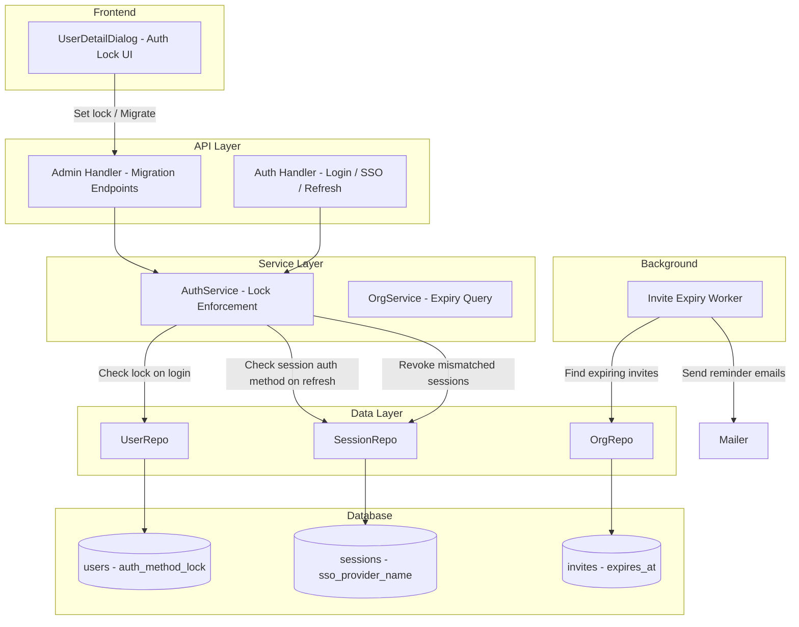
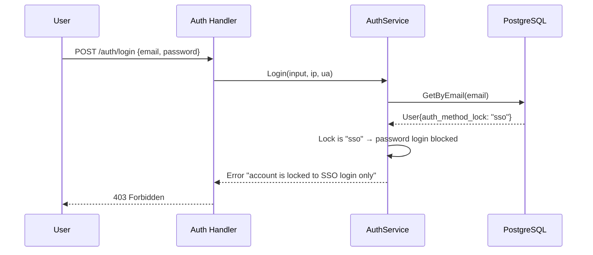
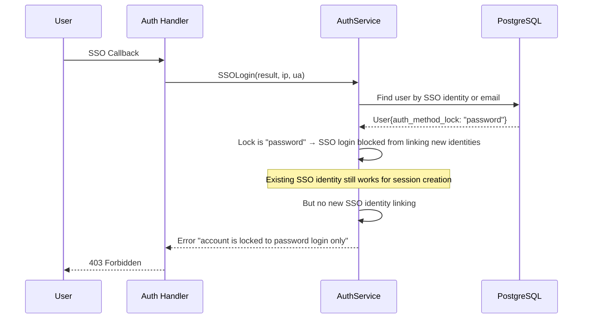
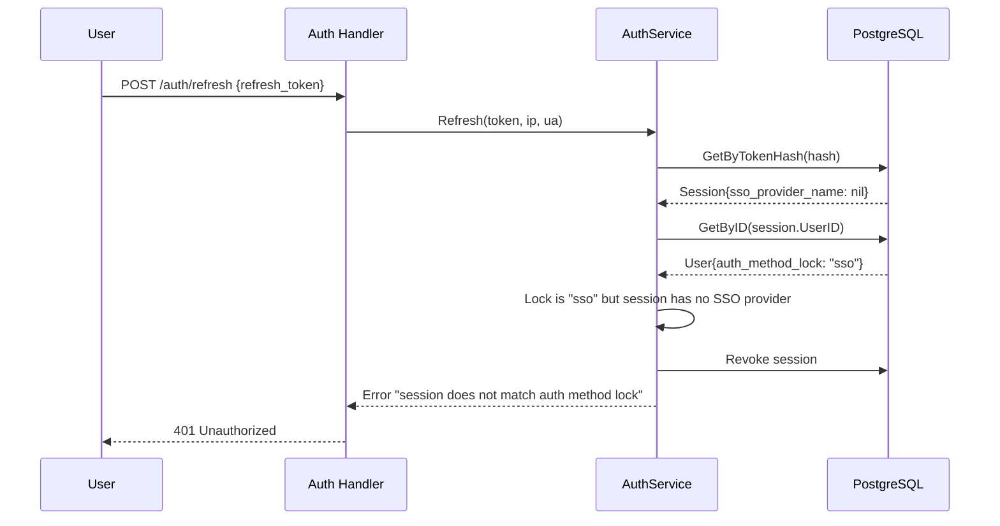
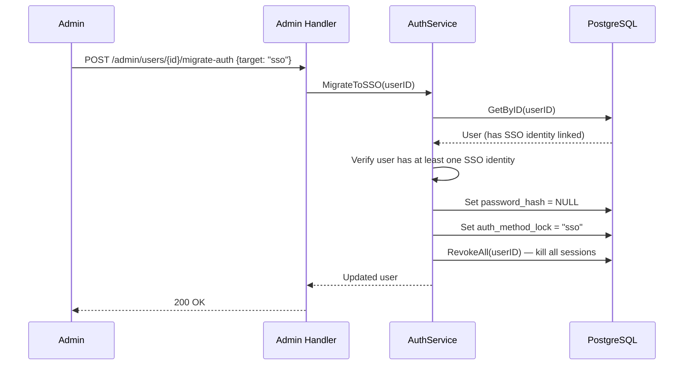
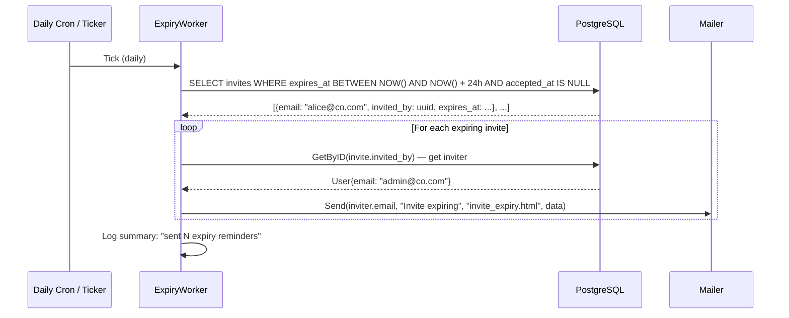

# Design Document: Auth Lifecycle Management

## Overview

This feature adds four capabilities on top of the existing invite-auth-provisioning system (v0.39.0): per-user auth method locking, admin-driven auth method migration, session binding to auth method, and invite expiry notifications.

Auth method locking lets an admin restrict a user to SSO-only or password-only login via a simple `auth_method_lock` field on the user. Auth method migration provides admin endpoints to switch a user between auth methods (removing the old credential and setting the lock). Session binding enforces the lock at refresh time — sessions created under the wrong auth method are rejected on the next refresh. Invite expiry notifications add a daily background worker that emails inviters when their invites are about to expire.

All changes are minimal. The user table gains one nullable column. The auth service gains lock checks in Login, SSOLogin, and Refresh. Two new admin endpoints handle migration. One new worker job handles expiry notifications.

## Architecture



## Sequence Diagrams

### Auth Method Lock Enforcement on Login



### Auth Method Lock Enforcement on SSO Login



### Session Binding on Refresh



### Admin Auth Method Migration (Password → SSO)



### Invite Expiry Notification Worker



## Components and Interfaces

### Component 1: User Domain Model (Extended)

**Purpose**: Add the `auth_method_lock` field to the User struct.

**Interface**:
```go
type User struct {
    // ... existing fields ...
    AuthMethodLock *string `json:"auth_method_lock,omitempty"` // nil = any, "sso", "password"
}
```

**Responsibilities**:
- Store the per-user auth method lock
- Expose it in JSON responses so the frontend can display it

### Component 2: AuthService (Extended)

**Purpose**: Enforce auth method lock in Login, SSOLogin, and Refresh. Provide migration methods.

**Interface**:
```go
// Lock enforcement — added to existing methods
func (s *AuthService) Login(ctx, input, ip, ua) (*User, *TokenPair, error)
    // NEW: if user.AuthMethodLock == "sso", return error

func (s *AuthService) SSOLogin(ctx, result, ip, ua) (*User, *TokenPair, error)
    // NEW: if user.AuthMethodLock == "password" and user is existing (not new), return error

func (s *AuthService) Refresh(ctx, refreshToken, ip, ua) (*TokenPair, error)
    // NEW: after loading session + user, check lock vs session.SSOProviderName

// Migration — new methods
func (s *AuthService) MigrateToSSO(ctx context.Context, userID uuid.UUID) (*User, error)
func (s *AuthService) MigrateToPassword(ctx context.Context, userID uuid.UUID, newPassword string) (*User, error)

// Admin lock — new method
func (s *AuthService) SetAuthMethodLock(ctx context.Context, userID uuid.UUID, lock *string) (*User, error)
```

**Responsibilities**:
- Check `auth_method_lock` before allowing login
- Check session auth method on refresh
- MigrateToSSO: verify SSO identity exists, clear password hash, set lock, revoke sessions
- MigrateToPassword: validate + hash new password, set lock, revoke sessions
- SetAuthMethodLock: set/clear the lock field (admin use)

### Component 3: Admin Handler (Extended)

**Purpose**: Expose migration and lock endpoints.

**New Routes**:
```
POST   /admin/users/{userId}/migrate-auth   — migrate auth method
PATCH  /admin/users/{userId}                — extended to accept auth_method_lock
```

**Responsibilities**:
- Validate migration requests
- Audit log all auth method changes
- Return updated user

### Component 4: Invite Expiry Worker

**Purpose**: Daily background job that finds invites expiring within 24 hours and emails the inviter.

**Interface**:
```go
type InviteExpiryWorker struct {
    orgRepo  *postgres.OrgRepo
    userRepo *postgres.UserRepo
    mailer   *mailer.Mailer
    interval time.Duration // default: 24h
}

func (w *InviteExpiryWorker) Start(ctx context.Context)
func (w *InviteExpiryWorker) RunOnce(ctx context.Context) error
```

**Responsibilities**:
- Run on a ticker (daily)
- Query invites where `expires_at` is between now and now+24h, `accepted_at IS NULL`
- For each, look up the inviter user and send a reminder email
- Log results, skip invites with no inviter

### Component 5: Frontend — UserDetailDialog (Extended)

**Purpose**: Show auth method lock status and provide migration controls in the admin user detail view.

**Responsibilities**:
- Display current `auth_method_lock` value as a badge
- Admin can set lock to "sso", "password", or clear it (any)
- "Migrate to SSO" button (only if user has SSO identity linked)
- "Migrate to Password" button (prompts for new password)

## Data Models

### Database Schema Changes

#### Modified: `users` table

```sql
ALTER TABLE users ADD COLUMN auth_method_lock VARCHAR(20) DEFAULT NULL;
-- Valid values: NULL (any method allowed), 'sso', 'password'
```

### Validation Rules

#### `auth_method_lock` field
- Must be one of: `NULL`, `"sso"`, `"password"`
- When set to `"sso"`, user must have at least one linked SSO identity
- When set to `"password"`, user must have a non-null password hash
- Can only be set by system admins

#### Migration: Password → SSO
- User must have at least one linked SSO identity
- Password hash is set to NULL
- `auth_method_lock` is set to `"sso"`
- All existing sessions are revoked

#### Migration: SSO → Password
- A new password must be provided and pass validation
- `auth_method_lock` is set to `"password"`
- All existing sessions are revoked
- SSO identities are NOT deleted (kept for audit trail)

## Error Handling

### Error Scenario 1: Login with Wrong Auth Method

**Condition**: User has `auth_method_lock = "sso"` and attempts password login
**Response**: 403 with message "account is locked to SSO login only"
**Recovery**: User must use SSO to log in

### Error Scenario 2: SSO Login with Password Lock

**Condition**: User has `auth_method_lock = "password"` and attempts SSO login (existing user, not new)
**Response**: 403 with message "account is locked to password login only"
**Recovery**: User must use password to log in

### Error Scenario 3: Session Refresh Mismatch

**Condition**: User's lock changed after session was created; session auth method doesn't match lock
**Response**: 401 with message "session does not match auth method lock"
**Recovery**: User must log in again with the correct auth method

### Error Scenario 4: Migration Without Prerequisites

**Condition**: Admin tries to migrate to SSO but user has no SSO identity linked
**Response**: 400 with message "user has no linked SSO identity; link one before migrating"
**Recovery**: User or admin must link an SSO identity first

### Error Scenario 5: Migration to Password Without Valid Password

**Condition**: Admin tries to migrate to password but provides a weak password
**Response**: 400 with password policy error
**Recovery**: Provide a password that meets the configured policy

## Testing Strategy

### Unit Testing Approach

- Test `Login` rejects password login when `auth_method_lock = "sso"`
- Test `Login` allows password login when `auth_method_lock = nil` or `"password"`
- Test `SSOLogin` rejects SSO for existing users when `auth_method_lock = "password"`
- Test `SSOLogin` allows SSO when `auth_method_lock = nil` or `"sso"`
- Test `Refresh` rejects sessions that don't match the lock
- Test `Refresh` allows sessions that match the lock
- Test `MigrateToSSO` clears password hash and sets lock
- Test `MigrateToSSO` fails when no SSO identity exists
- Test `MigrateToPassword` sets password hash and lock
- Test invite expiry worker finds correct invites and sends emails

### Property-Based Testing Approach

**Property Test Library**: `pgregory.net/rapid`

- For any user with `auth_method_lock = "sso"`, password login always fails
- For any user with `auth_method_lock = "password"`, SSO login for existing users always fails
- For any session, refresh succeeds if and only if the session's auth method matches the user's lock (or lock is nil)
- Migration to SSO always results in `password_hash = nil` and `auth_method_lock = "sso"`
- Migration to password always results in `password_hash != nil` and `auth_method_lock = "password"`

### Integration Testing Approach

- End-to-end: set lock via admin API, verify login is blocked, verify refresh is rejected
- End-to-end: migrate user, verify old sessions are revoked, verify new login works
- Worker test: create expiring invites, run worker, verify emails sent

## Key Functions with Formal Specifications

### Function: checkAuthMethodLock (new helper)

```go
func checkAuthMethodLock(user *domain.User, method string) error
```

**Preconditions:**
- `user` is non-nil
- `method` is one of `"password"` or `"sso"`

**Postconditions:**
- Returns nil if `user.AuthMethodLock` is nil (any method allowed)
- Returns nil if `user.AuthMethodLock` matches `method`
- Returns error if `user.AuthMethodLock` does not match `method`

### Function: checkSessionAuthMethodLock (new helper)

```go
func checkSessionAuthMethodLock(user *domain.User, session *domain.Session) error
```

**Preconditions:**
- `user` and `session` are non-nil

**Postconditions:**
- Returns nil if `user.AuthMethodLock` is nil
- Returns nil if lock is `"sso"` and `session.SSOProviderName` is non-nil
- Returns nil if lock is `"password"` and `session.SSOProviderName` is nil
- Returns error otherwise

### Function: MigrateToSSO

```go
func (s *AuthService) MigrateToSSO(ctx context.Context, userID uuid.UUID) (*domain.User, error)
```

**Preconditions:**
- `userID` references an existing user
- User has at least one linked SSO identity

**Postconditions:**
- `user.PasswordHash` is nil
- `user.AuthMethodLock` is `"sso"`
- All sessions for the user are revoked
- Returns the updated user

### Function: MigrateToPassword

```go
func (s *AuthService) MigrateToPassword(ctx context.Context, userID uuid.UUID, newPassword string) (*domain.User, error)
```

**Preconditions:**
- `userID` references an existing user
- `newPassword` meets the configured password policy

**Postconditions:**
- `user.PasswordHash` is set to the bcrypt hash of `newPassword`
- `user.AuthMethodLock` is `"password"`
- `user.PasswordChangedAt` is updated to now
- All sessions for the user are revoked
- Returns the updated user

### Function: InviteExpiryWorker.RunOnce

```go
func (w *InviteExpiryWorker) RunOnce(ctx context.Context) error
```

**Preconditions:**
- Database connection is available
- Mailer is configured

**Postconditions:**
- All pending invites expiring within 24 hours have been processed
- For each invite with a non-nil `invited_by`, a reminder email was sent to the inviter
- Invites without an inviter are skipped
- Returns nil on success (individual email failures are logged, not returned)

## Algorithmic Pseudocode

### Algorithm: Login with Auth Method Lock Check

```go
func (s *AuthService) Login(ctx context.Context, input domain.LoginInput, ip, userAgent string) (*domain.User, *domain.TokenPair, error) {
    // ... existing: normalize email, fetch user, check lockout ...

    user, err := s.userRepo.GetByEmail(ctx, input.Email)
    // ... existing error handling ...

    // NEW: Check auth method lock
    if user.AuthMethodLock != nil && *user.AuthMethodLock == "sso" {
        return nil, nil, fmt.Errorf("account is locked to SSO login only")
    }

    // ... existing: check password hash exists, verify password, check enforce_sso ...
    // ... existing: create session ...
}
```

### Algorithm: SSOLogin with Auth Method Lock Check

```go
func (s *AuthService) SSOLogin(ctx context.Context, result *domain.SSOCallbackResult, ip, userAgent string) (*domain.User, *domain.TokenPair, error) {
    // ... existing: check allowed domains ...

    // Find existing user (by SSO identity or email)
    user := findExistingUser(...)

    if user != nil {
        // NEW: Check auth method lock for existing users
        if user.AuthMethodLock != nil && *user.AuthMethodLock == "password" {
            return nil, nil, fmt.Errorf("account is locked to password login only")
        }
    }

    // ... existing: handle new user creation, invite checks, domain mapping ...
    // ... existing: create session ...
}
```

### Algorithm: Refresh with Session Binding

```go
func (s *AuthService) Refresh(ctx context.Context, refreshToken, ip, userAgent string) (*domain.TokenPair, error) {
    // ... existing: hash token, get session, check reuse, check expiry ...

    session, err := s.sessionRepo.GetByTokenHash(ctx, hash)
    // ... existing checks ...

    user, err := s.userRepo.GetByID(ctx, session.UserID)
    // ... existing ...

    // NEW: Check session auth method matches user's lock
    if user.AuthMethodLock != nil {
        lock := *user.AuthMethodLock
        sessionIsSSO := session.SSOProviderName != nil

        if lock == "sso" && !sessionIsSSO {
            // Session was created via password, but user is now locked to SSO
            _ = s.sessionRepo.Revoke(ctx, session.ID)
            return nil, fmt.Errorf("session does not match auth method lock")
        }
        if lock == "password" && sessionIsSSO {
            // Session was created via SSO, but user is now locked to password
            _ = s.sessionRepo.Revoke(ctx, session.ID)
            return nil, fmt.Errorf("session does not match auth method lock")
        }
    }

    // ... existing: revoke old session, create new session in same family ...
}
```

### Algorithm: MigrateToSSO

```go
func (s *AuthService) MigrateToSSO(ctx context.Context, userID uuid.UUID) (*domain.User, error) {
    user, err := s.userRepo.GetByID(ctx, userID)
    if err != nil {
        return nil, fmt.Errorf("user not found")
    }

    // Verify user has at least one SSO identity
    identities, err := s.ssoIdentityRepo.ListByUser(ctx, userID)
    if err != nil || len(identities) == 0 {
        return nil, fmt.Errorf("user has no linked SSO identity; link one before migrating")
    }

    // Clear password hash
    user.PasswordHash = nil

    // Set lock
    lock := "sso"
    user.AuthMethodLock = &lock

    if err := s.userRepo.Update(ctx, user); err != nil {
        return nil, err
    }

    // Revoke all sessions — forces re-login via SSO
    _ = s.sessionRepo.RevokeAll(ctx, userID)

    return user, nil
}
```

### Algorithm: MigrateToPassword

```go
func (s *AuthService) MigrateToPassword(ctx context.Context, userID uuid.UUID, newPassword string) (*domain.User, error) {
    user, err := s.userRepo.GetByID(ctx, userID)
    if err != nil {
        return nil, fmt.Errorf("user not found")
    }

    // Validate password against policy
    if err := auth.ValidatePassword(newPassword, s.cfg.Password); err != nil {
        return nil, err
    }

    // Hash and set password
    hash, err := auth.HashPassword(newPassword)
    if err != nil {
        return nil, err
    }

    now := time.Now()
    user.PasswordHash = &hash
    user.PasswordChangedAt = &now

    // Set lock
    lock := "password"
    user.AuthMethodLock = &lock

    if err := s.userRepo.Update(ctx, user); err != nil {
        return nil, err
    }

    // Revoke all sessions — forces re-login via password
    _ = s.sessionRepo.RevokeAll(ctx, userID)

    return user, nil
}
```

### Algorithm: Invite Expiry Worker

```go
func (w *InviteExpiryWorker) RunOnce(ctx context.Context) error {
    // Find invites expiring within 24 hours that haven't been accepted
    invites, err := w.orgRepo.FindExpiringInvites(ctx, 24*time.Hour)
    if err != nil {
        return fmt.Errorf("query expiring invites: %w", err)
    }

    sent := 0
    for _, invite := range invites {
        if invite.InvitedBy == nil {
            continue // no inviter to notify
        }

        inviter, err := w.userRepo.GetByID(ctx, *invite.InvitedBy)
        if err != nil {
            slog.Warn("expiry worker: inviter not found", "invited_by", invite.InvitedBy, "invite_id", invite.ID)
            continue
        }

        hoursLeft := int(time.Until(invite.ExpiresAt).Hours())
        if err := w.mailer.Send(inviter.Email, "Invite expiring soon", "invite_expiry.html", map[string]string{
            "InviteeEmail": invite.Email,
            "HoursLeft":    fmt.Sprintf("%d", hoursLeft),
            "InviteURL":    fmt.Sprintf("%s/settings?tab=users", w.baseURL),
        }); err != nil {
            slog.Error("expiry worker: failed to send email", "inviter", inviter.Email, "error", err)
            continue
        }
        sent++
    }

    slog.Info("invite expiry worker completed", "expiring", len(invites), "emails_sent", sent)
    return nil
}
```

## Example Usage

### Setting Auth Method Lock via Admin API

```go
// Admin sets a user to SSO-only
// PATCH /admin/users/{userId}
// Body: {"auth_method_lock": "sso"}

// Admin clears the lock (allow any method)
// PATCH /admin/users/{userId}
// Body: {"auth_method_lock": null}
```

### Migrating a User from Password to SSO

```go
// POST /admin/users/{userId}/migrate-auth
// Body: {"target": "sso"}
//
// Response: updated user with password_hash cleared and auth_method_lock = "sso"
```

### Migrating a User from SSO to Password

```go
// POST /admin/users/{userId}/migrate-auth
// Body: {"target": "password", "new_password": "SecureP@ss123"}
//
// Response: updated user with password set and auth_method_lock = "password"
```

### Frontend: Auth Lock Badge in UserDetailDialog

```typescript
// In the Account Information section of UserDetailDialog:
<Badge variant="outline" className="text-[10px]">
  <Lock className="h-3 w-3 mr-0.5" />
  {user.auth_method_lock === "sso" ? "SSO Only" :
   user.auth_method_lock === "password" ? "Password Only" : "Any Method"}
</Badge>
```

## Correctness Properties

*A property is a characteristic or behavior that should hold true across all valid executions of a system — essentially, a formal statement about what the system should do. Properties serve as the bridge between human-readable specifications and machine-verifiable correctness guarantees.*

### Property 1: Lock enforcement is total

*For any* user U and login attempt, if U.auth_method_lock = "sso" then password login always fails, and if U.auth_method_lock = "password" then SSO login for existing users always fails. If U.auth_method_lock is nil, both methods are allowed.

**Validates: Requirements 1.1, 1.2, 1.3**

### Property 2: Session binding is consistent

*For any* session S and user U where U = owner(S), if U.auth_method_lock is non-nil, then Refresh(S) succeeds if and only if (U.auth_method_lock = "sso" ∧ S.sso_provider_name ≠ nil) ∨ (U.auth_method_lock = "password" ∧ S.sso_provider_name = nil). If U.auth_method_lock is nil, refresh always succeeds.

**Validates: Requirements 3.1, 3.2, 3.3**

### Property 3: Migration atomicity

*For any* user U with a linked SSO identity, after MigrateToSSO(U): U.password_hash = nil ∧ U.auth_method_lock = "sso" ∧ all prior sessions are revoked. *For any* user U and valid password pw, after MigrateToPassword(U, pw): U.password_hash ≠ nil ∧ U.auth_method_lock = "password" ∧ all prior sessions are revoked.

**Validates: Requirements 2.1, 2.3**

### Property 4: Migration preconditions

*For any* user U with no linked SSO identities, MigrateToSSO(U) fails. *For any* user U and password pw that does not meet the password policy, MigrateToPassword(U, pw) fails.

**Validates: Requirements 2.2, 2.4**

### Property 5: Expiry notifications are bounded

*For any* set of pending invites, the expiry worker sends at most one email per expiring invite per run, sends only to the inviter (not the invitee), and skips invites with no inviter.

**Validates: Requirements 4.1, 4.2, 4.3**

### Property 6: Expiry worker error resilience

*For any* sequence of expiring invites where some email sends fail, the expiry worker continues processing all remaining invites without aborting.

**Validates: Requirement 4.4**

## Dependencies

- Existing: `internal/service/auth_service.go`, `internal/domain/user.go`, `internal/handler/admin.go`
- Existing: `internal/repository/postgres/user_repo.go`, `internal/repository/postgres/session_repo.go`
- Existing: `internal/repository/postgres/org_repo.go` (invite queries)
- Existing: `internal/mailer/` (email sending)
- New: `internal/worker/invite_expiry.go` (background worker)
- New: `internal/mailer/templates/invite_expiry.html` (email template)
- Frontend: `web/src/components/settings/unified-users-tab.tsx` (UserDetailDialog extension)
