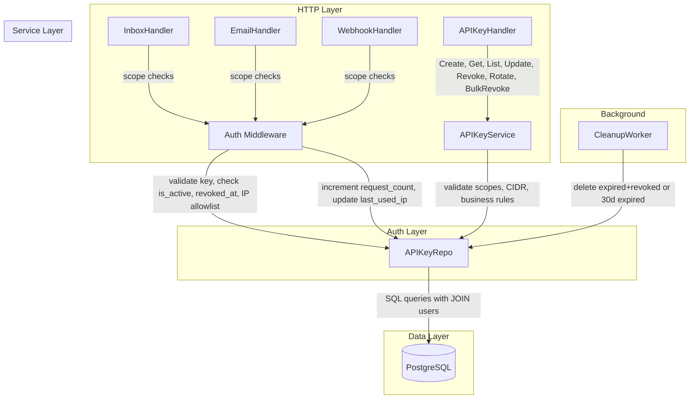
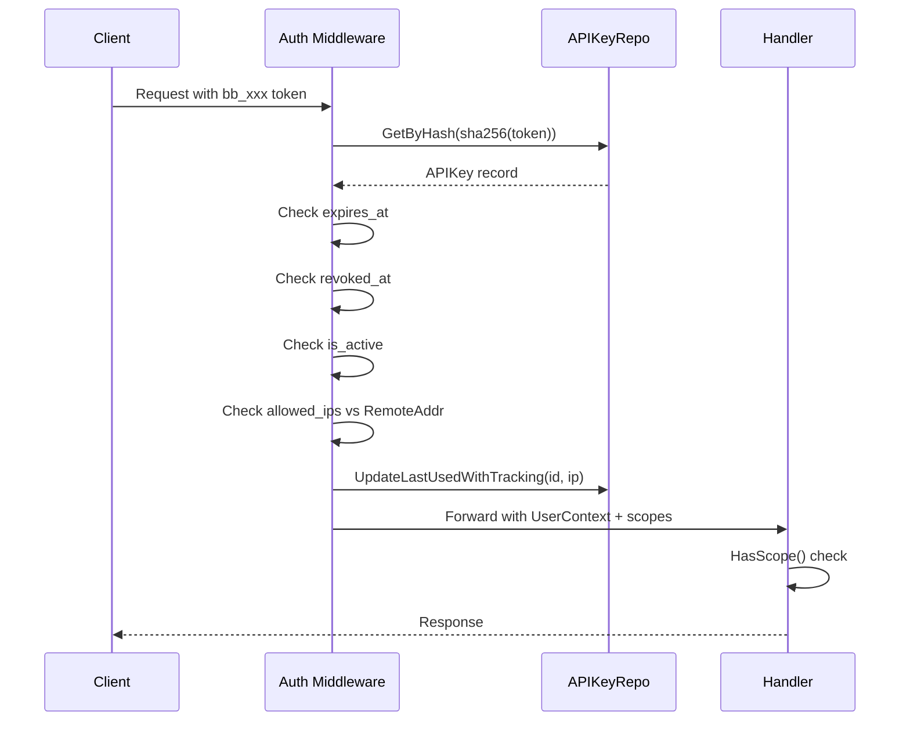

# Design Document: Enhanced API Keys

## Overview

This design enhances the BurnerByte API key system from basic CRUD to a full lifecycle management platform. The current implementation supports create, list, and hard-delete with four scopes (`inbox:create`, `inbox:read`, `email:read`, `email:delete`). The enhanced system adds nine scopes with enforcement across all resource endpoints, key metadata (description, enable/disable, soft-revoke with audit trail), key rotation, usage tracking (request count, last-used IP), IP allowlisting with CIDR validation, creator info in responses, expired key cleanup, and bulk revocation.

The design follows the existing Go/Chi/PostgreSQL architecture, extending the domain model, repository, service, handler, and middleware layers. A single migration (000032) adds all new columns and indexes to the `api_keys` table.

### Key Design Decisions

1. **Soft-revoke over hard-delete**: Revoked keys retain their row with `revoked_at`/`revoked_by` for audit trail. The existing `Delete` repo method is replaced with a `SoftRevoke` that sets these fields.
2. **IP allowlist in JSONB**: Stored as a JSONB array on the key row. Validated at write time using Go's `net.ParseCIDR` and `net.ParseIP`. Checked in middleware on every API key auth request.
3. **Usage tracking in middleware**: `request_count` is incremented and `last_used_ip` is updated atomically in the existing `UpdateLastUsed` call, avoiding a second DB round-trip.
4. **Creator info via JOIN**: List and Get queries join `users` to return `created_by_email` and `created_by_name` without denormalization.
5. **Scope enforcement pattern**: Each handler method checks `auth.HasScope(r.Context(), "scope:action")` at the top, consistent with the existing pattern in `email.go`.

## Architecture



### Request Flow for API Key Authentication



## Components and Interfaces

### Domain Model Changes (`internal/domain/apikey.go`)

```go
type APIKey struct {
    ID             uuid.UUID  `json:"id"`
    TeamID         uuid.UUID  `json:"team_id"`
    CreatedBy      uuid.UUID  `json:"created_by"`
    KeyHash        string     `json:"-"`
    KeyPrefix      string     `json:"key_prefix"`
    Name           string     `json:"name"`
    Description    *string    `json:"description,omitempty"`
    Scopes         []string   `json:"scopes"`
    IsActive       bool       `json:"is_active"`
    AllowedIPs     []string   `json:"allowed_ips,omitempty"`
    RequestCount   int64      `json:"request_count"`
    LastUsedAt     *time.Time `json:"last_used_at,omitempty"`
    LastUsedIP     *string    `json:"last_used_ip,omitempty"`
    ExpiresAt      *time.Time `json:"expires_at,omitempty"`
    RevokedAt      *time.Time `json:"revoked_at,omitempty"`
    RevokedBy      *uuid.UUID `json:"revoked_by,omitempty"`
    CreatedAt      time.Time  `json:"created_at"`
    CreatedByEmail string     `json:"created_by_email,omitempty"`
    CreatedByName  string     `json:"created_by_name,omitempty"`
    RawKey         string     `json:"raw_key,omitempty"`
}

type CreateAPIKeyInput struct {
    Name        string   `json:"name"`
    Description *string  `json:"description,omitempty"`
    Scopes      []string `json:"scopes"`
    ExpiresIn   *string  `json:"expires_in,omitempty"`
    AllowedIPs  []string `json:"allowed_ips,omitempty"`
}

type UpdateAPIKeyInput struct {
    Name        *string   `json:"name,omitempty"`
    Description *string   `json:"description,omitempty"`
    Scopes      []string  `json:"scopes,omitempty"`
    IsActive    *bool     `json:"is_active,omitempty"`
    ExpiresAt   *string   `json:"expires_at,omitempty"`
    AllowedIPs  *[]string `json:"allowed_ips,omitempty"`
}

type BulkRevokeInput struct {
    KeyIDs []uuid.UUID `json:"key_ids"`
}

type BulkRevokeResult struct {
    Revoked int         `json:"revoked"`
    Skipped []uuid.UUID `json:"skipped"`
}
```

### Repository Interface Changes (`internal/repository/postgres/apikey_repo.go`)

New and modified methods:

| Method | Description |
|--------|-------------|
| `Create(ctx, key)` | Updated to include `description`, `is_active`, `allowed_ips` |
| `GetByID(ctx, id)` | Updated to SELECT new columns + JOIN users for creator info |
| `GetByHash(ctx, hash)` | Updated to SELECT `is_active`, `revoked_at`, `allowed_ips`, `request_count`, `last_used_ip` |
| `ListByTeam(ctx, teamID, includeRevoked, page, perPage)` | Updated with optional revoked filter + JOIN users |
| `Update(ctx, id, input)` | New — dynamic SET for partial updates |
| `SoftRevoke(ctx, id, revokedBy)` | New — sets `revoked_at` and `revoked_by` |
| `BulkSoftRevoke(ctx, teamID, ids, revokedBy)` | New — soft-revokes multiple keys, returns skipped |
| `RotateKey(ctx, id, newHash, newPrefix)` | New — updates `key_hash` and `key_prefix` |
| `UpdateLastUsedWithTracking(ctx, id, ip)` | Replaces `UpdateLastUsed` — also increments `request_count` and sets `last_used_ip` |
| `DeleteExpiredKeys(ctx)` | New — deletes keys expired+revoked or expired >30 days |

### Service Layer Changes (`internal/service/apikey_service.go`)

Expanded `validScopes` map:

```go
var validScopes = map[string]bool{
    "inbox:create": true, "inbox:read": true, "inbox:write": true, "inbox:delete": true,
    "email:read": true, "email:write": true, "email:delete": true,
    "webhook:read": true, "webhook:write": true,
}
```

New service methods:

| Method | Description |
|--------|-------------|
| `Get(ctx, teamID, id)` | Returns single key with creator info, 404 if wrong team |
| `Update(ctx, teamID, id, input)` | Validates scopes/IPs, rejects if revoked |
| `Rotate(ctx, teamID, id)` | Generates new secret, rejects if revoked/inactive |
| `BulkRevoke(ctx, teamID, userID, input)` | Soft-revokes multiple keys |
| `ValidateIPs(ips []string)` | Validates each entry as IP or CIDR |

Modified methods:

| Method | Change |
|--------|--------|
| `Generate` | Accepts `description` and `allowed_ips`, validates IPs |
| `List` | Accepts `includeRevoked` parameter |
| `Revoke` | Calls `SoftRevoke` instead of `Delete` |
| `ValidateAndResolve` | Checks `is_active` and `revoked_at`, passes IP to tracking |

### Handler Layer Changes (`internal/handler/apikey.go`)

New routes registered in `cmd/api/main.go`:

```
GET    /orgs/{orgId}/teams/{teamId}/api-keys/{keyId}          → Get
PATCH  /orgs/{orgId}/teams/{teamId}/api-keys/{keyId}          → Update
POST   /orgs/{orgId}/teams/{teamId}/api-keys/{keyId}/rotate   → Rotate
POST   /orgs/{orgId}/teams/{teamId}/api-keys/bulk-revoke      → BulkRevoke
```

### Middleware Changes (`internal/auth/middleware.go`)

The API key auth block in `Middleware` is extended:

1. After `GetByHash`: check `key.RevokedAt != nil` → 401 "API key revoked"
2. After revoked check: check `!key.IsActive` → 401 "API key disabled"
3. After active check: check `key.AllowedIPs` against `r.RemoteAddr` → 403 "IP not allowed for this API key"
4. Replace `UpdateLastUsed` with `UpdateLastUsedWithTracking(id, remoteIP)`

The `APIKeyRepo` interface is extended:

```go
type APIKeyRepo interface {
    GetByHash(ctx context.Context, hash string) (*domain.APIKey, error)
    UpdateLastUsedWithTracking(ctx context.Context, id uuid.UUID, ip string) error
}
```

### Scope Enforcement in Handlers

**inbox.go** changes:
- `CreateInboxFlat`: check `inbox:create` (was `inbox:write`)
- `DeleteInbox`: check `inbox:delete` (was `inbox:write`)
- `ListMyInboxes`: add `inbox:read` check
- `GetInbox`: add `inbox:read` check

**email.go** changes:
- `MarkAllRead`: add `email:write` scope check
- `MarkReadUnread`: add `email:write` scope check

**webhook.go** changes:
- `Create`, `Update`, `Delete`: add `webhook:write` scope check
- `List`, `ListDeliveryLogs`: add `webhook:read` scope check

### Worker Changes (`internal/worker/cleanup.go`)

`CleanupJob` signature gains `apikeyRepo *postgres.APIKeyRepo`. A new block calls `apikeyRepo.DeleteExpiredKeys(ctx)` and logs the count.


## Data Models

### Migration 000032: Enhanced API Keys

**Up migration** (`migrations/000032_enhanced_api_keys.up.sql`):

```sql
-- Add new columns to api_keys table
ALTER TABLE api_keys
    ADD COLUMN description TEXT,
    ADD COLUMN is_active BOOLEAN NOT NULL DEFAULT TRUE,
    ADD COLUMN revoked_at TIMESTAMPTZ,
    ADD COLUMN revoked_by UUID REFERENCES users(id),
    ADD COLUMN request_count BIGINT NOT NULL DEFAULT 0,
    ADD COLUMN last_used_ip TEXT,
    ADD COLUMN allowed_ips JSONB;

-- Index for filtering active keys
CREATE INDEX idx_api_keys_is_active ON api_keys(is_active);

-- Index for filtering/querying revoked keys
CREATE INDEX idx_api_keys_revoked_at ON api_keys(revoked_at);
```

**Down migration** (`migrations/000032_enhanced_api_keys.down.sql`):

```sql
DROP INDEX IF EXISTS idx_api_keys_revoked_at;
DROP INDEX IF EXISTS idx_api_keys_is_active;

ALTER TABLE api_keys
    DROP COLUMN IF EXISTS allowed_ips,
    DROP COLUMN IF EXISTS last_used_ip,
    DROP COLUMN IF EXISTS request_count,
    DROP COLUMN IF EXISTS revoked_by,
    DROP COLUMN IF EXISTS revoked_at,
    DROP COLUMN IF EXISTS is_active,
    DROP COLUMN IF EXISTS description;
```

### Updated Table Schema (after migration)

| Column | Type | Default | Description |
|--------|------|---------|-------------|
| id | UUID PK | gen_random_uuid() | Primary key |
| team_id | UUID FK→teams | — | Owning team |
| created_by | UUID FK→users | — | Creator user |
| key_hash | TEXT | — | SHA-256 hash of raw key |
| key_prefix | VARCHAR(12) | — | First 11 chars for display |
| name | VARCHAR(255) | — | Human-readable name |
| description | TEXT | NULL | Optional longer description |
| scopes | JSONB | — | Array of scope strings |
| is_active | BOOLEAN | TRUE | Enable/disable toggle |
| allowed_ips | JSONB | NULL | Array of IP/CIDR strings |
| request_count | BIGINT | 0 | Total authenticated requests |
| last_used_at | TIMESTAMPTZ | NULL | Last successful auth time |
| last_used_ip | TEXT | NULL | IP of last successful auth |
| expires_at | TIMESTAMPTZ | NULL | Optional expiration |
| revoked_at | TIMESTAMPTZ | NULL | Soft-revoke timestamp |
| revoked_by | UUID FK→users | NULL | Who revoked the key |
| created_at | TIMESTAMPTZ | NOW() | Creation timestamp |

### Indexes

| Index | Columns | Condition |
|-------|---------|-----------|
| idx_api_keys_team | team_id | — |
| idx_api_keys_hash | key_hash | — |
| idx_api_keys_expires | expires_at | WHERE expires_at IS NOT NULL |
| idx_api_keys_is_active | is_active | — |
| idx_api_keys_revoked_at | revoked_at | — |


## Correctness Properties

*A property is a characteristic or behavior that should hold true across all valid executions of a system — essentially, a formal statement about what the system should do. Properties serve as the bridge between human-readable specifications and machine-verifiable correctness guarantees.*

### Property 1: Scope Map Completeness

*For any* scope string in the defined set {`inbox:create`, `inbox:read`, `inbox:write`, `inbox:delete`, `email:read`, `email:write`, `email:delete`, `webhook:read`, `webhook:write`}, the `validScopes` map SHALL return true. *For any* string not in this set, the map SHALL return false.

**Validates: Requirements 1.3**

### Property 2: Scope Enforcement Across Endpoints

*For any* API key scope set and any protected endpoint, if the scope set does not contain the required scope for that endpoint, the handler SHALL reject the request with HTTP 403. If the scope set does contain the required scope, the handler SHALL not reject on scope grounds.

**Validates: Requirements 2.1, 2.2, 2.3**

### Property 3: Update Field Persistence

*For any* valid API key and any valid update input (name, description, scopes subset, expires_at timestamp), patching the key and then retrieving it SHALL return the updated values for all provided fields, with unspecified fields unchanged.

**Validates: Requirements 4.1, 4.2, 4.5, 5.2**

### Property 4: Scope Validation on Mutation

*For any* set of scope strings provided during create or update, if all scopes are in the `validScopes` map the operation SHALL succeed. If any scope is not in the map, the operation SHALL fail with an error identifying the invalid scope.

**Validates: Requirements 4.3, 4.4**

### Property 5: Revoked Key Rejects All Mutations

*For any* API key where `revoked_at` is set, attempts to update, reactivate (`is_active=true`), or rotate the key SHALL be rejected with an error.

**Validates: Requirements 4.8, 6.5, 8.5**

### Property 6: Enable/Disable Round-Trip

*For any* active, non-revoked API key, setting `is_active` to false and then back to true SHALL restore the key to an active state where it can authenticate requests.

**Validates: Requirements 6.2, 6.3**

### Property 7: Middleware Rejects Disabled and Revoked Keys

*For any* API key that has `is_active=false` or `revoked_at` set, the auth middleware SHALL reject authentication attempts, returning HTTP 401.

**Validates: Requirements 6.4, 7.3**

### Property 8: Soft-Revoke Preserves Row with Metadata

*For any* active API key, revoking it SHALL set `revoked_at` to a non-null timestamp and `revoked_by` to the revoking user's ID, and the row SHALL still exist in the database (not deleted).

**Validates: Requirements 7.2**

### Property 9: List Filtering by Revocation Status

*For any* team with a mix of active and revoked API keys, listing without `include_revoked` SHALL return only keys where `revoked_at` is NULL. Listing with `include_revoked=true` SHALL return all keys including those with `revoked_at` set.

**Validates: Requirements 7.4, 7.5**

### Property 10: Key Rotation Produces New Credentials

*For any* active, non-revoked API key, rotating it SHALL produce a new raw key matching the format `bb_` followed by 64 hex characters, and the stored `key_hash` and `key_prefix` SHALL differ from their pre-rotation values. The key's ID, name, scopes, and other metadata SHALL remain unchanged.

**Validates: Requirements 8.1, 8.2**

### Property 11: Request Count Monotonic Increment

*For any* API key, after N successful authentication attempts through the middleware, the key's `request_count` SHALL equal its initial value plus N, and `last_used_ip` SHALL equal the IP of the most recent request.

**Validates: Requirements 9.3**

### Property 12: IP and CIDR Validation

*For any* string that is a valid IPv4 address, IPv6 address, or CIDR notation, the `ValidateIPs` function SHALL accept it. *For any* string that is not a valid IP or CIDR, the function SHALL reject it with an error identifying the invalid entry.

**Validates: Requirements 11.2, 11.5**

### Property 13: IP Allowlist Enforcement

*For any* API key with a non-empty `allowed_ips` list and any request IP, the middleware SHALL allow the request if and only if the IP matches at least one entry in the allowlist (exact match or CIDR containment). *For any* API key with NULL or empty `allowed_ips`, the middleware SHALL allow requests from any IP.

**Validates: Requirements 11.3, 11.4**

### Property 14: Expired Key Cleanup Correctness

*For any* set of API keys with varying `expires_at` and `revoked_at` values, the cleanup function SHALL delete only keys where (a) `expires_at` is in the past AND `revoked_at` is set, or (b) `expires_at` is more than 30 days in the past. Keys that are expired but within the 30-day grace period and not revoked SHALL be preserved.

**Validates: Requirements 12.1, 12.3**

### Property 15: Bulk Revoke Correctness

*For any* team and any set of key IDs, bulk revoke SHALL soft-revoke exactly those keys that belong to the specified team and are not already revoked. Keys not belonging to the team or already revoked SHALL appear in the `skipped` array. The count of revoked keys plus the length of the skipped array SHALL equal the total number of input IDs.

**Validates: Requirements 13.1, 13.2, 13.3**

## Error Handling

### Handler Layer Errors

| Scenario | HTTP Status | Response |
|----------|-------------|----------|
| Invalid UUID in path param | 400 | `{"error": "invalid [param] ID"}` |
| Invalid request body JSON | 400 | `{"error": "invalid request body"}` |
| Invalid scope in create/update | 400 | `{"error": "invalid scope: [scope]"}` |
| Invalid IP/CIDR in allowed_ips | 400 | `{"error": "invalid IP/CIDR: [entry]"}` |
| Invalid expires_in duration | 400 | `{"error": "invalid expires_in"}` |
| Key not found or wrong team | 404 | `{"error": "API key not found"}` |
| Missing required scope | 403 | `{"error": "insufficient scope"}` |
| IP not in allowlist | 403 | `{"error": "IP not allowed for this API key"}` |
| Insufficient role (not admin/lead) | 403 | `{"error": "forbidden"}` |
| API key disabled | 401 | `{"error": "API key disabled"}` |
| API key revoked | 401 | `{"error": "API key revoked"}` |
| API key expired | 401 | `{"error": "API key expired"}` |
| Update/rotate/reactivate revoked key | 400 | `{"error": "cannot modify revoked key"}` |
| Rotate inactive key | 400 | `{"error": "cannot rotate inactive key"}` |
| Empty key_ids in bulk revoke | 400 | `{"error": "key_ids is required"}` |

### Service Layer Errors

- Scope validation errors include the specific invalid scope string
- IP validation errors include the specific invalid entry
- All database errors are wrapped with context (e.g., `"create api key: %w"`)
- Revoked key mutation attempts return descriptive errors before hitting the database

### Middleware Error Handling

The middleware checks are ordered for fail-fast:
1. Key lookup failure → 401 "invalid API key"
2. Expiration check → 401 "API key expired"
3. Revocation check → 401 "API key revoked"
4. Active check → 401 "API key disabled"
5. IP allowlist check → 403 "IP not allowed for this API key"
6. Usage tracking failure → logged but does not block the request

## Testing Strategy

### Property-Based Tests

Property-based testing is appropriate for this feature because it contains significant pure business logic (scope validation, IP/CIDR validation, key lifecycle state machines, cleanup filtering) with clear input/output behavior and large input spaces.

**Library**: [rapid](https://github.com/flyingmutant/rapid) (Go property-based testing library)

**Configuration**: Minimum 100 iterations per property test.

**Tag format**: `Feature: enhanced-api-keys, Property {N}: {title}`

Each correctness property (P1–P15) maps to a single property-based test:

| Property | Test Focus | Generator Strategy |
|----------|-----------|-------------------|
| P1: Scope Map Completeness | `validScopes` map | Generate random strings, partition into valid/invalid |
| P2: Scope Enforcement | Handler scope checks | Generate random scope subsets × endpoint pairs |
| P3: Update Persistence | Service Update method | Generate random valid update inputs |
| P4: Scope Validation | Create/Update scope validation | Generate random string arrays, mix valid/invalid |
| P5: Revoked Rejects Mutations | Service reject logic | Generate random mutation inputs on revoked keys |
| P6: Enable/Disable Round-Trip | Service toggle | Generate random active keys, toggle twice |
| P7: Middleware Rejects | Auth middleware | Generate disabled/revoked key states |
| P8: Soft-Revoke Preserves | Revoke method | Generate random active keys, revoke, verify row |
| P9: List Filtering | List with/without revoked | Generate mixed key sets per team |
| P10: Rotation Credentials | Rotate method | Generate random active keys, rotate, compare |
| P11: Request Count | Middleware tracking | Generate N auth attempts, verify count |
| P12: IP/CIDR Validation | ValidateIPs function | Generate random valid IPs/CIDRs and invalid strings |
| P13: IP Allowlist | Middleware IP check | Generate random IPs × allowlists |
| P14: Cleanup Correctness | DeleteExpiredKeys | Generate keys with varied expiry/revocation states |
| P15: Bulk Revoke | BulkRevoke method | Generate random key sets across teams |

### Unit Tests (Example-Based)

- Scope mismatch fix: verify `inbox:create` and `inbox:delete` replace `inbox:write` in inbox handler
- Email handler: verify `email:write` check on mark-read/mark-unread
- Get single key: verify 404 for wrong team, verify creator info in response
- Update: verify 404 for wrong team, verify role enforcement
- Rotation: verify raw key returned once, verify role enforcement, verify 404 for wrong team
- Bulk revoke: verify response shape (revoked count + skipped array), verify role enforcement
- Middleware: verify ordered checks (expired → revoked → disabled → IP)

### Integration Tests

- Creator info JOIN: create user → create key → GET/List → verify email and display_name
- Full lifecycle: create → update → disable → enable → rotate → revoke → verify state at each step
- Cleanup worker: insert keys with various states → run cleanup → verify correct deletions
- Migration: run up → verify columns/indexes → run down → verify removal

