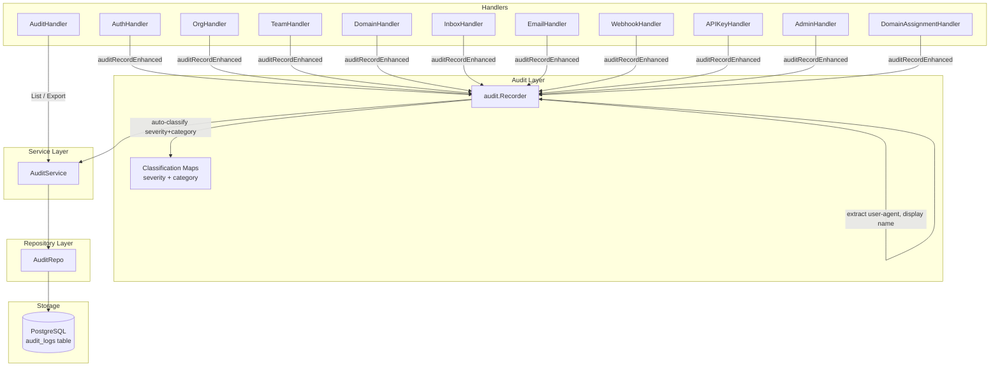

# Design Document: Enhanced Audit Logging

## Overview

This design enhances the BurnerByte audit logging system from a basic action recorder into a comprehensive, security-classified, human-readable audit trail with full before/after context, coverage of all state-changing actions, and an enriched API for filtering, searching, and exporting.

The current system records ~30 actions with minimal metadata (action name, resource type/ID, IP address, and a freeform metadata JSONB blob). The enhanced system adds:

- **5 new schema columns**: `user_agent`, `resource_name`, `actor_display_name`, `severity`, `category`
- **Before/after diffs** on all update operations
- **Human-readable names** for all referenced entities in metadata
- **~15 new audit events** covering user profile updates, SSO login, session management, email actions, team membership changes, domain/assignment updates, and admin role management
- **Severity classification** (`info`, `warning`, `critical`) for every action
- **Category classification** (`auth`, `org`, `team`, `domain`, `inbox`, `email`, `webhook`, `apikey`, `admin`, `member`) for every action
- **API filtering** by severity, category, and resource_name
- **CSV/JSON export** endpoint with filter support
- **Full backward compatibility** with existing audit entries and the existing `auditRecord` helper

### Design Rationale

The design follows a **write-time enrichment** strategy: all human-readable names, severity, category, and actor display names are captured at the time of the audit event rather than resolved at query time. This ensures:

1. Historical accuracy — names reflect the state at the time of the action, not the current state
2. Query performance — no JOINs needed for display names, severity, or category filtering
3. Resilience — audit entries remain readable even if referenced entities are deleted

## Architecture



### Key Architectural Decisions

1. **Classification maps live in the recorder package** — Severity and category are determined by static lookup maps keyed on the action string. This keeps classification logic centralized and testable, separate from handler code.

2. **Enhanced recorder with backward-compatible wrapper** — The existing `auditRecord` helper in `rbac.go` continues to work unchanged. A new `auditRecordEnhanced` helper accepts additional parameters (`resourceName`, `severity`, `category`). Both call through to the same `Recorder` which auto-fills `user_agent`, `actor_display_name`, and applies classification defaults.

3. **Export uses streaming writes** — The CSV/JSON export endpoint streams results to avoid loading 10,000 entries into memory at once. The repository provides a `ListAll` method with a hard cap of 10,000 rows.

4. **Before/after diffs are computed in handlers** — Handlers fetch the current state before applying mutations, then include both snapshots in the metadata map. This keeps the diff logic close to the mutation site and avoids adding audit concerns to service/repository layers.

## Components and Interfaces

### 1. Migration: `migrations/000031_audit_logs_enhanced.up.sql`

Adds 5 new columns to `audit_logs` with safe defaults and creates indexes for the filterable columns.

### 2. Domain Model: `internal/domain/audit.go`

**AuditEntry** — Extended with 5 new fields:

```go
type AuditEntry struct {
    ID               uuid.UUID  `json:"id"`
    OrgID            uuid.UUID  `json:"org_id"`
    ActorID          *uuid.UUID `json:"actor_id,omitempty"`
    ActorEmail       string     `json:"actor_email,omitempty"`
    ActorDisplayName string     `json:"actor_display_name,omitempty"`
    Action           string     `json:"action"`
    ResourceType     string     `json:"resource_type"`
    ResourceID       uuid.UUID  `json:"resource_id"`
    ResourceName     string     `json:"resource_name,omitempty"`
    Metadata         any        `json:"metadata,omitempty"`
    IPAddress        *string    `json:"ip_address,omitempty"`
    UserAgent        string     `json:"user_agent,omitempty"`
    Severity         string     `json:"severity,omitempty"`
    Category         string     `json:"category,omitempty"`
    CreatedAt        time.Time  `json:"created_at"`
}
```

**AuditFilter** — Extended with 3 new filter fields:

```go
type AuditFilter struct {
    ActorID      *uuid.UUID `json:"actor_id,omitempty"`
    Action       *string    `json:"action,omitempty"`
    ResourceType *string    `json:"resource_type,omitempty"`
    DateFrom     *time.Time `json:"date_from,omitempty"`
    DateTo       *time.Time `json:"date_to,omitempty"`
    Severity     *string    `json:"severity,omitempty"`
    Category     *string    `json:"category,omitempty"`
    ResourceName *string    `json:"resource_name,omitempty"`
}
```

### 3. Audit Recorder: `internal/audit/recorder.go`

**Classification maps** — Two package-level maps:

```go
var SeverityMap = map[string]string{
    "user.password_changed":           "critical",
    "user.password_reset":             "critical",
    "user.account_deleted":            "critical",
    "admin.user_deleted":              "critical",
    "admin.sessions_revoked":          "critical",
    "admin.sso_config_updated":        "critical",
    "admin.platform_settings_updated": "critical",
    "member.role_changed":             "critical",
    "admin.role_created":              "critical",
    "admin.role_updated":              "critical",
    "admin.role_deleted":              "critical",
    "org.deleted":                     "critical",
    // warning
    "member.removed":        "warning",
    "member.invited":        "warning",
    "team.deleted":          "warning",
    "domain.deleted":        "warning",
    "domain.unassigned":     "warning",
    "webhook.deleted":       "warning",
    "apikey.revoked":        "warning",
    "inbox.deleted":         "warning",
    "email.deleted":         "warning",
    "admin.user_updated":    "warning",
    "org.updated":           "warning",
    "org.settings.updated":  "warning",
}

var CategoryMap = map[string]string{
    "user.registered":       "auth",
    "user.login":            "auth",
    "user.sso_login":        "auth",
    "user.logout":           "auth",
    "user.password_changed": "auth",
    "user.password_reset":   "auth",
    "user.account_deleted":  "auth",
    "user.profile_updated":  "auth",
    "user.email_verified":   "auth",
    "session.revoked":       "auth",
    "session.revoked_all":   "auth",
    // org
    "org.created":          "org",
    "org.updated":          "org",
    "org.deleted":          "org",
    "org.settings.updated": "org",
    // member
    "member.invited":      "member",
    "member.role_changed": "member",
    "member.removed":      "member",
    "invite.revoked":      "member",
    "invite.accepted":     "member",
    // team
    "team.created":             "team",
    "team.updated":             "team",
    "team.deleted":             "team",
    "team.member_added":        "team",
    "team.member_removed":      "team",
    "team.member_role_changed": "team",
    // domain
    "domain.created":              "domain",
    "domain.updated":              "domain",
    "domain.deleted":              "domain",
    "domain.verified":             "domain",
    "domain.assigned":             "domain",
    "domain.unassigned":           "domain",
    "domain_assignment.updated":   "domain",
    // inbox
    "inbox.created":  "inbox",
    "inbox.deleted":  "inbox",
    "inbox.extended": "inbox",
    // email
    "email.deleted":  "email",
    "email.all_read": "email",
    // webhook
    "webhook.created": "webhook",
    "webhook.updated": "webhook",
    "webhook.deleted": "webhook",
    // apikey
    "apikey.created": "apikey",
    "apikey.revoked": "apikey",
    // admin
    "admin.user_deleted":              "admin",
    "admin.user_updated":              "admin",
    "admin.sessions_revoked":          "admin",
    "admin.platform_settings_updated": "admin",
    "admin.sso_config_updated":        "admin",
    "admin.role_created":              "admin",
    "admin.role_updated":              "admin",
    "admin.role_deleted":              "admin",
}
```

**Enhanced Record method** — New signature:

```go
func (rec *Recorder) RecordEnhanced(
    r *http.Request,
    orgID uuid.UUID,
    action, resourceType string,
    resourceID uuid.UUID,
    resourceName string,
    metadata map[string]any,
) {
    // 1. Extract user-agent from r.Header.Get("User-Agent")
    // 2. Extract actor display name from auth.GetUser(r.Context())
    //    (requires adding DisplayName to UserContext, or looking up via a user repo)
    // 3. Look up severity from SeverityMap (default "info")
    // 4. Look up category from CategoryMap (default "")
    // 5. Build AuditEntry with all fields populated
    // 6. Call svc.Record(ctx, entry)
}
```

**Backward-compatible RecordFromRequest** — The existing method continues to work. It delegates to the same service but leaves the new fields empty/default. The existing `auditRecord` helper in `rbac.go` remains unchanged.

**New `auditRecordEnhanced` helper in `rbac.go`**:

```go
func auditRecordEnhanced(r *http.Request, orgID uuid.UUID, action, resourceType string, resourceID uuid.UUID, resourceName string, meta map[string]any) {
    if Audit != nil {
        Audit.RecordEnhanced(r, orgID, action, resourceType, resourceID, resourceName, meta)
    }
}
```

### 4. Repository: `internal/repository/postgres/audit_repo.go`

**Create** — Updated INSERT to include the 5 new columns.

**List** — Updated SELECT to read the 5 new columns. Extended WHERE clause builder to support `severity`, `category`, and `resource_name` (ILIKE) filters.

**ListAll** — New method for export. Same filter support as List but returns up to 10,000 rows without pagination, ordered by `created_at DESC`.

### 5. Audit Service: `internal/service/audit_service.go`

**ListAll** — New method delegating to `repo.ListAll` for export use.

### 6. Audit Handler: `internal/handler/audit.go`

**List** — Extended to parse `severity`, `category`, and `resource_name` query parameters. Validates `severity` against `["info", "warning", "critical"]` and `category` against the defined set.

**Export** — New endpoint `GET /orgs/{orgId}/audit/export`:
- Requires `format` query parameter (`csv` or `json`)
- Applies the same filters as List
- Sets `Content-Disposition: attachment; filename="audit_export_{timestamp}.{ext}"`
- CSV: writes header row + data rows using `encoding/csv`
- JSON: writes a JSON array using `encoding/json`
- Hard cap of 10,000 entries

### 7. Handler Updates (All Handlers)

Each handler is updated to:
1. Use `auditRecordEnhanced` instead of `auditRecord` where enrichment is needed
2. Fetch before-state for update operations and include `before`/`after` in metadata
3. Include human-readable names (`resource_name` parameter + metadata fields)
4. New audit events are added at the appropriate handler call sites

#### Specific Handler Changes

**auth.go**:
- `UpdateProfile`: Add `user.profile_updated` with before/after diffs
- `VerifyEmail`: Add `user.email_verified` event
- `SSOCallback`: Add `user.sso_login` event (distinct from `user.login`)
- `RevokeSession`: Add `session.revoked` event
- `RevokeAllSessions`: Add `session.revoked_all` event
- `Login`: Enrich existing `user.login` with user_agent in metadata
- `ResetPassword`: Fix resource_id to use actual user ID instead of uuid.Nil

**email.go**:
- `DeleteEmail`: Add `email.deleted` event with subject and inbox address
- `MarkAllRead`: Add `email.all_read` event with inbox address and count

**team.go**:
- `AddMember`: Add `team.member_added` event
- `RemoveMember`: Add `team.member_removed` event
- `ChangeRole`: Add `team.member_role_changed` event
- `UpdateTeam`: Enrich with before/after diffs
- `DeleteTeam`: Include team name in metadata

**org.go**:
- `UpdateOrg`: Enrich with before/after diffs
- `UpdateSettings`: Enrich with before/after diffs
- `DeleteOrg`: Include org name in metadata
- `ChangeRole`: Enrich with old_role, target_user_email
- `RemoveMember`: Enrich with target_user_email, target_user_display_name

**domain.go**:
- `UpdateDomain`: Add `domain.updated` event with before/after diffs
- `DeleteDomain`: Include domain name in metadata

**domain_assignment.go**:
- `UpdateAssignment`: Add `domain_assignment.updated` with before/after diffs
- `AssignDomain`: Include domain name and team name in metadata
- `Unassign`: Include domain name and team name in metadata

**webhook.go**:
- `Update`: Enrich with before/after diffs

**admin.go** (and inline handlers in `main.go`):
- `DeleteUser`: Include target user email and display name
- `UpdateUser`: Enrich with before/after diffs
- Role CRUD inline handlers: Add `admin.role_created`, `admin.role_updated`, `admin.role_deleted` events

### 8. Route Registration: `cmd/api/main.go`

Add the export route:
```go
r.Get("/orgs/{orgId}/audit/export", auditHandler.Export)
```

### 9. UserContext Enhancement

The `auth.UserContext` struct needs a `DisplayName` field so the recorder can extract it without an additional DB lookup. This is populated during JWT validation and API key auth in the middleware.

```go
type UserContext struct {
    UserID        uuid.UUID
    Email         string
    DisplayName   string    // NEW
    IsSystemAdmin bool
    APIKeyScopes  []string
}
```

The middleware already fetches the user from the DB (`userRepo.GetByID`) for password_changed_at validation, so adding `DisplayName` to the context is zero-cost.

## Data Models

### Database Schema Changes

**Migration `000031_audit_logs_enhanced.up.sql`**:

```sql
-- Add new columns with safe defaults for backward compatibility
ALTER TABLE audit_logs ADD COLUMN user_agent TEXT DEFAULT '';
ALTER TABLE audit_logs ADD COLUMN resource_name TEXT DEFAULT '';
ALTER TABLE audit_logs ADD COLUMN actor_display_name TEXT DEFAULT '';
ALTER TABLE audit_logs ADD COLUMN severity VARCHAR(20) DEFAULT 'info';
ALTER TABLE audit_logs ADD COLUMN category VARCHAR(30) DEFAULT '';

-- Indexes for filtered queries
CREATE INDEX idx_audit_logs_severity ON audit_logs(severity);
CREATE INDEX idx_audit_logs_category ON audit_logs(category);
CREATE INDEX idx_audit_logs_resource_name ON audit_logs(resource_name);
```

**Migration `000031_audit_logs_enhanced.down.sql`**:

```sql
DROP INDEX IF EXISTS idx_audit_logs_resource_name;
DROP INDEX IF EXISTS idx_audit_logs_category;
DROP INDEX IF EXISTS idx_audit_logs_severity;
ALTER TABLE audit_logs DROP COLUMN IF EXISTS category;
ALTER TABLE audit_logs DROP COLUMN IF EXISTS severity;
ALTER TABLE audit_logs DROP COLUMN IF EXISTS actor_display_name;
ALTER TABLE audit_logs DROP COLUMN IF EXISTS resource_name;
ALTER TABLE audit_logs DROP COLUMN IF EXISTS user_agent;
```

### Severity Classification Table

| Severity | Actions |
|----------|---------|
| `critical` | `user.password_changed`, `user.password_reset`, `user.account_deleted`, `admin.user_deleted`, `admin.sessions_revoked`, `admin.sso_config_updated`, `admin.platform_settings_updated`, `member.role_changed`, `admin.role_created`, `admin.role_updated`, `admin.role_deleted`, `org.deleted` |
| `warning` | `member.removed`, `member.invited`, `team.deleted`, `domain.deleted`, `domain.unassigned`, `webhook.deleted`, `apikey.revoked`, `inbox.deleted`, `email.deleted`, `admin.user_updated`, `org.updated`, `org.settings.updated` |
| `info` | All remaining actions (default) |

### Category Classification Table

| Category | Actions |
|----------|---------|
| `auth` | `user.registered`, `user.login`, `user.sso_login`, `user.logout`, `user.password_changed`, `user.password_reset`, `user.account_deleted`, `user.profile_updated`, `user.email_verified`, `session.revoked`, `session.revoked_all` |
| `org` | `org.created`, `org.updated`, `org.deleted`, `org.settings.updated` |
| `member` | `member.invited`, `member.role_changed`, `member.removed`, `invite.revoked`, `invite.accepted` |
| `team` | `team.created`, `team.updated`, `team.deleted`, `team.member_added`, `team.member_removed`, `team.member_role_changed` |
| `domain` | `domain.created`, `domain.updated`, `domain.deleted`, `domain.verified`, `domain.assigned`, `domain.unassigned`, `domain_assignment.updated` |
| `inbox` | `inbox.created`, `inbox.deleted`, `inbox.extended` |
| `email` | `email.deleted`, `email.all_read` |
| `webhook` | `webhook.created`, `webhook.updated`, `webhook.deleted` |
| `apikey` | `apikey.created`, `apikey.revoked` |
| `admin` | `admin.user_deleted`, `admin.user_updated`, `admin.sessions_revoked`, `admin.platform_settings_updated`, `admin.sso_config_updated`, `admin.role_created`, `admin.role_updated`, `admin.role_deleted` |

### Before/After Diff Metadata Structure

For update operations, the metadata will follow this pattern:

```json
{
  "before": { "name": "Old Name", "logo_url": null },
  "after":  { "name": "New Name", "logo_url": "https://..." },
  "domain_name": "example.com",
  "team_name": "Engineering"
}
```

### Export Formats

**CSV columns**: `id`, `created_at`, `org_id`, `actor_id`, `actor_email`, `actor_display_name`, `action`, `severity`, `category`, `resource_type`, `resource_id`, `resource_name`, `ip_address`, `user_agent`, `metadata`

**JSON**: Array of AuditEntry objects with all fields.


## Correctness Properties

*A property is a characteristic or behavior that should hold true across all valid executions of a system — essentially, a formal statement about what the system should do. Properties serve as the bridge between human-readable specifications and machine-verifiable correctness guarantees.*

### Property 1: Severity classification is complete and correct

*For any* action string known to the system, the severity classification SHALL return exactly one of `info`, `warning`, or `critical`. Actions explicitly listed in the critical set SHALL return `critical`, actions in the warning set SHALL return `warning`, and all other actions SHALL return `info`.

**Validates: Requirements 1.4, 12.1, 12.2, 12.3**

### Property 2: Category classification is complete and correct

*For any* action string known to the system, the category classification SHALL return a value from the defined set (`auth`, `org`, `team`, `domain`, `inbox`, `email`, `webhook`, `apikey`, `admin`, `member`) or an empty string. Each action SHALL map to exactly the category specified in the classification table.

**Validates: Requirements 1.5, 13.1, 13.2, 13.3, 13.4, 13.5, 13.6, 13.7, 13.8, 13.9, 13.10**

### Property 3: AuditEntry JSON serialization round-trip

*For any* valid AuditEntry with all fields populated (including the new `user_agent`, `resource_name`, `actor_display_name`, `severity`, and `category` fields), marshaling to JSON and unmarshaling back SHALL produce an equivalent AuditEntry with all field values preserved.

**Validates: Requirements 2.3**

### Property 4: Recorder enrichment preserves all provided fields

*For any* HTTP request with a User-Agent header, an authenticated user context with a display name, and caller-provided resource_name, the recorder SHALL produce an AuditEntry where `user_agent` equals the request's User-Agent header, `actor_display_name` equals the user context's display name, and `resource_name` equals the caller-provided value.

**Validates: Requirements 3.1, 3.2, 3.3**

### Property 5: Repository Create/List round-trip preserves all fields

*For any* valid AuditEntry with all new fields populated, after calling Create and then List with matching filters, the returned entry SHALL contain identical values for `user_agent`, `resource_name`, `actor_display_name`, `severity`, and `category`.

**Validates: Requirements 4.1, 4.2**

### Property 6: Severity filter returns only matching entries

*For any* collection of audit entries with mixed severity values and any valid severity filter value, all entries returned by the filtered List query SHALL have a severity equal to the filter value, and no entries with that severity SHALL be excluded.

**Validates: Requirements 4.3, 14.1**

### Property 7: Category filter returns only matching entries

*For any* collection of audit entries with mixed category values and any valid category filter value, all entries returned by the filtered List query SHALL have a category equal to the filter value, and no entries with that category SHALL be excluded.

**Validates: Requirements 4.4, 14.2**

### Property 8: ResourceName ILIKE filter returns only matching entries

*For any* collection of audit entries with varied resource_name values and any search term, all entries returned by the filtered List query SHALL have a resource_name that contains the search term (case-insensitive), and no entries whose resource_name contains the term SHALL be excluded.

**Validates: Requirements 4.5, 14.3**

### Property 9: Invalid filter values are rejected

*For any* string that is not one of `info`, `warning`, or `critical`, the severity filter validation SHALL reject it. *For any* string that is not one of the defined categories, the category filter validation SHALL reject it.

**Validates: Requirements 14.4, 14.5**

### Property 10: Export results match list results for same filters

*For any* valid filter combination, the set of audit entries returned by the export endpoint SHALL be identical to the set returned by the list endpoint (up to the 10,000 entry cap), differing only in response format (CSV/JSON vs paginated JSON).

**Validates: Requirements 15.3**

## Error Handling

### Migration Errors
- If the migration fails (e.g., column already exists), the `down.sql` provides a clean rollback path using `DROP COLUMN IF EXISTS` and `DROP INDEX IF EXISTS`.

### Recorder Errors
- If the audit recorder fails to persist an entry, it logs the error via `slog.Error` and does **not** propagate the error to the handler. Audit logging must never block or fail the primary operation. This is the existing behavior and is preserved.
- If the user context is nil (unauthenticated request), `actor_id` and `actor_display_name` are left empty.
- If the User-Agent header is missing, `user_agent` is stored as an empty string.

### Filter Validation Errors
- Invalid `severity` parameter → HTTP 400 with message: `"invalid severity: must be info, warning, or critical"`
- Invalid `category` parameter → HTTP 400 with message: `"invalid category: must be one of auth, org, team, domain, inbox, email, webhook, apikey, admin, member"`
- Invalid `date_from` or `date_to` → HTTP 400 (existing behavior preserved)

### Export Errors
- Missing or invalid `format` parameter → HTTP 400 with message: `"format is required and must be csv or json"`
- If the query returns more than 10,000 entries, the export truncates at 10,000 and includes a `X-Truncated: true` response header.
- CSV encoding errors (e.g., metadata containing special characters) → metadata is JSON-encoded as a string column in the CSV.

### Backward Compatibility Errors
- Existing audit entries with NULL new columns are handled by `COALESCE` in the SELECT query (or by Go's zero-value handling for string fields scanned from NULL).
- The existing `auditRecord` helper continues to work — entries created through it will have empty new fields, which is valid.

## Testing Strategy

### Property-Based Tests (using `rapid` for Go)

Property-based testing is appropriate for this feature because:
- The classification maps are pure functions with clear input/output behavior
- The filter logic has universal properties that should hold across a wide input space
- The serialization round-trip is a classic PBT pattern

Each property test runs a minimum of **100 iterations**.

**Tag format**: `Feature: enhanced-audit-logging, Property {N}: {title}`

| Property | Test Description | Library |
|----------|-----------------|---------|
| 1 | Generate random action strings (from known set + unknown), verify severity is always valid | `pgregory.net/rapid` |
| 2 | Generate random action strings, verify category is always from defined set | `pgregory.net/rapid` |
| 3 | Generate random AuditEntry structs, marshal/unmarshal, verify equality | `pgregory.net/rapid` |
| 4 | Generate random request params (user-agent, display name, resource name), verify recorder output | `pgregory.net/rapid` |
| 5 | Generate random AuditEntry, Create then List, verify field preservation | `pgregory.net/rapid` (with test DB) |
| 6 | Generate entries with random severities, filter by one, verify all results match | `pgregory.net/rapid` (with test DB) |
| 7 | Generate entries with random categories, filter by one, verify all results match | `pgregory.net/rapid` (with test DB) |
| 8 | Generate entries with random resource_names, filter by substring, verify ILIKE match | `pgregory.net/rapid` (with test DB) |
| 9 | Generate random invalid strings, verify rejection | `pgregory.net/rapid` |
| 10 | Generate random filters, compare export vs list results | `pgregory.net/rapid` (with test DB) |

### Unit Tests (Example-Based)

- **Before/after diffs**: For each update handler (org, team, webhook, settings, admin user, domain assignment), verify the metadata contains `before` and `after` keys with the correct fields.
- **New audit events**: For each new event (user.profile_updated, user.email_verified, user.sso_login, session.revoked, session.revoked_all, user.logout, email.deleted, email.all_read, team.member_added, team.member_removed, team.member_role_changed, domain.updated, domain_assignment.updated, admin.role_created, admin.role_updated, admin.role_deleted), verify the event is recorded with correct action string and metadata.
- **Human-readable names**: Verify that domain.assigned includes domain_name and team_name, domain.deleted includes domain_name, etc.
- **Export format**: Verify CSV output has correct headers and data format. Verify JSON output is a valid array.
- **Backward compatibility**: Verify old `auditRecord` calls still produce valid entries. Verify old entries (with NULL new fields) are returned without errors.
- **10,000 cap**: Verify export truncates at the limit.

### Integration Tests

- **End-to-end filter flow**: Create entries via API, then query with various filter combinations and verify correct results.
- **Migration**: Run the up migration on a database with existing audit_logs rows and verify they remain queryable.
- **Export download**: Hit the export endpoint and verify the response is a downloadable file with correct Content-Disposition header.
