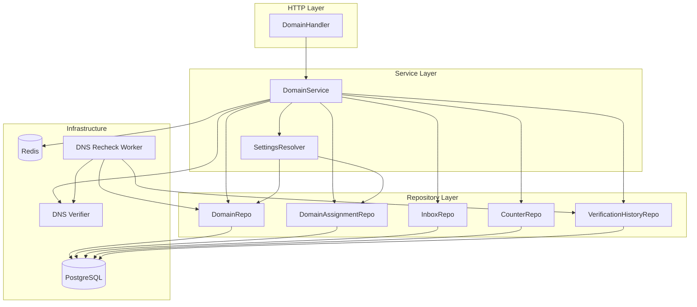
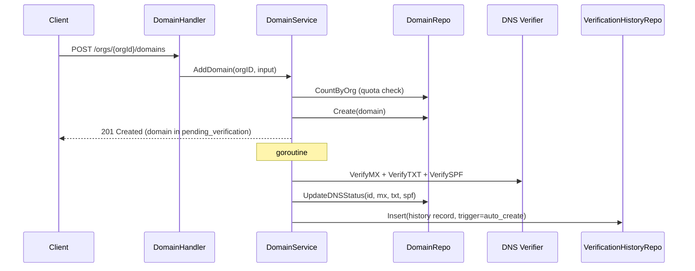
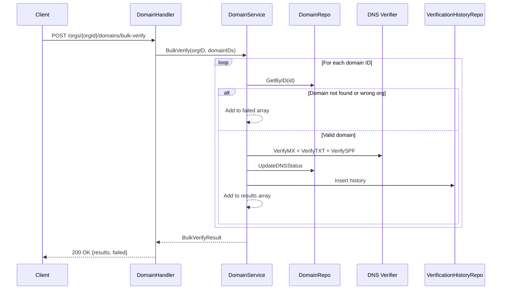
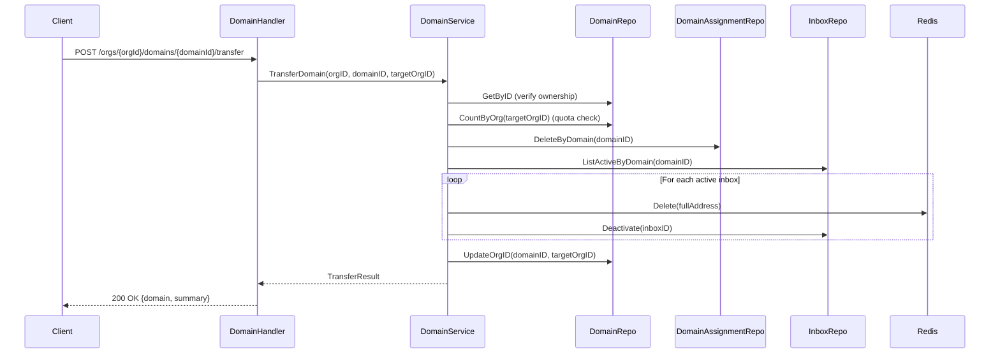

# Design Document: Enhanced Domains

## Overview

This design extends the BurnerByte domain management system with comprehensive search/filtering, extended settings cascade, computed status fields, domain descriptions, enriched impact checks, auto-verification on create, bulk operations, inter-org domain transfer, SPF record verification, verification history logging, enriched detail responses, and domain-level analytics.

The existing domain system provides basic CRUD, MX/TXT DNS verification, a single `attachments_enabled` setting, and a background DNS recheck worker. This enhancement builds on that foundation across all layers: domain model, repository, service, handler, DNS verifier, settings resolver, background workers, and database migrations.

### Key Design Decisions

1. **Computed status field** — The `status` field is derived at the service layer from `mx_verified`, `txt_verified`, and `dns_last_checked_at` rather than stored in the database. This avoids data inconsistency between the status and the underlying booleans.

2. **Async auto-verify** — DNS verification on domain creation runs in a goroutine to avoid blocking the HTTP response. Failures are logged and the domain remains in `pending_verification` status.

3. **SPF as informational** — SPF verification is stored and returned but does not affect the computed `status` field. This keeps the existing verified/pending/failed semantics stable while adding deliverability monitoring.

4. **Verification history** — A separate `domain_verification_history` table records every DNS check attempt. This provides an audit trail for debugging DNS configuration issues without bloating the domains table.

5. **Bulk operation cap** — Bulk verify and bulk delete are capped at 50 domain IDs per request to prevent abuse and keep response times predictable.

6. **Domain transfer** — Transfer is a system-admin-only operation that atomically moves a domain between orgs, cleaning up assignments and deactivating inboxes since those belong to the source org's context.

7. **Trigram search** — Domain name search uses PostgreSQL's `pg_trgm` extension with a GIN index for efficient case-insensitive substring matching.

## Architecture



### Request Flow: Domain Creation with Auto-Verify



### Request Flow: Bulk Verify



### Request Flow: Domain Transfer



## Components and Interfaces

### 1. Domain Model (`internal/domain/domain.go`)

Extended domain struct and input types:

```go
type Domain struct {
    ID                  uuid.UUID      `json:"id"`
    OrgID               uuid.UUID      `json:"org_id"`
    DomainName          string         `json:"domain_name"`
    Description         string         `json:"description,omitempty"`
    MXVerified          bool           `json:"mx_verified"`
    TXTVerified         bool           `json:"txt_verified"`
    SPFVerified         bool           `json:"spf_verified"`
    Status              string         `json:"status"`
    VerificationRecord  string         `json:"verification_record"`
    DNSLastCheckedAt    *time.Time     `json:"dns_last_checked_at,omitempty"`
    Settings            DomainSettings `json:"settings"`
    CreatedAt           time.Time      `json:"created_at"`
    UpdatedAt           time.Time      `json:"updated_at"`
    // Joined counts
    ActiveInboxes       int `json:"active_inboxes"`
    TotalInboxes        int `json:"total_inboxes"`
    InboxesCreatedCount int `json:"inboxes_created_count"`
    TotalEmails         int `json:"total_emails"`
    TeamCount           int `json:"team_count"`
    EmailsReceivedCount int `json:"emails_received_count"`
    // Enriched detail (populated on GetDomain only)
    Assignments []DomainAssignmentSummary `json:"assignments,omitempty"`
}

type DomainSettings struct {
    AttachmentsEnabled  *string `json:"attachments_enabled,omitempty"`
    DefaultInboxTTL     *string `json:"default_inbox_ttl,omitempty"`
    MaxInboxTTL         *string `json:"max_inbox_ttl,omitempty"`
    MaxInboxesPerDomain *int    `json:"max_inboxes_per_domain,omitempty"`
}

type DomainAssignmentSummary struct {
    TeamID      uuid.UUID `json:"team_id"`
    TeamName    string    `json:"team_name"`
    AccessLevel string    `json:"access_level"`
}

type CreateDomainInput struct {
    DomainName  string `json:"domain_name"`
    Description string `json:"description,omitempty"`
}

type UpdateDomainInput struct {
    Description *string         `json:"description,omitempty"`
    Settings    *DomainSettings `json:"settings,omitempty"`
}

type DomainListFilter struct {
    Search string
    Status string
}

type VerificationHistory struct {
    ID            uuid.UUID  `json:"id"`
    DomainID      uuid.UUID  `json:"domain_id"`
    CheckedAt     time.Time  `json:"checked_at"`
    MXResult      bool       `json:"mx_result"`
    TXTResult     bool       `json:"txt_result"`
    SPFResult     bool       `json:"spf_result"`
    TriggerSource string     `json:"trigger_source"`
    ErrorDetails  *string    `json:"error_details,omitempty"`
}

type BulkDomainRequest struct {
    DomainIDs []uuid.UUID `json:"domain_ids"`
    Force     bool        `json:"force,omitempty"`
}

type BulkVerifyResult struct {
    Results []BulkVerifyItem `json:"results"`
    Failed  []BulkFailItem   `json:"failed"`
}

type BulkVerifyItem struct {
    DomainID    uuid.UUID `json:"domain_id"`
    DomainName  string    `json:"domain_name"`
    MXVerified  bool      `json:"mx_verified"`
    TXTVerified bool      `json:"txt_verified"`
    SPFVerified bool      `json:"spf_verified"`
    Status      string    `json:"status"`
}

type BulkFailItem struct {
    DomainID uuid.UUID `json:"domain_id"`
    Reason   string    `json:"reason"`
}

type BulkDeleteResult struct {
    DeletedCount int            `json:"deleted_count"`
    Skipped      []BulkFailItem `json:"skipped"`
    Failed       []BulkFailItem `json:"failed"`
}

type TransferDomainInput struct {
    TargetOrgID uuid.UUID `json:"target_org_id"`
}

type TransferResult struct {
    Domain                   *Domain `json:"domain"`
    RemovedAssignmentsCount  int     `json:"removed_assignments_count"`
    DeactivatedInboxesCount  int     `json:"deactivated_inboxes_count"`
}
```

### 2. DNS Verifier (`internal/dns/verifier.go`)

New `VerifySPF` function:

```go
// VerifySPF checks if the domain has a TXT record starting with "v=spf1"
// that includes the expected hostname.
func VerifySPF(domainName, expectedHost string) (bool, error) {
    records, err := net.LookupTXT(domainName)
    if err != nil {
        return false, fmt.Errorf("spf lookup: %w", err)
    }
    for _, txt := range records {
        if strings.HasPrefix(txt, "v=spf1") && strings.Contains(txt, expectedHost) {
            return true, nil
        }
    }
    return false, nil
}
```

### 3. Domain Repository (`internal/repository/postgres/domain_repo.go`)

Extended methods:

| Method | Description |
|--------|-------------|
| `ListByOrgFiltered(ctx, orgID, filter, page, perPage)` | List with search/status filter and pagination |
| `GetByIDEnriched(ctx, id)` | Get domain with total_inboxes, total_emails, assignments |
| `UpdateDNSStatus(ctx, id, mx, txt, spf)` | Updated to include SPF |
| `UpdateOrgID(ctx, id, newOrgID)` | Transfer domain to new org |
| `DeleteAssignmentsByDomain(ctx, domainID)` | Remove all assignments for a domain |
| `DeactivateInboxesByDomain(ctx, domainID)` | Set is_active=false for all active inboxes |
| `ListActiveAddressesByDomain(ctx, domainID)` | Existing — used for Redis cleanup |
| `CountActiveByDomain(ctx, domainID)` | Count active inboxes for a domain |

### 4. Verification History Repository (`internal/repository/postgres/verification_history_repo.go`)

New repository:

| Method | Description |
|--------|-------------|
| `Create(ctx, record)` | Insert a verification history record |
| `ListByDomain(ctx, domainID, page, perPage)` | Paginated history for a domain |

### 5. Domain Service (`internal/service/domain_service.go`)

Extended and new methods:

| Method | Description |
|--------|-------------|
| `AddDomain` | Extended: accepts description, triggers async auto-verify |
| `GetDomain` | Extended: computes status, returns enriched detail |
| `ListByOrg` | Extended: accepts DomainListFilter for search/status |
| `UpdateDomain` | Extended: validates new settings fields, description |
| `DeleteDomain` | Unchanged |
| `TriggerVerify` | Extended: includes SPF, records verification history |
| `BulkVerify(ctx, orgID, domainIDs)` | New: verify multiple domains |
| `BulkDelete(ctx, orgID, domainIDs, force)` | New: delete multiple domains |
| `TransferDomain(ctx, orgID, domainID, targetOrgID)` | New: transfer domain between orgs |
| `GetVerificationHistory(ctx, orgID, domainID, page, perPage)` | New: paginated history |
| `ComputeStatus(d *Domain) string` | New: pure function computing status from booleans |

### 6. Settings Resolver (`internal/service/settings_resolver.go`)

Extended cascade methods:

| Method | Description |
|--------|-------------|
| `ResolveDefaultInboxTTL` | Extended: includes domain level in cascade |
| `ResolveMaxInboxTTL` | Extended: includes domain level in cascade |
| `ResolveMaxInboxesPerDomain` | New: assignment → domain → org → system default |

The updated cascade for `ResolveDefaultInboxTTL`:
1. Team settings (if provided)
2. Domain settings (`default_inbox_ttl`)
3. Org settings
4. System default

The updated cascade for `ResolveMaxInboxTTL`:
1. Assignment settings (`max_inbox_ttl`)
2. Domain settings (`max_inbox_ttl`)
3. Org settings
4. System default

### 7. Domain Handler (`internal/handler/domain.go`)

Extended and new endpoints:

| Endpoint | Method | Handler | Role |
|----------|--------|---------|------|
| `/orgs/{orgId}/domains` | GET | `ListDomains` | OrgMember |
| `/orgs/{orgId}/domains` | POST | `CreateDomain` | OrgAdmin |
| `/orgs/{orgId}/domains/{domainId}` | GET | `GetDomain` | OrgMember |
| `/orgs/{orgId}/domains/{domainId}` | PATCH | `UpdateDomain` | OrgAdmin |
| `/orgs/{orgId}/domains/{domainId}` | DELETE | `DeleteDomain` | OrgAdmin |
| `/orgs/{orgId}/domains/{domainId}/verify` | POST | `VerifyDomain` | OrgAdmin |
| `/orgs/{orgId}/domains/{domainId}/impact` | GET | `GetDomainImpact` | OrgAdmin |
| `/orgs/{orgId}/domains/{domainId}/verification-history` | GET | `GetVerificationHistory` | OrgAdmin |
| `/orgs/{orgId}/domains/{domainId}/transfer` | POST | `TransferDomain` | SystemAdmin |
| `/orgs/{orgId}/domains/bulk-verify` | POST | `BulkVerify` | OrgAdmin |
| `/orgs/{orgId}/domains/bulk-delete` | POST | `BulkDelete` | OrgAdmin |

### 8. DNS Recheck Worker (`internal/worker/dns_recheck.go`)

Extended to:
- Check SPF records alongside MX and TXT
- Record verification history with `trigger_source = "background"`
- Accept `VerificationHistoryRepo` as a dependency

### 9. Database Migration (`migrations/000034_enhanced_domains`)

See Data Models section for full schema.

## Data Models

### Modified Table: `domains`

New columns added to the existing `domains` table:

```sql
ALTER TABLE domains ADD COLUMN description TEXT;
ALTER TABLE domains ADD COLUMN spf_verified BOOLEAN NOT NULL DEFAULT FALSE;
```

New index for trigram search:

```sql
CREATE EXTENSION IF NOT EXISTS pg_trgm;
CREATE INDEX idx_domains_name_trgm ON domains USING GIN (domain_name gin_trgm_ops);
```

### New Table: `domain_verification_history`

```sql
CREATE TABLE domain_verification_history (
    id              UUID PRIMARY KEY DEFAULT gen_random_uuid(),
    domain_id       UUID NOT NULL REFERENCES domains(id) ON DELETE CASCADE,
    checked_at      TIMESTAMPTZ NOT NULL DEFAULT NOW(),
    mx_result       BOOLEAN NOT NULL,
    txt_result      BOOLEAN NOT NULL,
    spf_result      BOOLEAN NOT NULL,
    trigger_source  VARCHAR(20) NOT NULL,  -- 'manual', 'auto_create', 'background'
    error_details   TEXT
);

CREATE INDEX idx_verification_history_domain_time
    ON domain_verification_history(domain_id, checked_at DESC);
```

### Domain Settings JSONB Schema

The `settings` JSONB column on `domains` now supports:

```json
{
    "attachments_enabled": "inherit|enabled|disabled",
    "default_inbox_ttl": "1h",
    "max_inbox_ttl": "24h",
    "max_inboxes_per_domain": 100
}
```

### Settings Cascade Resolution Order

For `default_inbox_ttl`:
```
team.settings.default_inbox_ttl
  → domain.settings.default_inbox_ttl
    → org.settings.default_inbox_ttl
      → config.defaults.default_inbox_ttl
```

For `max_inbox_ttl`:
```
assignment.settings.max_inbox_ttl
  → domain.settings.max_inbox_ttl
    → org.settings.max_inbox_ttl
      → config.defaults.max_inbox_ttl
```

For `max_inboxes_per_domain`:
```
domain.settings.max_inboxes_per_domain
  → org.settings.max_inboxes_per_domain
    → config.defaults.max_inboxes_per_domain
```

### Domain Status Computation

```
if mx_verified AND txt_verified → "verified"
if NOT mx_verified AND NOT txt_verified AND dns_last_checked_at IS NULL → "pending_verification"
if (mx_verified XOR txt_verified) → "partially_verified"
if NOT mx_verified AND NOT txt_verified AND dns_last_checked_at IS NOT NULL → "failed"
```

### Enriched GetDomain Response Shape

```json
{
    "id": "uuid",
    "org_id": "uuid",
    "domain_name": "example.com",
    "description": "Production email domain",
    "mx_verified": true,
    "txt_verified": true,
    "spf_verified": true,
    "status": "verified",
    "verification_record": "burnerbyte-verify=uuid",
    "mx_target": "mail.burnerbyte.com",
    "dns_last_checked_at": "2025-01-01T00:00:00Z",
    "settings": {
        "attachments_enabled": "inherit",
        "default_inbox_ttl": "1h",
        "max_inbox_ttl": "24h",
        "max_inboxes_per_domain": 100
    },
    "active_inboxes": 5,
    "total_inboxes": 42,
    "inboxes_created_count": 150,
    "total_emails": 1234,
    "team_count": 3,
    "emails_received_count": 5678,
    "assignments": [
        {"team_id": "uuid", "team_name": "Engineering", "access_level": "full"},
        {"team_id": "uuid", "team_name": "QA", "access_level": "create_inbox"}
    ],
    "created_at": "2025-01-01T00:00:00Z",
    "updated_at": "2025-01-01T00:00:00Z"
}
```


## Correctness Properties

*A property is a characteristic or behavior that should hold true across all valid executions of a system — essentially, a formal statement about what the system should do. Properties serve as the bridge between human-readable specifications and machine-verifiable correctness guarantees.*

### Property 1: Domain status computation is deterministic and correct

*For any* combination of `mx_verified` (bool), `txt_verified` (bool), `spf_verified` (bool), and `dns_last_checked_at` (*time.Time, possibly nil), the `ComputeStatus` function SHALL return:
- `"verified"` when both `mx_verified` and `txt_verified` are true
- `"pending_verification"` when both are false and `dns_last_checked_at` is nil
- `"partially_verified"` when exactly one of `mx_verified` or `txt_verified` is true
- `"failed"` when both are false and `dns_last_checked_at` is not nil

The `spf_verified` value SHALL NOT affect the computed status.

**Validates: Requirements 3.1, 3.2, 3.3, 3.4, 9.6**

### Property 2: Status filter returns exactly matching domains

*For any* set of domains with random verification states and *for any* valid status filter value (`verified`, `pending_verification`, `partially_verified`, `failed`), the filtered result set SHALL contain exactly those domains whose computed status matches the filter value — no more, no less.

**Validates: Requirements 1.2, 1.3, 1.4, 1.5**

### Property 3: Search filter returns only matching domains

*For any* set of domains and *for any* search term, every domain in the filtered result SHALL have a `domain_name` that contains the search term (case-insensitive), and every domain in the original set whose name contains the search term SHALL appear in the result.

**Validates: Requirements 1.1**

### Property 4: Combined search and status filter equals intersection

*For any* set of domains, *for any* search term, and *for any* valid status filter value, the result of applying both filters simultaneously SHALL equal the intersection of applying each filter independently.

**Validates: Requirements 1.6**

### Property 5: Duration string validation matches Go's time.ParseDuration

*For any* string, the domain settings validation for `default_inbox_ttl` and `max_inbox_ttl` SHALL accept the string if and only if `time.ParseDuration` succeeds on it.

**Validates: Requirements 2.4, 2.5**

### Property 6: Default TTL cannot exceed max TTL

*For any* pair of valid duration strings where the parsed `default_inbox_ttl` exceeds the resolved `max_inbox_ttl`, the domain settings update SHALL return a validation error. Conversely, when `default_inbox_ttl` does not exceed `max_inbox_ttl`, the update SHALL succeed (assuming all other validations pass).

**Validates: Requirements 2.7**

### Property 7: Settings cascade returns first non-nil value in priority order

*For any* cascade configuration (assignment settings, domain settings, org settings, system default) for `default_inbox_ttl`, `max_inbox_ttl`, and `max_inboxes_per_domain`, the resolver SHALL return the value from the highest-priority level that has a non-nil value. If all levels are nil/unset, the system default SHALL be returned.

**Validates: Requirements 2.8, 2.9, 2.10**

### Property 8: Description length validation

*For any* string of length greater than 1000 characters, the domain service SHALL reject it as a description. *For any* string of length 1000 or fewer characters, the domain service SHALL accept it as a valid description.

**Validates: Requirements 4.5**

## Error Handling

### Input Validation Errors (HTTP 400)

| Scenario | Error Message |
|----------|---------------|
| Empty domain name | `"domain_name is required"` |
| Invalid domain name format | `"invalid domain name format"` |
| Private/internal domain | `"cannot add private/internal domain"` |
| Invalid status filter value | `"invalid status filter: must be verified, pending_verification, partially_verified, or failed"` |
| Invalid duration string for TTL settings | `"invalid default_inbox_ttl duration"` / `"invalid max_inbox_ttl duration"` |
| Non-positive max_inboxes_per_domain | `"max_inboxes_per_domain must be a positive integer"` |
| Default TTL exceeds max TTL | `"default_inbox_ttl exceeds max_inbox_ttl"` |
| Description exceeds 1000 chars | `"description must not exceed 1000 characters"` |
| Bulk operation exceeds 50 IDs | `"bulk operation limited to 50 domain IDs"` |
| Empty domain_ids array | `"domain_ids is required"` |
| Invalid target_org_id | `"invalid target_org_id"` |

### Authorization Errors (HTTP 403)

| Scenario | Error Message |
|----------|---------------|
| Non-admin attempts domain create/update/delete | `"forbidden: insufficient permissions"` |
| Non-system-admin attempts transfer | `"forbidden: system admin required"` |

### Not Found Errors (HTTP 404)

| Scenario | Error Message |
|----------|---------------|
| Domain not found or wrong org | `"domain not found"` |
| Target org not found (transfer) | `"target organization not found"` |

### Conflict Errors (HTTP 409)

| Scenario | Error Message |
|----------|---------------|
| Domain name already registered | `"domain already registered"` |
| Domain has active inboxes (delete without force) | `"domain has active inboxes"` with `active_inboxes` count |

### Quota Errors (HTTP 400)

| Scenario | Error Message |
|----------|---------------|
| Org domain limit reached | `"domain limit reached (N)"` |
| Target org domain limit reached (transfer) | `"target organization domain limit reached (N)"` |

### Async Error Handling

- DNS verification failures during auto-verify on create are logged at `slog.Error` level with domain ID and error details
- The domain remains in `pending_verification` status
- A verification history record is created with `error_details` populated
- No error is returned to the client (the create response has already been sent)

### Bulk Operation Error Handling

- Each domain in a bulk operation is processed independently
- Failures for individual domains do not abort the entire operation
- Failed domains are collected in a `failed` array with the domain ID and reason
- Skipped domains (e.g., active inboxes without force) are collected in a `skipped` array
- The response always includes the full results, failed, and skipped arrays

## Testing Strategy

### Property-Based Tests (using `pgregory.net/rapid`)

The project uses Go with the `rapid` library for property-based testing. Each property test runs a minimum of 100 iterations.

| Test | Property | Min Iterations |
|------|----------|----------------|
| `TestProperty_ComputeStatus` | Property 1: Status computation | 100 |
| `TestProperty_StatusFilter` | Property 2: Status filter correctness | 100 |
| `TestProperty_SearchFilter` | Property 3: Search filter correctness | 100 |
| `TestProperty_CombinedFilter` | Property 4: Combined filter = intersection | 100 |
| `TestProperty_DurationValidation` | Property 5: Duration validation | 100 |
| `TestProperty_DefaultTTLNotExceedMax` | Property 6: Default TTL ≤ Max TTL | 100 |
| `TestProperty_SettingsCascade` | Property 7: Cascade resolution | 100 |
| `TestProperty_DescriptionLength` | Property 8: Description length | 100 |

Each test is tagged with: `Feature: enhanced-domains, Property N: <property_text>`

### Unit Tests (example-based)

| Test | Validates |
|------|-----------|
| `TestAddDomain_WithDescription` | Req 4.2 |
| `TestUpdateDomain_Description` | Req 4.3 |
| `TestUpdateDomain_NewSettings` | Req 2.1, 2.2, 2.3 |
| `TestUpdateDomain_InvalidMaxInboxes` | Req 2.6 |
| `TestCreateDomain_AutoVerifyFailure` | Req 6.4 |
| `TestBulkVerify_MixedResults` | Req 7.1, 7.2 |
| `TestBulkDelete_ActiveInboxesSkipped` | Req 7.5 |
| `TestBulkDelete_WithForce` | Req 7.5 |
| `TestBulkOperation_ExceedsLimit` | Req 7.8 |
| `TestTransfer_TargetOrgNotFound` | Req 8.2 |
| `TestTransfer_TargetOrgFull` | Req 8.2 |
| `TestVerifySPF_ValidRecord` | Req 9.1 |
| `TestVerifySPF_NoRecord` | Req 9.1 |
| `TestVerifySPF_WrongHost` | Req 9.1 |
| `TestGetDomain_EnrichedResponse` | Req 11.1, 11.2, 11.3 |
| `TestGetDomain_AnalyticsZeroDefault` | Req 12.3 |

### Integration Tests

| Test | Validates |
|------|-----------|
| `TestListDomains_PaginationWithFilters` | Req 1.7 |
| `TestAutoVerify_UpdatesDNSFields` | Req 6.1, 6.2, 6.3 |
| `TestTransferDomain_FullFlow` | Req 8.1, 8.3, 8.4, 8.5, 8.6, 8.8, 8.9 |
| `TestVerificationHistory_InsertAndList` | Req 10.2, 10.3, 10.4 |
| `TestImpactEndpoint_AllFields` | Req 5.1-5.6 |
| `TestEnrichedDetail_Counts` | Req 11.4, 11.5, 11.6 |
| `TestDomainAnalytics_Counter` | Req 12.1, 12.2 |

### Migration Tests

| Test | Validates |
|------|-----------|
| `TestMigration034_UpDown` | Req 13.1-13.5 |
