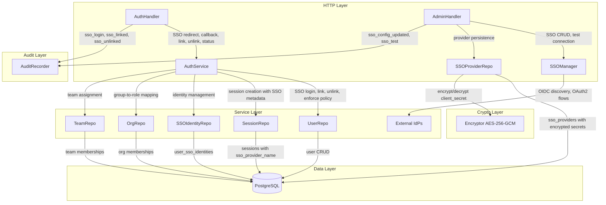
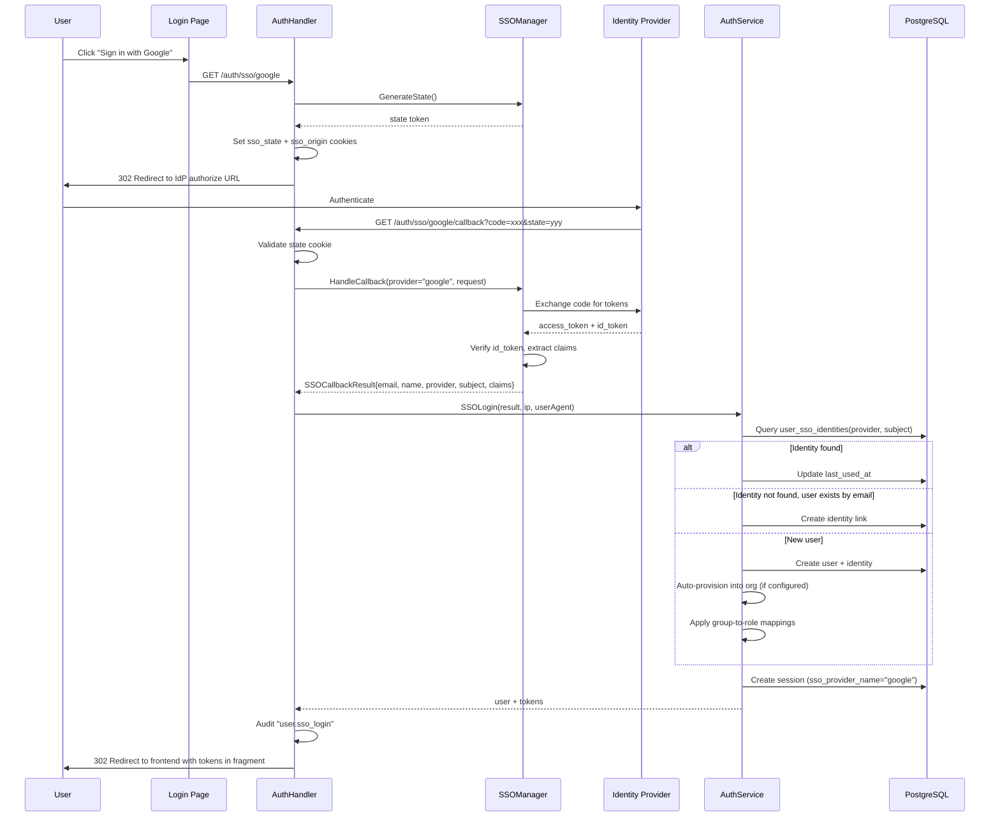
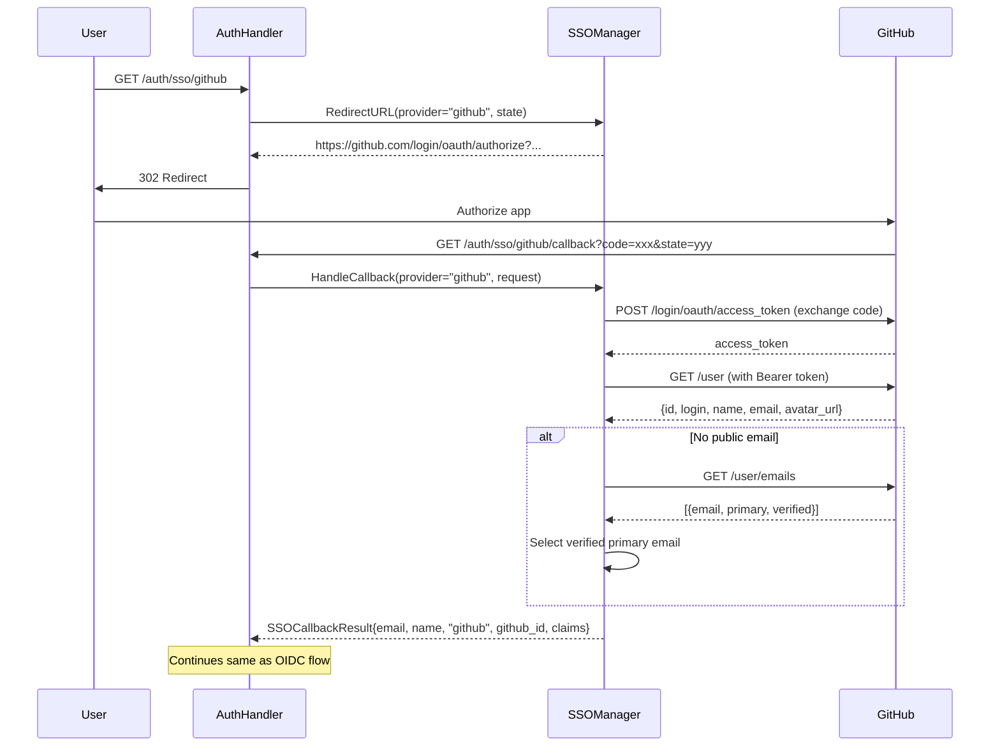
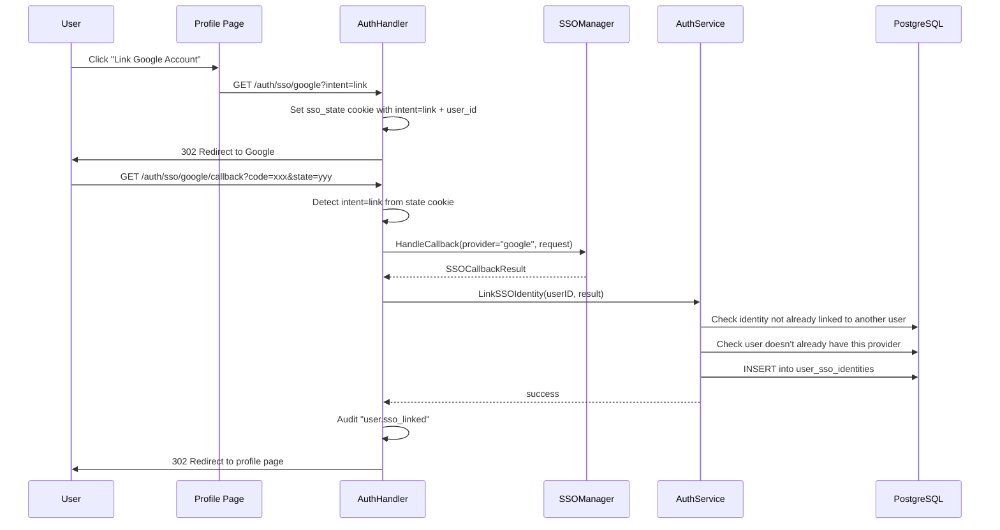

# Design Document: Enhanced SSO

## Overview

This design transforms BurnerByte's SSO subsystem from a single-provider OIDC-only implementation into a production-grade, multi-provider authentication platform. The current implementation (`internal/auth/sso.go`) has several critical gaps: GitHub SSO is broken (it points at the GitHub Actions OIDC token endpoint instead of the OAuth2 authorization endpoint), only one provider can be active at a time, there is no account linking/unlinking UI, no connection testing, no IdP group-to-role mapping, and SSO configuration is stored only in the YAML config file.

The enhanced system delivers:

- **GitHub OAuth2 fix**: Dedicated OAuth2 flow for GitHub using the correct authorization, token exchange, and user API endpoints — no OIDC discovery required.
- **Multi-provider support**: Multiple SSO providers configured simultaneously via the `sso_providers` database table, each with independent credentials, claim mappings, and enabled/disabled state.
- **Account linking/unlinking**: Users can link and unlink SSO identities from their profile page, with safety checks (must have a password before unlinking, enforce_sso blocks unlinking).
- **SSO connection testing**: Admins can dry-run validate provider configurations (discovery endpoint reachability, credential validity) before going live.
- **IdP group-to-role mapping**: Claim mapping rules stored as JSONB on each provider, mapping IdP group/role claims to BurnerByte org roles and team memberships.
- **Enhanced claim extraction**: Standard OIDC claims (picture, given_name, family_name, locale) plus configurable custom claims.
- **Comprehensive audit trail**: Dedicated audit events for SSO login, login failure, link, unlink, config changes, connection tests, and enforce_sso denials.
- **Session SSO metadata**: Sessions record which SSO provider was used, displayed in the sessions list.
- **Database-backed configuration**: `sso_providers` table with encrypted client secrets, merged with file-based config at startup.
- **Enhanced enforce_sso policy**: Granular enforcement that blocks password login only for users with linked SSO identities.
- **Frontend overhaul**: Multi-provider SSO buttons on login/register, Connected Accounts section on profile, and a comprehensive admin SSO dashboard.

### Key Design Decisions

1. **Separate OAuth2 path for GitHub**: GitHub does not support OIDC discovery. Rather than forcing it through the OIDC code path (which is the current broken behavior), the SSO Manager uses a dedicated `handleGitHubCallback` method that exchanges the code at GitHub's token endpoint and fetches user info from the GitHub User API. This keeps the OIDC path clean for providers that support it.

2. **`user_sso_identities` table for multi-provider**: Instead of the current single `sso_provider`/`sso_subject` columns on the users table, a new junction table allows multiple identities per user. The old columns are retained (deprecated) for backward compatibility and populated by the migration.

3. **`sso_providers` table for configuration**: Provider configs are stored in a dedicated table rather than the existing `system_configs` key-value store. This gives us proper relational structure, per-provider CRUD, and the ability to query linked user counts per provider. Client secrets are encrypted at rest using the existing `internal/crypto/encryptor.go` AES-256-GCM encryptor.

4. **Database config takes precedence over file config**: When both exist for the same provider name, the database configuration wins. File-based config serves as a bootstrap mechanism for initial setup.

5. **Link intent via state cookie**: The SSO linking flow reuses the existing redirect/callback infrastructure but adds a `link` intent and the authenticated user's ID to the state cookie. This avoids creating new endpoints for the OAuth2 redirect while clearly distinguishing login from linking in the callback handler.

6. **Claim mappings as JSONB on sso_providers**: Each provider stores its own claim mapping rules as a JSONB array, keeping the mapping tightly coupled to the provider that produces the claims. This avoids a separate mapping table and simplifies the admin UI.

7. **Migration 000035**: A single migration creates both new tables (`sso_providers`, `user_sso_identities`), migrates existing SSO data, and adds the `sso_provider_name` column to sessions.

## Architecture



### SSO Login Flow (OIDC Provider)



### SSO Login Flow (GitHub OAuth2)



### Account Linking Flow



## Components and Interfaces

### Domain Model Changes

#### New: `internal/domain/sso.go`

```go
// SSOIdentity represents a user's linked SSO identity.
type SSOIdentity struct {
    ID          uuid.UUID  `json:"id"`
    UserID      uuid.UUID  `json:"user_id"`
    Provider    string     `json:"provider"`
    Subject     string     `json:"subject"`
    Email       string     `json:"email"`
    DisplayName string     `json:"display_name"`
    Metadata    any        `json:"metadata,omitempty"`
    LinkedAt    time.Time  `json:"linked_at"`
    LastUsedAt  time.Time  `json:"last_used_at"`
}

// SSOProvider represents a configured SSO provider stored in the database.
type SSOProvider struct {
    ID                   uuid.UUID       `json:"id"`
    Name                 string          `json:"name"`
    ProviderType         string          `json:"provider_type"` // "google", "github", "azure", "okta", "oidc"
    ClientID             string          `json:"client_id"`
    ClientSecretEncrypted string         `json:"-"`
    ClientSecret         string          `json:"client_secret,omitempty"` // only for input; masked on output
    RedirectURL          string          `json:"redirect_url"`
    IssuerURL            string          `json:"issuer_url,omitempty"`
    TenantID             string          `json:"tenant_id,omitempty"`
    AutoProvision        bool            `json:"auto_provision"`
    DefaultOrgRole       string          `json:"default_org_role,omitempty"`
    DefaultTeamRole      string          `json:"default_team_role,omitempty"`
    AllowedDomains       string          `json:"allowed_domains,omitempty"`
    ClaimMappings        []ClaimMapping  `json:"claim_mappings,omitempty"`
    CustomClaims         []string        `json:"custom_claims,omitempty"`
    Enabled              bool            `json:"enabled"`
    LinkedUserCount      int             `json:"linked_user_count,omitempty"` // computed on read
    CreatedAt            time.Time       `json:"created_at"`
    UpdatedAt            time.Time       `json:"updated_at"`
}

// ClaimMapping maps an IdP claim value to a BurnerByte role/team assignment.
type ClaimMapping struct {
    ClaimName    string `json:"claim_name"`    // e.g., "groups", "roles"
    ClaimValue   string `json:"claim_value"`   // e.g., "engineering", "admin"
    OrgRole      string `json:"org_role"`       // e.g., "admin", "member"
    TeamID       string `json:"team_id,omitempty"`
    TeamRole     string `json:"team_role,omitempty"` // e.g., "lead", "member"
}

// SSOCallbackResult holds the extracted data from an SSO callback.
type SSOCallbackResult struct {
    Email        string            `json:"email"`
    DisplayName  string            `json:"display_name"`
    Provider     string            `json:"provider"`
    Subject      string            `json:"subject"`
    AvatarURL    string            `json:"avatar_url,omitempty"`
    Claims       map[string]any    `json:"claims,omitempty"`
}

// SSOTestResult holds the result of an SSO connection test.
type SSOTestResult struct {
    Success      bool   `json:"success"`
    Endpoint     string `json:"endpoint"`
    StatusCode   int    `json:"status_code,omitempty"`
    Message      string `json:"message"`
    ResponseTime string `json:"response_time"`
}

// SSOStatusResponse is returned by the SSO status endpoint.
type SSOStatusResponse struct {
    Enabled            bool              `json:"enabled"`
    AllowRegistration  bool              `json:"allow_registration"`
    EnforceSSO         bool              `json:"enforce_sso"`
    Providers          []SSOStatusProvider `json:"providers"`
    PasswordPolicy     any               `json:"password_policy"`
}

// SSOStatusProvider is a public-facing summary of a configured provider.
type SSOStatusProvider struct {
    Name          string `json:"name"`
    ProviderType  string `json:"provider_type"`
    Label         string `json:"label"`
    Enabled       bool   `json:"enabled"`
}
```

#### Updated: `internal/domain/user.go`

The `Session` struct gains an SSO provider field:

```go
type Session struct {
    // ... existing fields ...
    SSOProviderName *string `json:"sso_provider_name,omitempty"`
}
```

### SSO Manager Changes (`internal/auth/sso.go`)

The SSOManager is refactored from a single-provider model to a multi-provider registry.

```go
type SSOManager struct {
    cfg       *config.Config
    encryptor *crypto.Encryptor
    providers map[string]*providerState // keyed by provider name
    mu        sync.RWMutex
}

type providerState struct {
    config   domain.SSOProvider
    oidcProv *oidc.Provider
    verifier *oidc.IDTokenVerifier
    oauth    *oauth2.Config
}
```

Key method changes:

| Method | Description |
|--------|-------------|
| `NewSSOManager(cfg, encryptor)` | Updated constructor accepting encryptor |
| `LoadProviders(ctx, providers []domain.SSOProvider)` | New — initializes provider states from DB + file config |
| `IsConfigured() bool` | Updated — returns true if any provider is enabled |
| `IsProviderConfigured(name string) bool` | New — checks specific provider |
| `ListProviders() []domain.SSOStatusProvider` | New — returns public provider list for status endpoint |
| `RedirectURL(ctx, providerName, state) (string, error)` | Updated — accepts provider name |
| `HandleCallback(ctx, providerName, r) (*domain.SSOCallbackResult, error)` | Updated — dispatches to OIDC or GitHub handler based on provider type |
| `handleOIDCCallback(ctx, ps, r) (*domain.SSOCallbackResult, error)` | New — extracted OIDC-specific callback logic |
| `handleGitHubCallback(ctx, ps, r) (*domain.SSOCallbackResult, error)` | New — GitHub OAuth2 flow: token exchange → user API → emails API fallback |
| `TestConnection(ctx, provider domain.SSOProvider) (*domain.SSOTestResult, error)` | New — dry-run validation with 10s timeout |
| `extractClaims(idToken, customClaims) map[string]any` | New — extracts standard + custom claims |

### Repository Changes

#### New: `internal/repository/postgres/sso_provider_repo.go`

```go
type SSOProviderRepo struct {
    db        database.DBTX
    encryptor *crypto.Encryptor
}

func NewSSOProviderRepo(db database.DBTX, enc *crypto.Encryptor) *SSOProviderRepo
```

| Method | Description |
|--------|-------------|
| `Create(ctx, provider)` | Insert with encrypted client_secret |
| `GetByName(ctx, name) (*domain.SSOProvider, error)` | Fetch + decrypt secret |
| `GetByID(ctx, id) (*domain.SSOProvider, error)` | Fetch + decrypt secret |
| `List(ctx) ([]domain.SSOProvider, error)` | List all with decrypted secrets + linked user counts |
| `ListEnabled(ctx) ([]domain.SSOProvider, error)` | List enabled only |
| `Update(ctx, provider)` | Update with re-encrypted secret |
| `Delete(ctx, id)` | Hard delete |
| `CountLinkedUsers(ctx, providerName) (int, error)` | Count users linked to provider |

#### New: `internal/repository/postgres/sso_identity_repo.go`

```go
type SSOIdentityRepo struct {
    db database.DBTX
}

func NewSSOIdentityRepo(db database.DBTX) *SSOIdentityRepo
```

| Method | Description |
|--------|-------------|
| `Create(ctx, identity)` | Insert new identity link |
| `GetByProviderSubject(ctx, provider, subject) (*domain.SSOIdentity, error)` | Lookup by provider+subject |
| `ListByUser(ctx, userID) ([]domain.SSOIdentity, error)` | All identities for a user |
| `GetByUserAndProvider(ctx, userID, provider) (*domain.SSOIdentity, error)` | Check if user has provider linked |
| `Delete(ctx, userID, provider) error` | Remove identity link |
| `UpdateLastUsed(ctx, id) error` | Touch last_used_at |
| `MigrateFromUsers(ctx) (int, error)` | One-time migration helper (used by migration) |

#### Updated: `internal/repository/postgres/session_repo.go`

- `Create` updated to include `sso_provider_name` column
- `scanOne` and `ListByUser` updated to scan `sso_provider_name`

### Service Layer Changes (`internal/service/auth_service.go`)

New dependencies:

```go
type AuthService struct {
    // ... existing fields ...
    ssoIdentityRepo *postgres.SSOIdentityRepo
    ssoProviderRepo *postgres.SSOProviderRepo
    teamRepo        *postgres.TeamRepo
}
```

New and modified methods:

| Method | Description |
|--------|-------------|
| `SSOLogin(ctx, result, ip, userAgent)` | Refactored — uses `ssoIdentityRepo` for lookups, creates identity records, applies claim mappings, stores SSO provider on session |
| `LinkSSOIdentity(ctx, userID, result)` | New — links SSO identity to existing user with conflict checks |
| `UnlinkSSOIdentity(ctx, userID, provider)` | New — unlinks with password-required and enforce_sso checks |
| `GetSSOIdentities(ctx, userID) ([]domain.SSOIdentity, error)` | New — returns user's linked identities |
| `applyClaimMappings(ctx, userID, provider, claims)` | New — maps IdP group claims to org roles and team memberships |
| `Login(ctx, input, ip, userAgent)` | Updated — enhanced enforce_sso check: only blocks users with linked SSO identities |

### Handler Layer Changes

#### Updated: `internal/handler/auth.go`

New routes:

```
GET    /auth/sso/{provider}              → SSORedirect (updated for multi-provider)
GET    /auth/sso/{provider}/callback     → SSOCallback (updated for multi-provider + link intent)
GET    /auth/sso-status                  → SSOStatus (updated to return provider list)
DELETE /auth/me/sso/{provider}           → UnlinkSSO (new)
GET    /auth/me/sso                      → ListSSOIdentities (new)
```

The `SSORedirect` handler now:
1. Reads `intent` query param (empty = login, "link" = account linking)
2. Looks up provider config from the SSOManager by `{provider}` path param
3. Stores intent + user_id (if linking) in the state cookie

The `SSOCallback` handler now:
1. Reads intent from state cookie
2. If intent=link, calls `AuthService.LinkSSOIdentity` and redirects to profile
3. If intent=login (default), calls `AuthService.SSOLogin` as before

#### Updated: `internal/handler/admin.go`

New routes:

```
GET    /admin/sso/providers              → ListSSOProviders
POST   /admin/sso/providers              → CreateSSOProvider
GET    /admin/sso/providers/{providerId} → GetSSOProvider
PUT    /admin/sso/providers/{providerId} → UpdateSSOProvider
DELETE /admin/sso/providers/{providerId} → DeleteSSOProvider
POST   /admin/sso/test                   → TestSSOConnection
```

The existing `GET /admin/sso` and `PUT /admin/sso` endpoints are retained for backward compatibility but marked as deprecated. They operate on the first provider in the list.

### Frontend Changes

#### Login Page (`web/src/app/login/page.tsx`)

- `SSOStatus` response updated to include `providers[]` array
- Renders a separate SSO button for each enabled provider with provider-specific icons/labels
- Provider label mapping: Google → "Google", GitHub → "GitHub", Azure → "Microsoft", Okta → "Okta", OIDC → custom name

#### Register Page (`web/src/app/register/page.tsx`)

- Same multi-provider SSO button rendering as login page

#### Profile Page (`web/src/app/profile/page.tsx`)

New `ConnectedAccountsCard` component:
- Fetches `GET /auth/me/sso` for linked identities
- Fetches `GET /auth/sso-status` for available providers
- Shows linked providers with email, linked date, and "Unlink" button
- Shows unlinked but available providers with "Link Account" button
- Disables "Unlink" when user has no password or enforce_sso is active
- Hides password change section when user has no password hash

#### Settings Page (`web/src/app/settings/page.tsx`)

New `SSOProvidersTab` component (replaces existing `SSOCard`):
- Lists all configured providers as cards with status badge, type, linked user count
- "Add Provider" button opens a form dialog
- Provider form includes: name, type selector, client ID, client secret, redirect URL, provider-specific fields (tenant ID, issuer URL), auto-provision toggle, default roles, allowed domains
- Claim mapping editor within each provider card: table of rules with claim name, value pattern, org role, optional team + role
- "Test Connection" button per provider with inline result display
- Delete provider with confirmation dialog showing affected user count

### Audit Events

New audit actions added to `internal/audit/recorder.go`:

| Action | Category | Severity |
|--------|----------|----------|
| `user.sso_login` | auth | info | (already exists) |
| `user.sso_login_failed` | auth | warning | (new) |
| `user.sso_linked` | auth | info | (new) |
| `user.sso_unlinked` | auth | warning | (new) |
| `user.sso_enforced` | auth | warning | (new) |
| `admin.sso_config_updated` | admin | critical | (already exists) |
| `admin.sso_provider_created` | admin | critical | (new) |
| `admin.sso_provider_deleted` | admin | critical | (new) |
| `admin.sso_test` | admin | info | (new) |

## Data Models

### Migration 000035: Enhanced SSO

**Up migration** (`migrations/000035_enhanced_sso.up.sql`):

```sql
-- SSO provider configurations (multi-provider support)
CREATE TABLE sso_providers (
    id                    UUID PRIMARY KEY DEFAULT gen_random_uuid(),
    name                  VARCHAR(50) UNIQUE NOT NULL,
    provider_type         VARCHAR(20) NOT NULL, -- google, github, azure, okta, oidc
    client_id             VARCHAR(255) NOT NULL,
    client_secret_encrypted TEXT NOT NULL,
    redirect_url          TEXT NOT NULL,
    issuer_url            TEXT,
    tenant_id             VARCHAR(255),
    auto_provision        BOOLEAN NOT NULL DEFAULT FALSE,
    default_org_role      VARCHAR(50) DEFAULT 'member',
    default_team_role     VARCHAR(50) DEFAULT 'member',
    allowed_domains       TEXT,
    claim_mappings        JSONB DEFAULT '[]',
    custom_claims         JSONB DEFAULT '[]',
    enabled               BOOLEAN NOT NULL DEFAULT TRUE,
    created_at            TIMESTAMPTZ NOT NULL DEFAULT NOW(),
    updated_at            TIMESTAMPTZ NOT NULL DEFAULT NOW()
);

-- User SSO identities (multi-provider per user)
CREATE TABLE user_sso_identities (
    id            UUID PRIMARY KEY DEFAULT gen_random_uuid(),
    user_id       UUID NOT NULL REFERENCES users(id) ON DELETE CASCADE,
    provider      VARCHAR(50) NOT NULL,
    subject       VARCHAR(255) NOT NULL,
    email         VARCHAR(255),
    display_name  VARCHAR(255),
    metadata      JSONB DEFAULT '{}',
    linked_at     TIMESTAMPTZ NOT NULL DEFAULT NOW(),
    last_used_at  TIMESTAMPTZ NOT NULL DEFAULT NOW(),
    UNIQUE(provider, subject)
);

CREATE INDEX idx_user_sso_identities_user_id ON user_sso_identities(user_id);
CREATE INDEX idx_user_sso_identities_provider_subject ON user_sso_identities(provider, subject);

-- Migrate existing SSO data from users table to user_sso_identities
INSERT INTO user_sso_identities (id, user_id, provider, subject, email, display_name, linked_at, last_used_at)
SELECT gen_random_uuid(), u.id, u.sso_provider, u.sso_subject, u.email, u.display_name, u.created_at, u.updated_at
FROM users u
WHERE u.sso_provider IS NOT NULL AND u.sso_subject IS NOT NULL;

-- Add SSO provider name to sessions for session binding
ALTER TABLE sessions ADD COLUMN sso_provider_name VARCHAR(50);

-- Comment deprecated columns (cannot drop for backward compatibility)
COMMENT ON COLUMN users.sso_provider IS 'DEPRECATED: Use user_sso_identities table instead';
COMMENT ON COLUMN users.sso_subject IS 'DEPRECATED: Use user_sso_identities table instead';
```

**Down migration** (`migrations/000035_enhanced_sso.down.sql`):

```sql
-- Remove SSO provider name from sessions
ALTER TABLE sessions DROP COLUMN IF EXISTS sso_provider_name;

-- Remove deprecated column comments
COMMENT ON COLUMN users.sso_provider IS NULL;
COMMENT ON COLUMN users.sso_subject IS NULL;

-- Drop new tables
DROP TABLE IF EXISTS user_sso_identities;
DROP TABLE IF EXISTS sso_providers;
```

### Table Schemas

#### `sso_providers`

| Column | Type | Default | Description |
|--------|------|---------|-------------|
| id | UUID PK | gen_random_uuid() | Primary key |
| name | VARCHAR(50) UNIQUE | — | Provider display name / slug (e.g., "google", "github-corp") |
| provider_type | VARCHAR(20) | — | Protocol type: google, github, azure, okta, oidc |
| client_id | VARCHAR(255) | — | OAuth2 client ID |
| client_secret_encrypted | TEXT | — | AES-256-GCM encrypted client secret |
| redirect_url | TEXT | — | OAuth2 callback URL |
| issuer_url | TEXT | NULL | OIDC issuer URL (for okta, oidc types) |
| tenant_id | VARCHAR(255) | NULL | Azure AD tenant ID |
| auto_provision | BOOLEAN | FALSE | Auto-create user on first SSO login |
| default_org_role | VARCHAR(50) | 'member' | Role for auto-provisioned users |
| default_team_role | VARCHAR(50) | 'member' | Team role for auto-provisioned users |
| allowed_domains | TEXT | NULL | Comma-separated allowed email domains |
| claim_mappings | JSONB | '[]' | Array of ClaimMapping objects |
| custom_claims | JSONB | '[]' | Array of custom claim names to extract |
| enabled | BOOLEAN | TRUE | Whether provider is active |
| created_at | TIMESTAMPTZ | NOW() | Creation timestamp |
| updated_at | TIMESTAMPTZ | NOW() | Last update timestamp |

#### `user_sso_identities`

| Column | Type | Default | Description |
|--------|------|---------|-------------|
| id | UUID PK | gen_random_uuid() | Primary key |
| user_id | UUID FK→users | — | Owning user |
| provider | VARCHAR(50) | — | Provider name matching sso_providers.name |
| subject | VARCHAR(255) | — | IdP subject identifier |
| email | VARCHAR(255) | NULL | Email from IdP at link time |
| display_name | VARCHAR(255) | NULL | Display name from IdP at link time |
| metadata | JSONB | '{}' | Additional IdP claims/metadata |
| linked_at | TIMESTAMPTZ | NOW() | When identity was linked |
| last_used_at | TIMESTAMPTZ | NOW() | Last SSO login with this identity |

#### `sessions` (updated)

| Column | Type | Default | Description |
|--------|------|---------|-------------|
| sso_provider_name | VARCHAR(50) | NULL | SSO provider used for this session (NULL = password login) |

### Claim Mappings JSONB Schema

```json
[
    {
        "claim_name": "groups",
        "claim_value": "engineering",
        "org_role": "member",
        "team_id": "uuid-of-engineering-team",
        "team_role": "member"
    },
    {
        "claim_name": "groups",
        "claim_value": "platform-admins",
        "org_role": "admin",
        "team_id": null,
        "team_role": null
    }
]
```


## Correctness Properties

*A property is a characteristic or behavior that should hold true across all valid executions of a system — essentially, a formal statement about what the system should do. Properties serve as the bridge between human-readable specifications and machine-verifiable correctness guarantees.*

### Property 1: GitHub redirect URL uses correct OAuth2 endpoint

*For any* SSO provider configuration with provider_type="github" and any valid client_id and redirect_url, the generated authorization redirect URL SHALL start with `https://github.com/login/oauth/authorize` and never use the GitHub Actions OIDC token endpoint.

**Validates: Requirements 1.1**

### Property 2: GitHub callback extracts correct user fields

*For any* valid GitHub User API response containing id, login, name, and email fields, the SSO callback result SHALL have provider="github", subject equal to the string representation of the numeric GitHub user ID, email matching the API response email, and display_name matching the API response name (or login as fallback).

**Validates: Requirements 1.4**

### Property 3: Multi-provider redirect dispatches to correct provider

*For any* set of configured SSO providers and any provider name from that set, calling RedirectURL with that provider name SHALL return a URL corresponding to that provider's authorization endpoint, and calling RedirectURL with a name not in the set SHALL return an error.

**Validates: Requirements 2.2, 2.4**

### Property 4: SSO status returns all configured providers

*For any* list of SSO provider configurations with varying enabled states, the SSO status response SHALL contain exactly the same set of provider names with matching enabled flags and correct labels.

**Validates: Requirements 2.3**

### Property 5: SSO identity linking creates correct record

*For any* authenticated user and valid SSO callback result where no conflicts exist, calling LinkSSOIdentity SHALL create a record in user_sso_identities with the correct user_id, provider, subject, email, and display_name, and subsequently calling ListByUser SHALL include that identity.

**Validates: Requirements 3.2**

### Property 6: SSO identity linking detects conflicts

*For any* SSO identity (provider, subject) that is already linked to user A, attempting to link the same identity to user B SHALL return an error. Additionally, *for any* user who already has an identity linked for provider P, attempting to link a different identity from provider P SHALL return an error.

**Validates: Requirements 3.3, 3.4**

### Property 7: SSO unlink safety guards

*For any* user whose only authentication method is SSO (password_hash is nil), attempting to unlink their SSO identity SHALL be rejected. Additionally, *for any* user in an organization with enforce_sso enabled, attempting to unlink any SSO identity SHALL be rejected regardless of whether they have a password.

**Validates: Requirements 4.2, 4.6**

### Property 8: Claim extraction completeness

*For any* IdP token claim map and any set of configured custom claim names, the extracted claims SHALL include all standard claims (email, name, given_name, family_name, picture, locale) that are present in the token, plus all configured custom claims that are present in the token, and SHALL not include claims that are absent from the token.

**Validates: Requirements 6.2, 7.1, 7.5**

### Property 9: Claim mapping produces correct role assignments

*For any* set of claim mapping rules and any IdP token claims, the resulting role assignments SHALL match the mapping rules: each claim value that matches a rule SHALL produce the corresponding org role and optional team assignment, and claim values that match no rule SHALL result in the default org role being applied.

**Validates: Requirements 6.3, 6.4, 6.5**

### Property 10: Role assignments update on re-login with changed claims

*For any* user with existing role assignments from previous SSO login, when the user logs in again with different IdP group claims, the resulting role assignments SHALL reflect the new claims (not the old ones).

**Validates: Requirements 6.8**

### Property 11: Avatar set from picture claim only when user has no avatar

*For any* user and SSO callback result, the user's avatar_url SHALL be set to the picture claim value only when the user's current avatar_url is nil/empty AND the picture claim is present. If the user already has an avatar_url, it SHALL remain unchanged regardless of the picture claim.

**Validates: Requirements 7.2**

### Property 12: Display name construction from given_name and family_name

*For any* IdP token containing given_name and family_name claims but no name claim, the constructed display name SHALL equal the concatenation of given_name, a space, and family_name. When a name claim is present, it SHALL be used directly regardless of given_name/family_name.

**Validates: Requirements 7.3**

### Property 13: SSO sessions store provider metadata

*For any* session created via SSO login with provider P, the session record SHALL have sso_provider_name equal to P. *For any* session created via password login, sso_provider_name SHALL be nil.

**Validates: Requirements 9.1**

### Property 14: Client secret encryption round-trip

*For any* valid client secret string, encrypting it via the Encryptor, storing the ciphertext in sso_providers.client_secret_encrypted, and then reading and decrypting it SHALL produce the original client secret.

**Validates: Requirements 11.3**

### Property 15: Client secret masking on admin read

*For any* SSO provider configuration returned by the admin GET endpoint, the client_secret field SHALL always be "••••••••" regardless of the actual stored secret value.

**Validates: Requirements 11.4**

### Property 16: Enforce SSO login policy

*For any* user with at least one linked SSO identity in an organization with enforce_sso enabled, password login SHALL be rejected with an SSO redirect message. *For any* user with no linked SSO identities, password login SHALL be allowed regardless of the enforce_sso setting (assuming correct credentials).

**Validates: Requirements 12.1, 12.2**

### Property 17: Enforce SSO registration policy

*For any* organization with enforce_sso enabled, password-based registration attempts SHALL be rejected with a message directing users to authenticate via SSO.

**Validates: Requirements 12.5**

## Error Handling

### SSO Manager Errors

| Error Scenario | HTTP Status | Error Code | Message |
|---------------|-------------|------------|---------|
| Provider not configured | 404 | not_found | "SSO provider '{name}' not configured" |
| Provider disabled | 403 | forbidden | "SSO provider '{name}' is currently disabled" |
| OIDC discovery failure | 500 | internal_error | "Failed to discover OIDC configuration for {provider}" |
| Token exchange failure | 401 | unauthenticated | "SSO token exchange failed: {reason}" |
| ID token verification failure | 401 | unauthenticated | "SSO token verification failed: {reason}" |
| Missing email claim | 401 | unauthenticated | "Email claim missing from SSO token" |
| GitHub user API failure | 401 | unauthenticated | "Failed to retrieve GitHub user info: {reason}" |
| GitHub no verified email | 401 | unauthenticated | "No verified email found on GitHub account" |
| Invalid state parameter | 400 | validation_error | "Invalid state parameter" |
| Connection test timeout | 408 | error | "SSO connection test timed out after 10 seconds" |

### Account Linking Errors

| Error Scenario | HTTP Status | Error Code | Message |
|---------------|-------------|------------|---------|
| Identity already linked to another user | 409 | conflict | "This SSO identity is already linked to another account" |
| Provider already linked for user | 409 | conflict | "You already have a {provider} account linked" |
| Unlink without password | 400 | validation_error | "You must set a password before unlinking your SSO provider" |
| Unlink with enforce_sso | 403 | forbidden | "Cannot unlink SSO — your organization requires SSO authentication" |

### Enforce SSO Errors

| Error Scenario | HTTP Status | Error Code | Message |
|---------------|-------------|------------|---------|
| Password login blocked by enforce_sso | 403 | forbidden | "SSO login required for your organization. Please sign in with your SSO provider." |
| Password registration blocked by enforce_sso | 403 | forbidden | "Your organization requires SSO authentication. Please sign in with your SSO provider." |

### Admin SSO Errors

| Error Scenario | HTTP Status | Error Code | Message |
|---------------|-------------|------------|---------|
| Duplicate provider name | 409 | conflict | "A provider with name '{name}' already exists" |
| Invalid provider type | 400 | validation_error | "Invalid provider type. Must be one of: google, github, azure, okta, oidc" |
| Missing required fields | 400 | validation_error | "client_id and client_secret are required" |
| Missing issuer_url for OIDC/Okta | 400 | validation_error | "issuer_url is required for {type} providers" |
| Missing tenant_id for Azure | 400 | validation_error | "tenant_id is required for Azure AD providers" |
| Delete provider with linked users (warning) | 200 | — | Response includes `linked_user_count` for confirmation |
| Encryption key not configured | 500 | internal_error | "Encryption key required for storing SSO provider secrets" |

### Allowed Domain Errors

| Error Scenario | HTTP Status | Error Code | Message |
|---------------|-------------|------------|---------|
| Email domain not allowed | 403 | forbidden | "Email domain {domain} is not allowed for SSO provider {name}" |

## Testing Strategy

### Unit Tests

Unit tests cover specific examples, edge cases, and error conditions:

- **GitHub OAuth2 flow**: Mock GitHub endpoints, test token exchange, user API call, email fallback, error cases
- **OIDC flow**: Mock OIDC discovery, test token verification, claim extraction
- **Account linking**: Test link success, conflict detection (same identity different user, same provider same user), unlink with/without password, unlink with enforce_sso
- **Claim mapping**: Test mapping with matching rules, no matching rules (default), multiple matching rules, empty claims
- **Enforce SSO policy**: Test password login blocked/allowed based on SSO identity presence, registration blocked
- **Admin CRUD**: Test provider create/read/update/delete, secret masking, validation errors
- **Connection test**: Mock endpoints for success, failure, timeout scenarios
- **Session metadata**: Test SSO provider name stored on SSO sessions, null on password sessions
- **Migration data**: Test existing SSO data migrated correctly to user_sso_identities

### Property-Based Tests

Property-based tests use [pgregory.net/rapid](https://pgregory.net/rapid/) (the Go PBT library already used in this project) to verify universal properties across generated inputs. Each test runs a minimum of 100 iterations.

| Property | Test Description | Tag |
|----------|-----------------|-----|
| Property 1 | Generate random GitHub provider configs, verify redirect URL prefix | Feature: enhanced-sso, Property 1: GitHub redirect URL uses correct OAuth2 endpoint |
| Property 2 | Generate random GitHub API responses, verify extracted fields | Feature: enhanced-sso, Property 2: GitHub callback extracts correct user fields |
| Property 3 | Generate random provider sets, verify dispatch correctness | Feature: enhanced-sso, Property 3: Multi-provider redirect dispatches to correct provider |
| Property 4 | Generate random provider lists, verify status response completeness | Feature: enhanced-sso, Property 4: SSO status returns all configured providers |
| Property 5 | Generate random users + callback results, verify identity creation | Feature: enhanced-sso, Property 5: SSO identity linking creates correct record |
| Property 6 | Generate random conflict scenarios, verify rejection | Feature: enhanced-sso, Property 6: SSO identity linking detects conflicts |
| Property 7 | Generate random users without passwords + enforce_sso states, verify unlink rejection | Feature: enhanced-sso, Property 7: SSO unlink safety guards |
| Property 8 | Generate random token claims + custom claim configs, verify extraction | Feature: enhanced-sso, Property 8: Claim extraction completeness |
| Property 9 | Generate random mapping rules + claims, verify role assignments | Feature: enhanced-sso, Property 9: Claim mapping produces correct role assignments |
| Property 10 | Generate random before/after claim sets, verify role updates | Feature: enhanced-sso, Property 10: Role assignments update on re-login |
| Property 11 | Generate random users (with/without avatar) + picture claims, verify avatar logic | Feature: enhanced-sso, Property 11: Avatar set from picture claim only when no avatar |
| Property 12 | Generate random given_name/family_name/name combinations, verify display name | Feature: enhanced-sso, Property 12: Display name construction |
| Property 13 | Generate random SSO and password login scenarios, verify session metadata | Feature: enhanced-sso, Property 13: SSO sessions store provider metadata |
| Property 14 | Generate random secret strings, verify encrypt-then-decrypt round-trip | Feature: enhanced-sso, Property 14: Client secret encryption round-trip |
| Property 15 | Generate random provider configs, verify secret always masked | Feature: enhanced-sso, Property 15: Client secret masking on admin read |
| Property 16 | Generate random users with/without SSO identities + enforce_sso states, verify login policy | Feature: enhanced-sso, Property 16: Enforce SSO login policy |
| Property 17 | Generate random registration attempts with enforce_sso enabled, verify rejection | Feature: enhanced-sso, Property 17: Enforce SSO registration policy |

### Integration Tests

Integration tests verify end-to-end flows with real database and mocked external IdPs:

- **Full SSO login flow**: Redirect → mock IdP → callback → session creation → token response
- **Full linking flow**: Authenticated redirect with intent=link → mock IdP → callback → identity created
- **Migration verification**: Run migration 000035, verify data migrated from users to user_sso_identities
- **Provider CRUD lifecycle**: Create → read (masked secret) → update → test connection → delete
- **Multi-provider coexistence**: Configure Google + GitHub, verify both work independently
- **Enforce SSO end-to-end**: Enable enforce_sso, verify password login blocked for SSO users, allowed for non-SSO users
