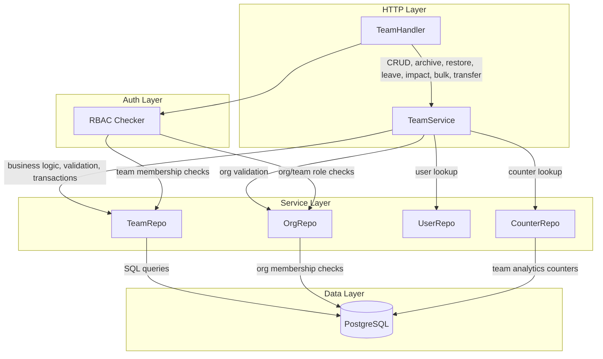
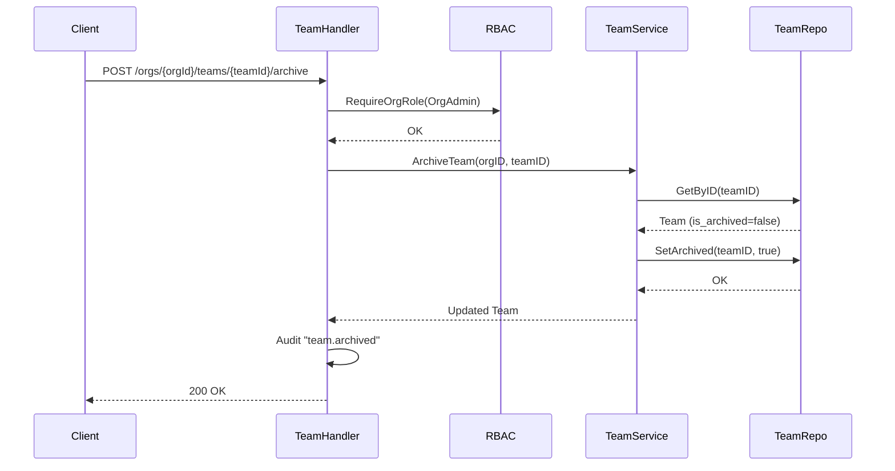
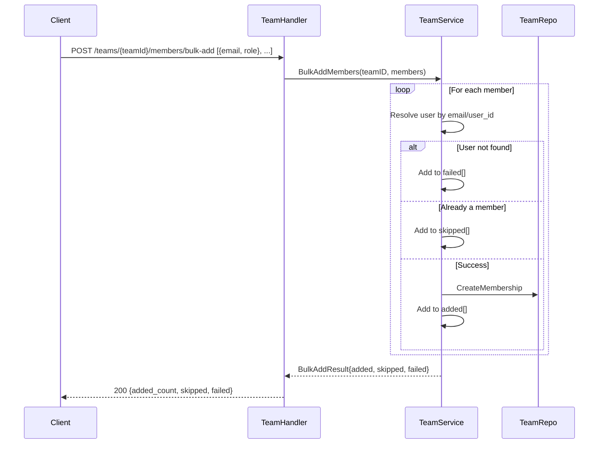
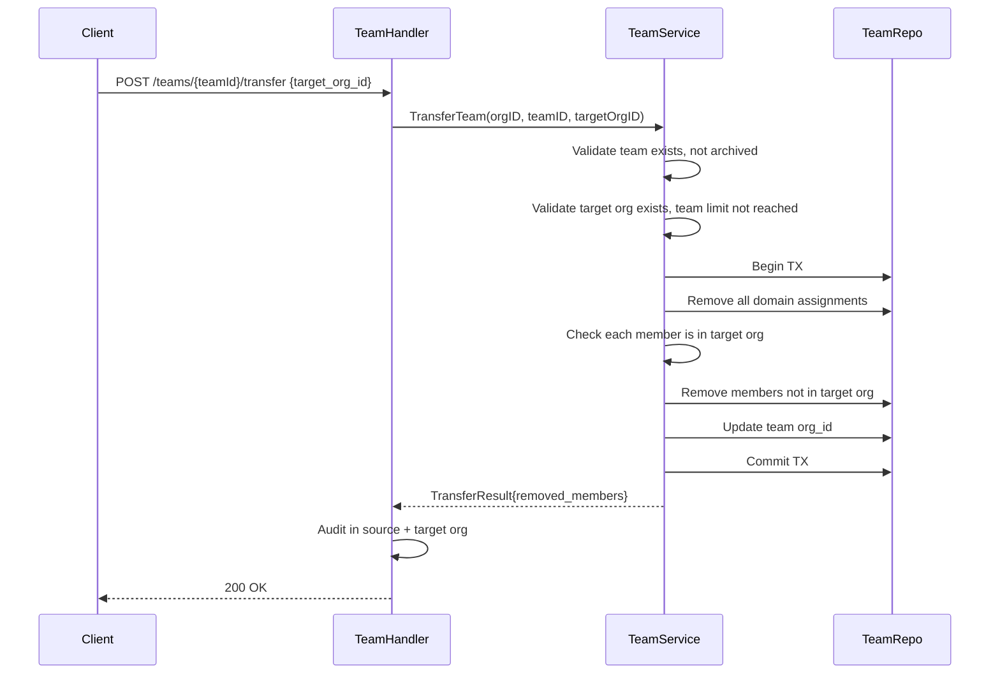

# Design Document: Enhanced Teams

## Overview

This design extends the BurnerByte teams system from basic CRUD and member management into a comprehensive team management platform. The current implementation provides team creation with slug auto-generation, two roles (lead, member), team settings (attachments_enabled, max_inbox_ttl), and simple member add/remove/role-change operations.

The enhanced system adds:

- **Team branding**: description and avatar_url fields with URL validation
- **Search and filtering**: case-insensitive name search on team lists, role/name/email search on member lists, archived status filtering
- **Enriched detail responses**: aggregated counts (members, domains, inboxes, emails, webhooks, API keys, total_emails_received) in a single GET
- **Archive/soft-delete**: is_archived + archived_at columns, archive/restore endpoints, rejection of write operations on archived teams
- **Delete impact preview**: read-only endpoint returning counts of all resources that would be affected by deletion
- **Self-leave**: members can leave teams themselves, with last-lead protection
- **Bulk member operations**: bulk-add and bulk-remove with partial-success semantics (added/skipped/failed arrays)
- **Team creation with initial members**: optional members array on create, with failed_members reporting
- **Viewer role re-activation**: re-adds `viewer` (rank 0) to the CHECK constraint and RBAC, granting read-only access
- **Extended settings**: default_inbox_ttl and max_inboxes_per_domain in team JSONB settings, with cascade through SettingsResolver
- **Team transfer**: move a team between organizations (system admin only), with domain assignment cleanup and member validation
- **Migration 000033**: single migration adding all new columns, indexes, and constraint changes

### Key Design Decisions

1. **Soft-archive over hard-delete by default**: Archiving sets `is_archived=true` and `archived_at` while preserving all data. Hard delete remains available but the impact endpoint encourages informed decisions.
2. **Partial-success semantics for bulk operations**: Bulk-add and bulk-remove process each entry independently, returning `added`/`skipped`/`failed` arrays rather than failing the entire request on a single bad entry. The exception is bulk-remove of the last lead, which rejects the entire request.
3. **Viewer role at rank 0**: The viewer role sits below member (rank 1) in the team rank map. The RBAC `RequireTeamRole` method already uses numeric rank comparison, so adding viewer at rank 0 means existing `minTeamRole: TeamMember` checks automatically exclude viewers from write operations.
4. **GIN trigram index for search**: Team name search uses `ILIKE '%term%'` backed by a GIN trigram index (`pg_trgm`), consistent with the existing email search pattern in migration 000018.
5. **Transfer removes domain assignments**: Domains belong to the source org and cannot cross org boundaries. The transfer operation removes all domain assignments and validates that each team member exists in the target org.
6. **Enriched detail via subqueries**: The team detail endpoint computes counts using correlated subqueries in a single SQL statement, avoiding N+1 queries. The list endpoint continues to return the lighter set of counts (member_count, domain_count, active_inboxes).

## Architecture



### Archive/Restore Flow



### Bulk Add Flow



### Team Transfer Flow



## Components and Interfaces

### Domain Model Changes (`internal/domain/team.go`)

```go
type Team struct {
    ID          uuid.UUID    `json:"id"`
    OrgID       uuid.UUID    `json:"org_id"`
    Name        string       `json:"name"`
    Slug        string       `json:"slug"`
    Description *string      `json:"description,omitempty"`
    AvatarURL   *string      `json:"avatar_url,omitempty"`
    IsArchived  bool         `json:"is_archived"`
    ArchivedAt  *time.Time   `json:"archived_at,omitempty"`
    Settings    TeamSettings `json:"settings"`
    CreatedAt   time.Time    `json:"created_at"`
    UpdatedAt   time.Time    `json:"updated_at"`
    // Joined counts (list endpoint)
    MemberCount   int `json:"member_count"`
    DomainCount   int `json:"domain_count"`
    ActiveInboxes int `json:"active_inboxes"`
}

type TeamDetail struct {
    Team
    TotalInboxes        int   `json:"total_inboxes"`
    EmailCount          int   `json:"email_count"`
    WebhookCount        int   `json:"webhook_count"`
    APIKeyCount         int   `json:"apikey_count"`
    TotalEmailsReceived int64 `json:"total_emails_received"`
}

type TeamSettings struct {
    AttachmentsEnabled  *string `json:"attachments_enabled,omitempty"`
    MaxInboxTTL         *string `json:"max_inbox_ttl,omitempty"`
    DefaultInboxTTL     *string `json:"default_inbox_ttl,omitempty"`
    MaxInboxesPerDomain *int    `json:"max_inboxes_per_domain,omitempty"`
}

type CreateTeamInput struct {
    Name        string              `json:"name"`
    Description *string             `json:"description,omitempty"`
    AvatarURL   *string             `json:"avatar_url,omitempty"`
    Members     []AddTeamMemberInput `json:"members,omitempty"`
}

type UpdateTeamInput struct {
    Name        *string       `json:"name,omitempty"`
    Description *string       `json:"description,omitempty"`
    AvatarURL   *string       `json:"avatar_url,omitempty"`
    Settings    *TeamSettings `json:"settings,omitempty"`
}

type BulkAddMembersInput struct {
    Members []AddTeamMemberInput `json:"members"`
}

type BulkRemoveMembersInput struct {
    UserIDs []uuid.UUID `json:"user_ids"`
}

type BulkMemberResult struct {
    AddedCount   int                    `json:"added_count,omitempty"`
    RemovedCount int                    `json:"removed_count,omitempty"`
    Skipped      []BulkMemberSkipped    `json:"skipped"`
    Failed       []BulkMemberFailed     `json:"failed,omitempty"`
}

type BulkMemberSkipped struct {
    Identifier string `json:"identifier"`
    Reason     string `json:"reason"`
}

type BulkMemberFailed struct {
    Identifier string `json:"identifier"`
    Reason     string `json:"reason"`
}

type TeamImpact struct {
    MemberCount          int `json:"member_count"`
    InboxCount           int `json:"inbox_count"`
    ActiveInboxCount     int `json:"active_inbox_count"`
    EmailCount           int `json:"email_count"`
    DomainAssignmentCount int `json:"domain_assignment_count"`
    WebhookCount         int `json:"webhook_count"`
    APIKeyCount          int `json:"apikey_count"`
}

type TransferTeamInput struct {
    TargetOrgID uuid.UUID `json:"target_org_id"`
}

type TransferTeamResult struct {
    Team           *Team              `json:"team"`
    RemovedMembers []TransferRemoved  `json:"removed_members"`
}

type TransferRemoved struct {
    UserID      uuid.UUID `json:"user_id"`
    Email       string    `json:"email"`
    DisplayName string    `json:"display_name"`
}

type CreateTeamResult struct {
    Team          *Team              `json:"team"`
    FailedMembers []BulkMemberFailed `json:"failed_members,omitempty"`
}
```

### RBAC Changes (`internal/auth/rbac/rbac.go`)

```go
const (
    TeamLead   = "lead"
    TeamMember = "member"
    TeamViewer = "viewer"
)

var teamRank = map[string]int{TeamLead: 2, TeamMember: 1, TeamViewer: 0}

func TeamRoles() []RoleInfo {
    return []RoleInfo{
        {Value: TeamLead, Label: "Lead", Description: "Manage team settings, webhooks, API keys, and members", Rank: 2},
        {Value: TeamMember, Label: "Member", Description: "Create inboxes, view emails, use team domains", Rank: 1},
        {Value: TeamViewer, Label: "Viewer", Description: "Read-only access to team resources", Rank: 0},
    }
}
```

The existing `RequireTeamRole` method uses `teamRank[tm.Role] < teamRank[minTeamRole]`, so:
- Read endpoints pass `minTeamRole: TeamViewer` → viewers, members, and leads all pass
- Write endpoints pass `minTeamRole: TeamMember` → only members and leads pass
- Management endpoints pass `minTeamRole: TeamLead` → only leads pass

### Repository Changes (`internal/repository/postgres/team_repo.go`)

New and modified methods:

| Method | Description |
|--------|-------------|
| `Create(ctx, team)` | Updated to include `description`, `avatar_url` columns |
| `GetByID(ctx, id)` | Updated to SELECT new columns (`description`, `avatar_url`, `is_archived`, `archived_at`) |
| `GetDetail(ctx, id)` | New — returns TeamDetail with all aggregated counts via subqueries |
| `ListByOrg(ctx, orgID, opts)` | Updated to accept `ListTeamsOpts` with `Search`, `IsArchived`, `Page`, `PerPage` |
| `Update(ctx, team)` | Updated to SET `description`, `avatar_url`, and new settings fields |
| `SetArchived(ctx, id, archived bool)` | New — sets `is_archived` and `archived_at` |
| `GetImpact(ctx, id)` | New — returns TeamImpact with all resource counts |
| `CountLeads(ctx, teamID)` | New — counts members with role='lead' |
| `ListMembersFiltered(ctx, teamID, opts)` | New — accepts `ListMembersOpts` with `Search`, `Role`, `Page`, `PerPage` |
| `RemoveDomainAssignments(ctx, teamID)` | New — deletes all domain_assignments for a team |
| `ListMemberUserIDs(ctx, teamID)` | New — returns all user IDs for a team (used in transfer) |
| `BulkDeleteMemberships(ctx, teamID, userIDs)` | New — removes multiple memberships in one query |

```go
type ListTeamsOpts struct {
    Search     string
    IsArchived *bool
    Page       int
    PerPage    int
}

type ListMembersOpts struct {
    Search  string
    Role    string
    Page    int
    PerPage int
}
```

### Service Layer Changes (`internal/service/team_service.go`)

The TeamService gains a `counterRepo` dependency for enriched detail responses.

New constructor:
```go
func NewTeamService(pool *pgxpool.Pool, teamRepo *postgres.TeamRepo, orgRepo *postgres.OrgRepo,
    userRepo *postgres.UserRepo, counterRepo *postgres.CounterRepo, cfg *config.Config) *TeamService
```

New and modified methods:

| Method | Description |
|--------|-------------|
| `CreateTeam(ctx, orgID, input, creatorID)` | Updated to accept description, avatar_url, initial members. Returns `CreateTeamResult`. |
| `GetTeamDetail(ctx, orgID, id)` | New — returns `TeamDetail` with all counts + total_emails_received from counter repo |
| `ListByOrg(ctx, orgID, opts)` | Updated to accept `ListTeamsOpts` |
| `UpdateTeam(ctx, orgID, id, input)` | Updated to handle description, avatar_url, new settings with validation |
| `ArchiveTeam(ctx, orgID, id)` | New — sets is_archived=true, validates team exists and belongs to org |
| `RestoreTeam(ctx, orgID, id)` | New — sets is_archived=false |
| `GetImpact(ctx, orgID, id)` | New — returns TeamImpact |
| `LeaveTeam(ctx, orgID, teamID, userID)` | New — self-leave with last-lead protection |
| `BulkAddMembers(ctx, teamID, members)` | New — partial-success bulk add |
| `BulkRemoveMembers(ctx, teamID, userIDs)` | New — bulk remove with last-lead protection |
| `ListMembers(ctx, teamID, opts)` | Updated to accept `ListMembersOpts` |
| `TransferTeam(ctx, orgID, teamID, targetOrgID)` | New — transfer with domain cleanup and member validation |
| `validateAvatarURL(url string)` | New — validates http/https scheme |
| `validateDefaultInboxTTL(ttl string, maxTTL string)` | New — validates Go duration, checks against max |
| `validateMaxInboxesPerDomain(n int)` | New — validates positive integer |

### Handler Layer Changes (`internal/handler/team.go`)

New routes registered in `cmd/api/main.go`:

```
POST   /orgs/{orgId}/teams/{teamId}/archive              → ArchiveTeam
POST   /orgs/{orgId}/teams/{teamId}/restore              → RestoreTeam
GET    /orgs/{orgId}/teams/{teamId}/impact                → GetImpact
POST   /orgs/{orgId}/teams/{teamId}/leave                 → LeaveTeam
POST   /orgs/{orgId}/teams/{teamId}/members/bulk-add      → BulkAddMembers
POST   /orgs/{orgId}/teams/{teamId}/members/bulk-remove   → BulkRemoveMembers
POST   /orgs/{orgId}/teams/{teamId}/transfer              → TransferTeam
```

Updated handlers:
- `ListTeams`: reads `search` and `is_archived` query params, passes `ListTeamsOpts`
- `GetTeam`: calls `GetTeamDetail` instead of `GetTeam` to return enriched response
- `CreateTeam`: accepts `description`, `avatar_url`, `members` in input, returns `CreateTeamResult`
- `UpdateTeam`: accepts `description`, `avatar_url` in input
- `ListMembers`: reads `search` and `role` query params, passes `ListMembersOpts`
- `AddMember`: accepts `viewer` as valid role
- `ChangeRole`: accepts `viewer` as valid role, checks last-lead protection

### Settings Resolver Changes (`internal/service/settings_resolver.go`)

New method:
```go
func (r *SettingsResolver) ResolveDefaultInboxTTLWithTeam(ctx context.Context, assignmentID uuid.UUID, teamSettings *domain.TeamSettings) time.Duration
```

The cascade becomes: team → org → system default. If `teamSettings.DefaultInboxTTL` is set and valid, it takes precedence over the org-level default.

### Audit Events

New audit actions added to `internal/audit/recorder.go` maps:

| Action | Category | Severity |
|--------|----------|----------|
| `team.archived` | team | warning |
| `team.restored` | team | info |
| `team.member_left` | team | info |
| `team.members_bulk_added` | team | info |
| `team.members_bulk_removed` | team | warning |
| `team.transferred` | team | critical |

## Data Models

### Migration 000033: Enhanced Teams

**Up migration** (`migrations/000033_enhanced_teams.up.sql`):

```sql
-- Enable pg_trgm extension for trigram search (idempotent)
CREATE EXTENSION IF NOT EXISTS pg_trgm;

-- Add new columns to teams table
ALTER TABLE teams
    ADD COLUMN description TEXT,
    ADD COLUMN avatar_url TEXT,
    ADD COLUMN is_archived BOOLEAN NOT NULL DEFAULT FALSE,
    ADD COLUMN archived_at TIMESTAMPTZ;

-- Index for filtered team listing by org and archived status
CREATE INDEX idx_teams_org_archived ON teams(org_id, is_archived);

-- GIN trigram index for case-insensitive name search
CREATE INDEX idx_teams_name_trgm ON teams USING GIN (name gin_trgm_ops);

-- Re-add viewer role to team_memberships CHECK constraint
ALTER TABLE team_memberships DROP CONSTRAINT IF EXISTS team_memberships_role_check;
ALTER TABLE team_memberships ADD CONSTRAINT team_memberships_role_check CHECK (role IN ('lead', 'member', 'viewer'));

-- Re-add viewer role to invites CHECK constraint
ALTER TABLE invites DROP CONSTRAINT IF EXISTS invites_team_role_check;
ALTER TABLE invites ADD CONSTRAINT invites_team_role_check CHECK (team_role IN ('lead', 'member', 'viewer'));
```

**Down migration** (`migrations/000033_enhanced_teams.down.sql`):

```sql
-- Revert viewer role: update existing viewers to member, then alter constraints
UPDATE team_memberships SET role = 'member' WHERE role = 'viewer';
UPDATE invites SET team_role = 'member' WHERE team_role = 'viewer';

ALTER TABLE team_memberships DROP CONSTRAINT IF EXISTS team_memberships_role_check;
ALTER TABLE team_memberships ADD CONSTRAINT team_memberships_role_check CHECK (role IN ('lead', 'member'));

ALTER TABLE invites DROP CONSTRAINT IF EXISTS invites_team_role_check;
ALTER TABLE invites ADD CONSTRAINT invites_team_role_check CHECK (team_role IN ('lead', 'member'));

-- Drop indexes
DROP INDEX IF EXISTS idx_teams_name_trgm;
DROP INDEX IF EXISTS idx_teams_org_archived;

-- Remove columns
ALTER TABLE teams
    DROP COLUMN IF EXISTS archived_at,
    DROP COLUMN IF EXISTS is_archived,
    DROP COLUMN IF EXISTS avatar_url,
    DROP COLUMN IF EXISTS description;
```

### Updated Teams Table Schema (after migration)

| Column | Type | Default | Description |
|--------|------|---------|-------------|
| id | UUID PK | gen_random_uuid() | Primary key |
| org_id | UUID FK→organizations | — | Owning organization |
| name | VARCHAR(255) | — | Team display name |
| slug | VARCHAR(255) | — | URL-safe slug (unique per org) |
| description | TEXT | NULL | Optional team description |
| avatar_url | TEXT | NULL | Optional avatar URL (http/https) |
| is_archived | BOOLEAN | FALSE | Whether team is archived |
| archived_at | TIMESTAMPTZ | NULL | When team was archived |
| settings | JSONB | '{}' | Team-level settings overrides |
| created_at | TIMESTAMPTZ | NOW() | Creation timestamp |
| updated_at | TIMESTAMPTZ | NOW() | Last update timestamp |

### Indexes

| Index | Columns/Expression | Purpose |
|-------|-------------------|---------|
| idx_teams_org | org_id | Existing — list by org |
| idx_teams_org_archived | (org_id, is_archived) | New — filtered list by archived status |
| idx_teams_name_trgm | name GIN(gin_trgm_ops) | New — case-insensitive name search |
| UNIQUE(org_id, slug) | (org_id, slug) | Existing — slug uniqueness |

### Team Settings JSONB Schema

```json
{
    "attachments_enabled": "inherit|enabled|disabled",
    "max_inbox_ttl": "24h",
    "default_inbox_ttl": "1h",
    "max_inboxes_per_domain": 10
}
```

