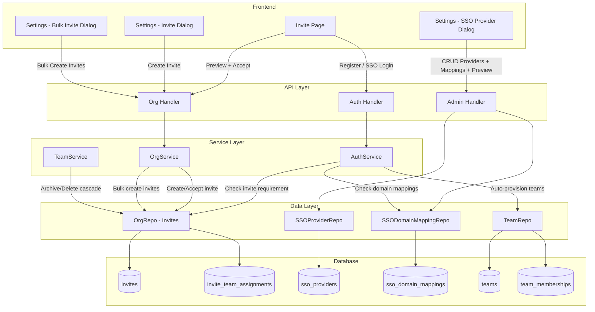
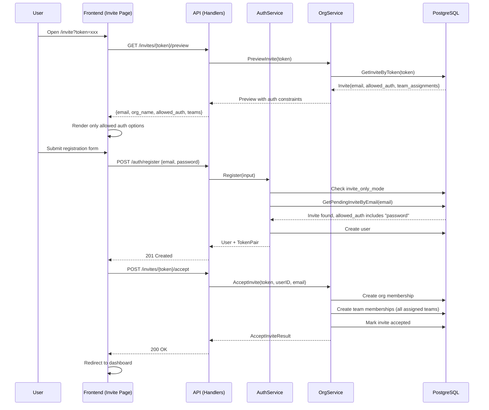
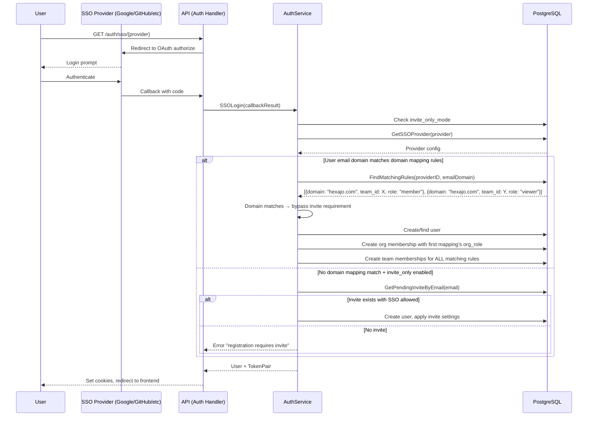
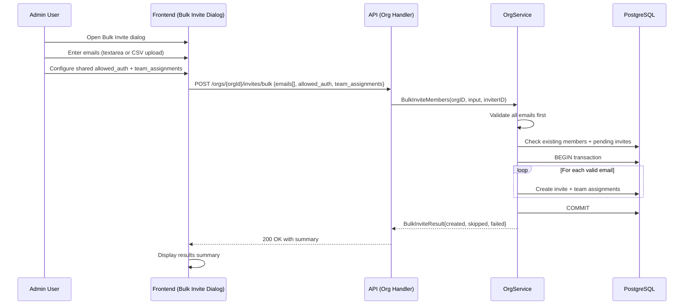
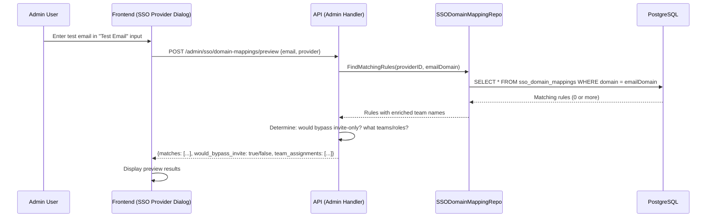
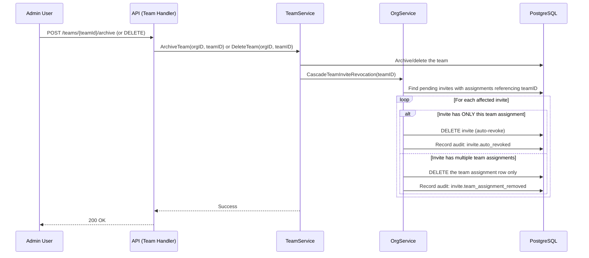

# Design Document: Invite Auth Provisioning

## Overview

This feature extends the platform's invite and authentication system with six interconnected capabilities: invite-only registration with configurable auth methods, enhanced invite flows with multi-team selection, SSO auto-provisioning with domain-based team routing, multi-team domain mappings, bulk invites, domain mapping dry-run/preview, and invite revocation cascade on team archive/delete.

Currently, the platform has a simple `allow_registration` toggle and basic invite flow that supports a single team assignment. SSO auto-provisioning exists but only assigns users to the first org with a flat role — it lacks domain-to-team routing rules. This design introduces per-invite auth method constraints, multi-team invite assignments, structured domain-to-team mapping rules on SSO providers (with multi-team support per domain), a bulk invite endpoint for batch operations, a domain mapping preview/dry-run endpoint for admin testing, and automatic invite revocation cascading when teams are archived or deleted.

The changes span the Go backend (domain models, services, handlers, repositories) and the Next.js frontend (invite page, settings UI, SSO provider management). The database schema gains new columns on `invites` and `sso_providers`, plus new `sso_domain_mappings` and `invite_team_assignments` tables.

## Architecture



## Sequence Diagrams

### Invite-Only Registration (Password)



### SSO Auto-Provisioning with Domain Routing (Multi-Team)



### Bulk Invite Flow



### Domain Mapping Dry-Run/Preview



### Invite Revocation Cascade on Team Archive/Delete



## Components and Interfaces

### Component 1: Domain Models (Extended)

**Purpose**: Define the data structures for invite auth constraints, multi-team assignments, domain mapping rules, bulk invite operations, and domain mapping preview.

**Interface**:
```go
// Extended Invite — adds auth method constraint and multi-team support
type Invite struct {
    ID              uuid.UUID          `json:"id"`
    OrgID           uuid.UUID          `json:"org_id"`
    Email           string             `json:"email"`
    OrgRole         string             `json:"org_role"`
    AllowedAuth     []string           `json:"allowed_auth"`      // ["password", "sso:google", "sso:github"] or ["any"]
    TeamAssignments []InviteTeamAssign `json:"team_assignments"`  // multiple teams
    Token           string             `json:"-"`
    InvitedBy       *uuid.UUID         `json:"invited_by,omitempty"`
    AcceptedAt      *time.Time         `json:"accepted_at,omitempty"`
    ExpiresAt       time.Time          `json:"expires_at"`
    CreatedAt       time.Time          `json:"created_at"`
    // Deprecated single-team fields kept for backward compat
    TeamID          *uuid.UUID         `json:"team_id,omitempty"`
    TeamRole        *string            `json:"team_role,omitempty"`
    TeamName        string             `json:"team_name,omitempty"`
}

// InviteTeamAssign represents a single team assignment within an invite
type InviteTeamAssign struct {
    TeamID   uuid.UUID `json:"team_id"`
    TeamRole string    `json:"team_role"`
    // Enriched fields (not stored, populated on read)
    TeamName string    `json:"team_name,omitempty"`
}

// SSODomainMapping maps an email domain to a team with role assignments.
// Multiple mappings can exist for the same (provider_id, domain) pair with different team_ids,
// enabling one domain rule to route users to multiple teams simultaneously.
type SSODomainMapping struct {
    ID         uuid.UUID `json:"id"`
    ProviderID uuid.UUID `json:"provider_id"`
    Domain     string    `json:"domain"`       // e.g. "hexajo.com"
    OrgRole    string    `json:"org_role"`      // e.g. "member"
    TeamID     uuid.UUID `json:"team_id"`
    TeamRole   string    `json:"team_role"`     // e.g. "member"
    CreatedAt  time.Time `json:"created_at"`
    UpdatedAt  time.Time `json:"updated_at"`
    // Enriched
    TeamName   string    `json:"team_name,omitempty"`
}

// Extended InviteMemberInput
type InviteMemberInput struct {
    Email           string              `json:"email"`
    OrgRole         string              `json:"org_role"`
    AllowedAuth     []string            `json:"allowed_auth,omitempty"`     // new
    TeamAssignments []InviteTeamAssign  `json:"team_assignments,omitempty"` // new
    // Deprecated — kept for backward compat
    TeamID          *string             `json:"team_id,omitempty"`
    TeamRole        *string             `json:"team_role,omitempty"`
}

// BulkInviteMemberInput represents a batch invite request where all invites
// share the same allowed_auth and team_assignments configuration.
type BulkInviteMemberInput struct {
    Emails          []string            `json:"emails"`
    OrgRole         string              `json:"org_role"`
    AllowedAuth     []string            `json:"allowed_auth,omitempty"`
    TeamAssignments []InviteTeamAssign  `json:"team_assignments,omitempty"`
}

// BulkInviteResult summarizes the outcome of a bulk invite operation.
type BulkInviteResult struct {
    Created int                    `json:"created"`
    Skipped []BulkInviteSkipped    `json:"skipped"`
    Failed  []BulkInviteFailed     `json:"failed"`
}

type BulkInviteSkipped struct {
    Email  string `json:"email"`
    Reason string `json:"reason"` // "already_invited" or "already_member"
}

type BulkInviteFailed struct {
    Email  string `json:"email"`
    Reason string `json:"reason"` // validation error message
}

// DomainMappingPreviewInput is the request body for the domain mapping dry-run endpoint.
type DomainMappingPreviewInput struct {
    Email    string `json:"email"`
    Provider string `json:"provider"` // provider name (e.g. "google")
}

// DomainMappingPreviewResult shows what would happen if a user with the given email
// authenticated via the given SSO provider.
type DomainMappingPreviewResult struct {
    Email              string                        `json:"email"`
    EmailDomain        string                        `json:"email_domain"`
    Provider           string                        `json:"provider"`
    MatchingRules      []SSODomainMapping            `json:"matching_rules"`
    WouldBypassInvite  bool                          `json:"would_bypass_invite"`
    TeamAssignments    []DomainMappingPreviewTeam     `json:"team_assignments"`
    OrgRole            string                        `json:"org_role,omitempty"`
}

type DomainMappingPreviewTeam struct {
    TeamID   uuid.UUID `json:"team_id"`
    TeamName string    `json:"team_name"`
    TeamRole string    `json:"team_role"`
}
```

**Responsibilities**:
- Define the shape of invite auth constraints
- Support multiple team assignments per invite
- Model domain-to-team mapping rules for SSO providers (multi-team per domain)
- Define bulk invite input/output structures
- Define domain mapping preview input/output structures

### Component 2: OrgService (Extended)

**Purpose**: Handle invite creation with auth constraints and multi-team assignments, invite acceptance with multi-team provisioning, bulk invite operations, and invite revocation cascade.

**Interface**:
```go
type OrgService interface {
    // Extended to handle allowed_auth and team_assignments
    InviteMember(ctx context.Context, orgID uuid.UUID, input InviteMemberInput, inviterID uuid.UUID) (*Invite, error)

    // NEW: Bulk invite creation — validates all emails, creates invites in a single transaction
    BulkInviteMembers(ctx context.Context, orgID uuid.UUID, input BulkInviteMemberInput, inviterID uuid.UUID) (*BulkInviteResult, error)

    // Extended to provision multiple team memberships
    AcceptInvite(ctx context.Context, token string, userID uuid.UUID, userEmail string) (*AcceptInviteResult, error)

    // Extended preview returns allowed_auth and team info
    PreviewInvite(ctx context.Context, token string) (map[string]any, error)

    // NEW: Cascade invite revocation when a team is archived or deleted
    CascadeTeamInviteRevocation(ctx context.Context, teamID uuid.UUID) error
}
```

**Responsibilities**:
- Validate allowed_auth values against configured SSO providers
- Validate all team_assignments belong to the org
- Create invite_team_assignments rows in a transaction
- On accept, create team memberships for all assigned teams
- Enrich preview with allowed auth options and team names
- Bulk invite: validate all emails upfront, skip already-invited/member, create in single transaction
- Cascade: auto-revoke invites that only reference the archived/deleted team; remove assignment for multi-team invites

### Component 3: AuthService (Extended)

**Purpose**: Enforce invite-only mode in Register and SSOLogin, apply domain-based auto-provisioning with multi-team support.

**Interface**:
```go
type AuthService interface {
    // Extended: checks invite_only_mode, validates invite exists + auth method allowed
    Register(ctx context.Context, input CreateUserInput) (*User, *TokenPair, error)

    // Extended: checks invite_only_mode, applies domain mapping rules (multi-team)
    SSOLogin(ctx context.Context, result *SSOCallbackResult, ip, userAgent string) (*User, *TokenPair, error)
}
```

**Responsibilities**:
- Check `allow_registration` config flag (invite-only when false)
- In Register: verify pending invite exists and `allowed_auth` includes "password"
- In SSOLogin: check domain mapping rules first; if match, bypass invite requirement
- In SSOLogin: if domain matches, provision ALL matching team memberships (multi-team)
- In SSOLogin: if no domain match and invite-only, verify pending invite with SSO provider allowed
- Apply domain mapping team/role assignments during auto-provisioning

### Component 4: SSODomainMappingRepo

**Purpose**: CRUD operations for domain-to-team mapping rules stored per SSO provider, with multi-team support per domain.

**Interface**:
```go
type SSODomainMappingRepo interface {
    Create(ctx context.Context, mapping *SSODomainMapping) error
    ListByProvider(ctx context.Context, providerID uuid.UUID) ([]SSODomainMapping, error)
    Update(ctx context.Context, mapping *SSODomainMapping) error
    Delete(ctx context.Context, id uuid.UUID) error
    GetByID(ctx context.Context, id uuid.UUID) (*SSODomainMapping, error)
    // Used during SSO login to find ALL matching rules for a domain (multi-team)
    FindMatchingRules(ctx context.Context, providerID uuid.UUID, emailDomain string) ([]SSODomainMapping, error)
}
```

**Responsibilities**:
- Store and retrieve domain mapping rules
- Enforce uniqueness of (provider_id, domain, team_id) triples (changed from provider_id, domain pairs)
- Support lookup by email domain during SSO login flow — returns ALL matching rules for multi-team provisioning
- Enrich results with team names via JOIN

### Component 5: Admin Handler (Extended)

**Purpose**: Expose CRUD endpoints for SSO domain mapping rules and domain mapping preview/dry-run.

**Interface**:
```go
// Existing routes for domain mapping CRUD
// GET    /admin/sso/providers/{providerId}/domain-mappings
// POST   /admin/sso/providers/{providerId}/domain-mappings
// PUT    /admin/sso/providers/{providerId}/domain-mappings/{mappingId}
// DELETE /admin/sso/providers/{providerId}/domain-mappings/{mappingId}

// NEW: Domain mapping dry-run/preview
// POST   /admin/sso/domain-mappings/preview
```

**Responsibilities**:
- Validate domain format and team existence
- Prevent duplicate (provider_id, domain, team_id) triples
- Audit log all mapping changes
- Preview endpoint: accept email + provider, return matching rules and predicted outcome

### Component 6: Frontend — Invite Page (Extended)

**Purpose**: Render only the auth options allowed by the invite's `allowed_auth` field.

**Responsibilities**:
- Fetch invite preview including `allowed_auth` and `team_assignments`
- If `allowed_auth` is `["any"]` or empty, show all available options (current behavior)
- If `allowed_auth` includes `"password"`, show the password form
- If `allowed_auth` includes `"sso:google"` etc., show only those SSO buttons
- Display team assignment info in the invite preview

### Component 7: Frontend — Invite Dialog (Enhanced)

**Purpose**: Allow admins to configure auth method and select multiple teams when creating invites, including bulk invite support.

**Responsibilities**:
- Add auth method selector (checkboxes: Password, each configured SSO provider, or "Any")
- Replace single team dropdown with multi-team selector
- Each team selection includes a role picker
- Fetch available SSO providers to populate auth method options
- NEW: Add "Bulk Invite" option with textarea for multiple emails (one per line or comma-separated)
- NEW: Optional CSV upload for bulk emails
- NEW: Display bulk invite results summary (created, skipped, failed)

### Component 8: Frontend — SSO Provider Domain Mappings

**Purpose**: UI for managing domain-to-team mapping rules within SSO provider settings, including dry-run preview.

**Responsibilities**:
- Display existing domain mappings in the SSO provider edit dialog
- Add/edit/delete domain mapping rules
- Each rule: domain, target team (dropdown), team role, org role
- Multiple rules can share the same domain with different teams
- Validate domain format client-side
- NEW: Add "Test Email" input in the domain mappings section
- NEW: Display preview results showing which rules would match and what assignments would be applied


### Component 9: TeamService (Extended)

**Purpose**: Trigger invite revocation cascade when a team is archived or deleted.

**Responsibilities**:
- On `ArchiveTeam`: call `OrgService.CascadeTeamInviteRevocation(teamID)` after archiving
- On `DeleteTeam`: cascade happens automatically via `ON DELETE CASCADE` on `invite_team_assignments.team_id`, but the service also calls `CascadeTeamInviteRevocation` to handle invite cleanup and audit logging before the delete
- Log all cascade actions in audit


## Data Models

### Database Schema Changes

#### Modified: `invites` table

```sql
-- Add allowed_auth column (JSONB array of strings)
ALTER TABLE invites ADD COLUMN allowed_auth JSONB DEFAULT '["any"]'::jsonb;

-- The existing team_id and team_role columns are kept for backward compatibility
-- New multi-team assignments use a separate join table
```

#### New: `invite_team_assignments` table

```sql
CREATE TABLE invite_team_assignments (
    id         UUID PRIMARY KEY DEFAULT gen_random_uuid(),
    invite_id  UUID NOT NULL REFERENCES invites(id) ON DELETE CASCADE,
    team_id    UUID NOT NULL REFERENCES teams(id) ON DELETE CASCADE,
    team_role  VARCHAR(50) NOT NULL DEFAULT 'member',
    created_at TIMESTAMPTZ NOT NULL DEFAULT NOW(),
    UNIQUE(invite_id, team_id)
);

CREATE INDEX idx_invite_team_assignments_invite ON invite_team_assignments(invite_id);
CREATE INDEX idx_invite_team_assignments_team ON invite_team_assignments(team_id);
```

#### New: `sso_domain_mappings` table (Multi-Team Support)

```sql
CREATE TABLE sso_domain_mappings (
    id          UUID PRIMARY KEY DEFAULT gen_random_uuid(),
    provider_id UUID NOT NULL REFERENCES sso_providers(id) ON DELETE CASCADE,
    domain      VARCHAR(255) NOT NULL,
    org_role    VARCHAR(50) NOT NULL DEFAULT 'member',
    team_id     UUID NOT NULL REFERENCES teams(id) ON DELETE CASCADE,
    team_role   VARCHAR(50) NOT NULL DEFAULT 'member',
    created_at  TIMESTAMPTZ NOT NULL DEFAULT NOW(),
    updated_at  TIMESTAMPTZ NOT NULL DEFAULT NOW(),
    -- Changed from UNIQUE(provider_id, domain) to allow multiple teams per domain per provider
    UNIQUE(provider_id, domain, team_id)
);

CREATE INDEX idx_sso_domain_mappings_provider ON sso_domain_mappings(provider_id);
CREATE INDEX idx_sso_domain_mappings_domain ON sso_domain_mappings(domain);
```

**Key change**: The UNIQUE constraint is on `(provider_id, domain, team_id)` instead of `(provider_id, domain)`. This allows one domain like `@hexajo.com` to map to multiple teams simultaneously under the same provider. For example:
- `(google, hexajo.com, engineering_team)` → role: member
- `(google, hexajo.com, platform_team)` → role: viewer

### Validation Rules

#### `allowed_auth` field
- Must be a non-empty array of strings
- Valid values: `"any"`, `"password"`, `"sso:<provider_name>"` (e.g., `"sso:google"`, `"sso:github"`)
- If `"any"` is present, it must be the only element
- SSO provider names must reference existing enabled providers
- Default: `["any"]`

#### `invite_team_assignments`
- Each team_id must belong to the invite's org
- Each team must not be archived
- team_role must be a valid team role (from rbac.ValidTeamRole)
- No duplicate team_id per invite

#### `sso_domain_mappings`
- domain must be a valid domain format (e.g., `hexajo.com`)
- No wildcard patterns — exact domain match only
- team_id must reference an existing, non-archived team
- org_role must be a valid org role
- team_role must be a valid team role
- Unique constraint on (provider_id, domain, team_id) — allows multiple teams per domain

#### Bulk invite validation
- Each email must pass the same validation as single invites (RFC format, valid domain, MX/A record check)
- Maximum batch size: 100 emails per request
- All emails in the batch share the same `allowed_auth` and `team_assignments`
- Emails that are already invited (pending) or already org members are skipped, not failed
- Validation runs on ALL emails before any invites are created (fail-fast)

## Algorithmic Pseudocode

### Algorithm: Register with Invite-Only Check

```go
func (s *AuthService) Register(ctx context.Context, input CreateUserInput) (*User, *TokenPair, error) {
    // ... existing validation (email format, password policy) ...

    // NEW: Check invite-only mode
    if !s.cfg.Defaults.AllowRegistration {
        invite, err := s.orgRepo.GetPendingInviteByEmail(ctx, input.Email)
        if err != nil {
            return nil, nil, fmt.Errorf("registration requires an invite")
        }
        // Verify password auth is allowed for this invite
        if !isAuthMethodAllowed(invite.AllowedAuth, "password") {
            return nil, nil, fmt.Errorf("password registration is not allowed for this invite")
        }
    }

    // ... existing user creation logic ...
}
```

**Preconditions:**
- `input.Email` is a valid, normalized email address
- `input.Password` meets the configured password policy
- Database connection is available

**Postconditions:**
- If `allow_registration` is true: user is created (existing behavior)
- If `allow_registration` is false and no pending invite exists: returns error
- If `allow_registration` is false and invite exists but doesn't allow password: returns error
- If `allow_registration` is false and invite allows password: user is created

### Algorithm: SSOLogin with Domain Mapping (Multi-Team)

```go
func (s *AuthService) SSOLogin(ctx context.Context, result *SSOCallbackResult, ip, userAgent string) (*User, *TokenPair, error) {
    email := strings.ToLower(result.Email)
    emailDomain := extractDomain(email)

    // ... existing allowed domains check ...

    // NEW: Check invite-only mode for new users
    isNewUser := false
    user, err := s.findExistingUser(ctx, result)
    if err != nil {
        isNewUser = true
    }

    if isNewUser && !s.cfg.Defaults.AllowRegistration {
        // Check domain mapping rules first (bypass invite requirement)
        provCfg, _ := s.ssoProviderRepo.GetByName(ctx, result.Provider)
        if provCfg != nil {
            // FindMatchingRules returns ALL rules for this domain (multi-team support)
            mappings, err := s.domainMappingRepo.FindMatchingRules(ctx, provCfg.ID, emailDomain)
            if err == nil && len(mappings) > 0 {
                // Domain mapping found — auto-provision with ALL mapped teams
                user = s.createAndProvisionFromMappings(ctx, result, mappings)
                // Skip invite check
                goto createSession
            }
        }

        // No domain mapping — check for pending invite
        invite, err := s.orgRepo.GetPendingInviteByEmail(ctx, email)
        if err != nil {
            return nil, nil, fmt.Errorf("registration requires an invite")
        }
        providerKey := "sso:" + result.Provider
        if !isAuthMethodAllowed(invite.AllowedAuth, providerKey) {
            return nil, nil, fmt.Errorf("SSO provider %s is not allowed for this invite", result.Provider)
        }
    }

    // ... existing user creation / identity linking ...

createSession:
    // ... existing session creation ...
}
```

**Preconditions:**
- `result` contains a valid email from the SSO provider
- SSO provider is configured and enabled
- Database connection is available

**Postconditions:**
- Existing users: login proceeds as before (no invite check)
- New users + registration open: user created as before
- New users + invite-only + domain mapping match: user created with ALL mapped team memberships, invite bypassed
- New users + invite-only + no domain match + valid invite: user created per invite constraints
- New users + invite-only + no domain match + no invite: error returned

### Algorithm: AcceptInvite with Multi-Team Assignment

```go
func (s *OrgService) AcceptInvite(ctx context.Context, token string, userID uuid.UUID, userEmail string) (*AcceptInviteResult, error) {
    invite, err := s.orgRepo.GetInviteByToken(ctx, token)
    // ... existing validation (expiry, email match, idempotency) ...

    tx, err := s.pool.Begin(ctx)
    // ... existing org membership creation ...

    // NEW: Process multi-team assignments
    assignments, err := s.orgRepo.GetInviteTeamAssignments(ctx, invite.ID)
    if err == nil && len(assignments) > 0 {
        for _, a := range assignments {
            team, err := teamRepoTx.GetByID(ctx, a.TeamID)
            if err != nil || team.IsArchived {
                slog.Warn("skipping team assignment", "team_id", a.TeamID, "reason", "not found or archived")
                continue
            }
            tm := &domain.TeamMembership{
                ID: uuid.New(), UserID: userID, TeamID: a.TeamID, Role: a.TeamRole,
            }
            if err := teamRepoTx.CreateMembership(ctx, tm); err != nil {
                if !errors.Is(err, postgres.ErrConflict) {
                    return nil, fmt.Errorf("create team membership: %w", err)
                }
                // Already a member — skip silently
            }
        }
    } else if invite.TeamID != nil {
        // Backward compat: use legacy single-team field
        // ... existing single-team logic ...
    }

    // ... existing email verification + commit ...
}
```

**Preconditions:**
- `token` is a valid, non-expired invite token
- `userEmail` matches the invite email
- User has been authenticated

**Postconditions:**
- Org membership created (or already exists)
- Team memberships created for all non-archived assigned teams
- Archived or deleted teams are skipped with a warning log
- Invite marked as accepted
- User email auto-verified

**Loop Invariants:**
- All previously processed team assignments resulted in either a new membership or a skipped duplicate
- Transaction remains valid throughout iteration

### Algorithm: Bulk Invite Members

```go
func (s *OrgService) BulkInviteMembers(ctx context.Context, orgID uuid.UUID, input BulkInviteMemberInput, inviterID uuid.UUID) (*BulkInviteResult, error) {
    result := &BulkInviteResult{
        Skipped: []BulkInviteSkipped{},
        Failed:  []BulkInviteFailed{},
    }

    // Phase 1: Validate ALL emails upfront
    var validEmails []string
    for _, rawEmail := range input.Emails {
        email := strings.ToLower(strings.TrimSpace(rawEmail))
        if email == "" {
            continue // skip blank lines
        }

        // RFC email validation
        if _, err := mail.ParseAddress(email); err != nil {
            result.Failed = append(result.Failed, BulkInviteFailed{Email: email, Reason: "invalid email format"})
            continue
        }

        // Domain validation (MX/A record check)
        parts := strings.SplitN(email, "@", 2)
        if len(parts) != 2 || !emailDomainRe.MatchString(parts[1]) {
            result.Failed = append(result.Failed, BulkInviteFailed{Email: email, Reason: "invalid email domain"})
            continue
        }

        // Check if already a member
        if s.isOrgMember(ctx, orgID, email) {
            result.Skipped = append(result.Skipped, BulkInviteSkipped{Email: email, Reason: "already_member"})
            continue
        }

        // Check if already has a pending invite
        if s.hasPendingInvite(ctx, orgID, email) {
            result.Skipped = append(result.Skipped, BulkInviteSkipped{Email: email, Reason: "already_invited"})
            continue
        }

        validEmails = append(validEmails, email)
    }

    // Validate shared config (allowed_auth, team_assignments) once
    if err := s.validateInviteConfig(ctx, orgID, input.AllowedAuth, input.TeamAssignments); err != nil {
        return nil, err
    }

    // Phase 2: Create all invites in a single transaction
    tx, err := s.pool.Begin(ctx)
    if err != nil {
        return nil, err
    }
    defer tx.Rollback(ctx)

    orgRepoTx := s.orgRepo.WithTx(tx)
    for _, email := range validEmails {
        invite := s.buildInvite(orgID, email, input.OrgRole, input.AllowedAuth, inviterID)
        if err := orgRepoTx.CreateInvite(ctx, invite); err != nil {
            result.Failed = append(result.Failed, BulkInviteFailed{Email: email, Reason: "failed to create invite"})
            continue
        }
        if len(input.TeamAssignments) > 0 {
            orgRepoTx.CreateInviteTeamAssignments(ctx, invite.ID, input.TeamAssignments)
        }
        result.Created++
    }

    if err := tx.Commit(ctx); err != nil {
        return nil, fmt.Errorf("commit bulk invites: %w", err)
    }

    // Phase 3: Send invite emails asynchronously
    go s.sendBulkInviteEmails(ctx, orgID, validEmails)

    return result, nil
}
```

**Preconditions:**
- `input.Emails` contains 1–100 email strings
- `input.OrgRole` is a valid org role
- `input.AllowedAuth` and `input.TeamAssignments` pass the same validation as single invites
- Caller has `org.members.invite` permission

**Postconditions:**
- All valid, non-duplicate emails have pending invites created
- Already-invited and already-member emails are reported as skipped
- Invalid emails are reported as failed
- All invites share the same `allowed_auth` and `team_assignments`
- Invite emails are sent asynchronously
- `result.Created + len(result.Skipped) + len(result.Failed) == len(input.Emails)` (minus blank lines)

### Algorithm: Domain Mapping Preview/Dry-Run

```go
func (h *AdminHandler) PreviewDomainMapping(w http.ResponseWriter, r *http.Request) {
    var input DomainMappingPreviewInput
    // ... decode request body ...

    email := strings.ToLower(strings.TrimSpace(input.Email))
    parts := strings.SplitN(email, "@", 2)
    if len(parts) != 2 {
        writeError(w, http.StatusBadRequest, "invalid email format")
        return
    }
    emailDomain := parts[1]

    // Look up provider
    provCfg, err := h.ssoProviderRepo.GetByName(r.Context(), input.Provider)
    if err != nil {
        writeError(w, http.StatusNotFound, "SSO provider not found")
        return
    }

    // Find ALL matching domain mapping rules
    mappings, err := h.domainMappingRepo.FindMatchingRules(r.Context(), provCfg.ID, emailDomain)

    result := DomainMappingPreviewResult{
        Email:             email,
        EmailDomain:       emailDomain,
        Provider:          input.Provider,
        MatchingRules:     mappings,
        WouldBypassInvite: len(mappings) > 0,
    }

    if len(mappings) > 0 {
        result.OrgRole = mappings[0].OrgRole
        for _, m := range mappings {
            result.TeamAssignments = append(result.TeamAssignments, DomainMappingPreviewTeam{
                TeamID:   m.TeamID,
                TeamName: m.TeamName,
                TeamRole: m.TeamRole,
            })
        }
    }

    writeJSON(w, http.StatusOK, result)
}
```

**Preconditions:**
- `input.Email` is a valid email address
- `input.Provider` references an existing SSO provider

**Postconditions:**
- Returns all matching domain mapping rules for the email's domain
- `WouldBypassInvite` is true if any rules match
- `TeamAssignments` lists all teams the user would be provisioned into
- No side effects — this is a read-only preview operation

### Algorithm: Cascade Team Invite Revocation

```go
func (s *OrgService) CascadeTeamInviteRevocation(ctx context.Context, teamID uuid.UUID) error {
    // Find all pending invites that have team assignments referencing this team
    affectedInvites, err := s.orgRepo.FindPendingInvitesWithTeamAssignment(ctx, teamID)
    if err != nil {
        return fmt.Errorf("find affected invites: %w", err)
    }

    for _, invite := range affectedInvites {
        assignmentCount, err := s.orgRepo.CountInviteTeamAssignments(ctx, invite.ID)
        if err != nil {
            slog.Error("failed to count invite assignments", "invite_id", invite.ID, "error", err)
            continue
        }

        if assignmentCount <= 1 {
            // This invite ONLY references the archived/deleted team — auto-revoke the entire invite
            if err := s.orgRepo.DeleteInvite(ctx, invite.OrgID, invite.ID); err != nil {
                slog.Error("failed to auto-revoke invite", "invite_id", invite.ID, "error", err)
                continue
            }
            slog.Info("auto-revoked invite due to team archive/delete",
                "invite_id", invite.ID, "email", invite.Email, "team_id", teamID)
            // Audit log
            s.auditLog(ctx, invite.OrgID, "invite.auto_revoked", map[string]any{
                "invite_id": invite.ID, "email": invite.Email,
                "team_id": teamID, "reason": "team_archived_or_deleted",
            })
        } else {
            // Invite has multiple team assignments — remove only the assignment for this team
            if err := s.orgRepo.DeleteInviteTeamAssignment(ctx, invite.ID, teamID); err != nil {
                slog.Error("failed to remove team assignment from invite", "invite_id", invite.ID, "team_id", teamID, "error", err)
                continue
            }
            slog.Info("removed team assignment from invite due to team archive/delete",
                "invite_id", invite.ID, "email", invite.Email, "team_id", teamID,
                "remaining_assignments", assignmentCount-1)
            // Audit log
            s.auditLog(ctx, invite.OrgID, "invite.team_assignment_removed", map[string]any{
                "invite_id": invite.ID, "email": invite.Email,
                "team_id": teamID, "reason": "team_archived_or_deleted",
                "remaining_assignments": assignmentCount - 1,
            })
        }
    }

    // Also handle legacy invites that use the old team_id column directly
    if err := s.orgRepo.RevokePendingInvitesByLegacyTeamID(ctx, teamID); err != nil {
        slog.Error("failed to revoke legacy team invites", "team_id", teamID, "error", err)
    }

    return nil
}
```

**Preconditions:**
- `teamID` references a team that is being archived or deleted
- Called within the team archive/delete flow

**Postconditions:**
- Pending invites that ONLY reference the archived/deleted team are fully deleted
- Pending invites with multiple team assignments have only the affected assignment removed; the invite remains active
- Legacy invites using the old `team_id` column are also revoked
- All cascade actions are logged in audit
- No effect on already-accepted invites

### Helper: isAuthMethodAllowed

```go
// isAuthMethodAllowed checks if a given auth method is permitted by the invite's allowed_auth list.
func isAuthMethodAllowed(allowedAuth []string, method string) bool {
    if len(allowedAuth) == 0 {
        return true // empty = any (backward compat)
    }
    for _, a := range allowedAuth {
        if a == "any" || a == method {
            return true
        }
    }
    return false
}
```

**Preconditions:**
- `method` is one of: `"password"`, `"sso:<provider_name>"`

**Postconditions:**
- Returns true if `allowedAuth` is empty, contains `"any"`, or contains the exact `method`
- Returns false otherwise

### Helper: createAndProvisionFromMappings (Multi-Team)

```go
func (s *AuthService) createAndProvisionFromMappings(ctx context.Context, result *SSOCallbackResult, mappings []SSODomainMapping) *User {
    provider := result.Provider
    user := &User{
        ID: uuid.New(), Email: strings.ToLower(result.Email),
        DisplayName: result.DisplayName, SSOProvider: &provider,
        IsSystemAdmin: false, EmailVerified: true,
    }
    if result.AvatarURL != "" {
        user.AvatarURL = &result.AvatarURL
    }
    s.userRepo.Create(ctx, user)

    // Create SSO identity
    if s.ssoIdentityRepo != nil {
        s.ssoIdentityRepo.Create(ctx, &SSOIdentity{
            ID: uuid.New(), UserID: user.ID, Provider: result.Provider,
            Subject: result.Subject, Email: user.Email, DisplayName: result.DisplayName,
        })
    }

    // Provision org membership using the first mapping's org_role
    orgs, _, _ := s.orgRepo.ListAll(ctx, 1, 1)
    if len(orgs) > 0 {
        s.orgRepo.CreateMembership(ctx, &OrgMembership{
            ID: uuid.New(), UserID: user.ID, OrgID: orgs[0].ID, Role: mappings[0].OrgRole,
        })
    }

    // Provision team memberships from ALL matching mappings
    for _, mapping := range mappings {
        team, err := s.teamRepo.GetByID(ctx, mapping.TeamID)
        if err != nil || team.IsArchived {
            slog.Warn("skipping domain mapping team assignment", "team_id", mapping.TeamID, "reason", "not found or archived")
            continue
        }
        s.teamRepo.CreateMembership(ctx, &TeamMembership{
            ID: uuid.New(), UserID: user.ID, TeamID: mapping.TeamID, Role: mapping.TeamRole,
        })
    }

    slog.Info("SSO auto-provisioned user via domain mappings",
        "email", user.Email, "provider", provider, "team_count", len(mappings))

    return user
}
```

**Preconditions:**
- `mappings` is a non-empty slice of domain mapping rules
- `result` contains valid SSO callback data

**Postconditions:**
- New user created with SSO provider set and email verified
- SSO identity record created
- Org membership created with the first mapping's org_role
- Team memberships created for ALL non-archived teams in the mappings
- Archived teams are skipped with a warning log


## Key Functions with Formal Specifications

### Function: OrgRepo.GetPendingInviteByEmail

```go
func (r *OrgRepo) GetPendingInviteByEmail(ctx context.Context, email string) (*Invite, error)
```

**Preconditions:**
- `email` is a normalized (lowercase, trimmed) email address

**Postconditions:**
- Returns the most recent pending (not accepted, not expired) invite for the email
- Returns `ErrNotFound` if no pending invite exists
- The returned invite includes the `allowed_auth` field

### Function: OrgRepo.GetInviteTeamAssignments

```go
func (r *OrgRepo) GetInviteTeamAssignments(ctx context.Context, inviteID uuid.UUID) ([]InviteTeamAssign, error)
```

**Preconditions:**
- `inviteID` is a valid UUID referencing an existing invite

**Postconditions:**
- Returns all team assignments for the invite, enriched with team names
- Returns empty slice if no assignments exist
- Does not filter out archived teams (caller handles that)

### Function: SSODomainMappingRepo.FindMatchingRules

```go
func (r *SSODomainMappingRepo) FindMatchingRules(ctx context.Context, providerID uuid.UUID, emailDomain string) ([]SSODomainMapping, error)
```

**Preconditions:**
- `providerID` references an existing SSO provider
- `emailDomain` is the domain part of an email (e.g., `hexajo.com`)

**Postconditions:**
- Returns ALL matching domain mapping rules for the domain (multi-team support)
- Returns empty slice if no rules match
- Exact domain match only (no wildcards)
- Results are enriched with team names

### Function: OrgService.BulkInviteMembers

```go
func (s *OrgService) BulkInviteMembers(ctx context.Context, orgID uuid.UUID, input BulkInviteMemberInput, inviterID uuid.UUID) (*BulkInviteResult, error)
```

**Preconditions:**
- `input.Emails` has 1–100 entries
- `input.OrgRole` is a valid org role
- `input.AllowedAuth` passes the same validation as single invites
- `input.TeamAssignments` passes the same validation as single invites
- Caller has `org.members.invite` permission

**Postconditions:**
- Returns a `BulkInviteResult` with counts of created, skipped, and failed invites
- All created invites share the same `allowed_auth` and `team_assignments`
- Already-invited emails are skipped with reason `"already_invited"`
- Already-member emails are skipped with reason `"already_member"`
- Invalid emails are reported as failed with specific validation error
- All invites are created in a single transaction (atomicity)

### Function: OrgService.CascadeTeamInviteRevocation

```go
func (s *OrgService) CascadeTeamInviteRevocation(ctx context.Context, teamID uuid.UUID) error
```

**Preconditions:**
- `teamID` references a team that is being archived or deleted

**Postconditions:**
- Pending invites with ONLY this team assignment are fully deleted
- Pending invites with multiple team assignments have only this team's assignment removed
- Legacy invites using the old `team_id` column are also revoked
- All actions are audit-logged
- Already-accepted invites are not affected

### Function: OrgRepo.FindPendingInvitesWithTeamAssignment

```go
func (r *OrgRepo) FindPendingInvitesWithTeamAssignment(ctx context.Context, teamID uuid.UUID) ([]Invite, error)
```

**Preconditions:**
- `teamID` is a valid UUID

**Postconditions:**
- Returns all pending (not accepted, not expired) invites that have a team assignment referencing `teamID`
- Does not return invites that only reference the team via the legacy `team_id` column (those are handled separately)

### Function: OrgRepo.CountInviteTeamAssignments

```go
func (r *OrgRepo) CountInviteTeamAssignments(ctx context.Context, inviteID uuid.UUID) (int, error)
```

**Preconditions:**
- `inviteID` is a valid UUID

**Postconditions:**
- Returns the total number of team assignments for the invite
- Used to determine whether to fully revoke or partially update an invite during cascade

### Function: OrgRepo.DeleteInviteTeamAssignment

```go
func (r *OrgRepo) DeleteInviteTeamAssignment(ctx context.Context, inviteID uuid.UUID, teamID uuid.UUID) error
```

**Preconditions:**
- `inviteID` and `teamID` are valid UUIDs

**Postconditions:**
- Removes the specific team assignment from the invite
- Returns nil if the assignment didn't exist (idempotent)

## Example Usage

### Creating an invite with auth constraints and multi-team assignment

```go
// Backend: Creating an invite
input := domain.InviteMemberInput{
    Email:       "alice@hexajo.com",
    OrgRole:     "member",
    AllowedAuth: []string{"password", "sso:google"},
    TeamAssignments: []domain.InviteTeamAssign{
        {TeamID: engineeringTeamID, TeamRole: "member"},
        {TeamID: platformTeamID, TeamRole: "viewer"},
    },
}
invite, err := orgService.InviteMember(ctx, orgID, input, adminUserID)
```

```typescript
// Frontend: Creating an invite via API
const payload = {
  email: "alice@hexajo.com",
  org_role: "member",
  allowed_auth: ["password", "sso:google"],
  team_assignments: [
    { team_id: engineeringTeamId, team_role: "member" },
    { team_id: platformTeamId, team_role: "viewer" },
  ],
};
await api.post(`/orgs/${orgId}/invites`, payload);
```

### Configuring multi-team SSO domain mapping

```go
// Backend: Creating multiple domain mapping rules for the same domain
// This allows @hexajo.com users to be auto-provisioned into both Engineering and Platform teams
mapping1 := &domain.SSODomainMapping{
    ID: uuid.New(), ProviderID: googleProviderID,
    Domain: "hexajo.com", OrgRole: "member",
    TeamID: engineeringTeamID, TeamRole: "member",
}
mapping2 := &domain.SSODomainMapping{
    ID: uuid.New(), ProviderID: googleProviderID,
    Domain: "hexajo.com", OrgRole: "member",
    TeamID: platformTeamID, TeamRole: "viewer",
}
domainMappingRepo.Create(ctx, mapping1)
domainMappingRepo.Create(ctx, mapping2)
```

```typescript
// Frontend: Managing multi-team domain mappings in SSO provider settings
// Add first mapping: hexajo.com → Engineering (member)
await api.post(`/admin/sso/providers/${providerId}/domain-mappings`, {
  domain: "hexajo.com",
  org_role: "member",
  team_id: engineeringTeamId,
  team_role: "member",
});
// Add second mapping: hexajo.com → Platform (viewer)
await api.post(`/admin/sso/providers/${providerId}/domain-mappings`, {
  domain: "hexajo.com",
  org_role: "member",
  team_id: platformTeamId,
  team_role: "viewer",
});
```

### Bulk invite creation

```go
// Backend: Creating bulk invites
input := domain.BulkInviteMemberInput{
    Emails:  []string{"alice@hexajo.com", "bob@hexajo.com", "charlie@hexajo.com"},
    OrgRole: "member",
    AllowedAuth: []string{"password", "sso:google"},
    TeamAssignments: []domain.InviteTeamAssign{
        {TeamID: engineeringTeamID, TeamRole: "member"},
    },
}
result, err := orgService.BulkInviteMembers(ctx, orgID, input, adminUserID)
// result.Created == 3 (or fewer if some were skipped/failed)
```

```typescript
// Frontend: Bulk invite via API
const payload = {
  emails: ["alice@hexajo.com", "bob@hexajo.com", "charlie@hexajo.com"],
  org_role: "member",
  allowed_auth: ["password", "sso:google"],
  team_assignments: [
    { team_id: engineeringTeamId, team_role: "member" },
  ],
};
const result = await api.post(`/orgs/${orgId}/invites/bulk`, payload);
// result: { created: 2, skipped: [{ email: "bob@hexajo.com", reason: "already_member" }], failed: [] }
```

### Domain mapping dry-run/preview

```typescript
// Frontend: Testing what would happen for a specific email
const preview = await api.post("/admin/sso/domain-mappings/preview", {
  email: "alice@hexajo.com",
  provider: "google",
});
// preview: {
//   email: "alice@hexajo.com",
//   email_domain: "hexajo.com",
//   provider: "google",
//   matching_rules: [
//     { domain: "hexajo.com", team_id: "...", team_name: "Engineering", team_role: "member", org_role: "member" },
//     { domain: "hexajo.com", team_id: "...", team_name: "Platform", team_role: "viewer", org_role: "member" },
//   ],
//   would_bypass_invite: true,
//   team_assignments: [
//     { team_id: "...", team_name: "Engineering", team_role: "member" },
//     { team_id: "...", team_name: "Platform", team_role: "viewer" },
//   ],
//   org_role: "member"
// }
```

### Invite page rendering based on allowed_auth

```typescript
// Frontend: Invite page conditionally renders auth options
const preview = await api.get<InvitePreview>(`/invites/${token}/preview`);

const allowedAuth = preview.allowed_auth ?? ["any"];
const showPassword = allowedAuth.includes("any") || allowedAuth.includes("password");
const allowedSSO = allowedAuth.includes("any")
  ? ssoProviders
  : ssoProviders.filter(p => allowedAuth.includes(`sso:${p.name}`));

// Render only the allowed options
{showPassword && <PasswordForm />}
{allowedSSO.map(p => <SSOButton key={p.name} provider={p} />)}
```


## Correctness Properties

*A property is a characteristic or behavior that should hold true across all valid executions of a system — essentially, a formal statement about what the system should do. Properties serve as the bridge between human-readable specifications and machine-verifiable correctness guarantees.*

### Property 1: Invite-only enforcement gates new registrations

*For any* new user registration attempt (password or SSO) while invite-only mode is active, if no pending invite exists for the user's email and no domain mapping rule matches the user's email domain, the registration attempt must be rejected.

**Validates: Requirements 1.1, 1.2, 1.4**

### Property 2: Auth method constraint enforcement

*For any* auth method M and any invite I, the `isAuthMethodAllowed(I.allowed_auth, M)` function returns true if and only if `I.allowed_auth` is empty, contains `"any"`, or contains the exact method M. This property ensures that password registration is blocked when the invite only allows SSO, and SSO login is blocked when the invite only allows password.

**Validates: Requirements 2.7, 2.8, 2.9, 2.10**

### Property 3: Allowed auth validation rejects invalid values

*For any* `allowed_auth` array submitted during invite creation, the Org_Service accepts the array if and only if every element is one of `"any"`, `"password"`, or `"sso:<name>"` where `<name>` is an existing enabled SSO provider, and if `"any"` is present it is the sole element.

**Validates: Requirements 2.3, 2.4, 2.5**

### Property 4: Domain mapping bypass provisions with correct roles (multi-team)

*For any* SSO login where the user's email domain exactly matches one or more domain mapping rules for the SSO provider, the login succeeds regardless of invite-only mode, and the provisioned user has an org membership with the first mapping's `org_role` and team memberships for ALL matching rules' `team_id` and `team_role` values (excluding archived teams).

**Validates: Requirements 4.2, 4.3, 4.4, 4.5, 12.3, 12.4, 12.5**

### Property 5: Exact domain matching only

*For any* domain mapping rule with domain D and any email with domain D', the rule matches if and only if D equals D' exactly (case-insensitive). Subdomains, partial matches, and wildcard patterns must not match.

**Validates: Requirement 4.7**

### Property 6: Multi-team assignment completeness

*For any* accepted invite with N team assignments, the accepting user has team memberships for exactly the non-archived teams in the assignment list. Archived teams are skipped, and the count of created memberships equals the count of non-archived assigned teams.

**Validates: Requirements 3.8, 3.9**

### Property 7: Idempotent team assignment on acceptance

*For any* invite acceptance where the user is already a member of one or more assigned teams, the acceptance operation succeeds without error and the user's existing team memberships are preserved unchanged.

**Validates: Requirement 3.10**

### Property 8: Existing user SSO passthrough

*For any* existing user (with a matching SSO identity or email in the database), SSO login succeeds regardless of invite-only mode, without checking for a pending invite or domain mapping rule.

**Validates: Requirements 1.5, 10.1**

### Property 9: Preview consistency round-trip

*For any* invite created with `allowed_auth` and `team_assignments`, the preview endpoint returns the same `allowed_auth` values and the same team assignment details (team IDs, roles, and enriched team names) as were stored during creation.

**Validates: Requirements 6.1, 6.2**

### Property 10: Domain mapping uniqueness enforcement (multi-team)

*For any* SSO provider, attempting to create two domain mapping rules with the same `(provider_id, domain, team_id)` triple results in a conflict error on the second creation. However, two rules with the same `(provider_id, domain)` but different `team_id` values are both accepted.

**Validates: Requirements 4.1, 5.7, 12.1, 12.2**

### Property 11: Bulk invite atomicity and completeness

*For any* bulk invite request with N emails, the result satisfies: `result.Created + len(result.Skipped) + len(result.Failed) == N` (excluding blank lines). All created invites share the same `allowed_auth` and `team_assignments`. All created invites are persisted in a single transaction — either all succeed or none do.

**Validates: Requirements 13.6, 13.7, 13.8, 13.10**

### Property 12: Bulk invite skip correctness

*For any* email in a bulk invite request, if the email belongs to an existing org member, it appears in `result.Skipped` with reason `"already_member"`. If the email has a pending invite for the same org, it appears in `result.Skipped` with reason `"already_invited"`. Skipped emails never result in new invite records.

**Validates: Requirements 13.4, 13.5**

### Property 13: Domain mapping preview is read-only

*For any* call to the domain mapping preview endpoint, the database state is unchanged after the call. No users, invites, memberships, or mappings are created, modified, or deleted.

**Validates: Requirement 14.5**

### Property 14: Domain mapping preview accuracy

*For any* email E and provider P, the preview endpoint returns `would_bypass_invite: true` if and only if `FindMatchingRules(P.ID, domain(E))` returns a non-empty result. The `team_assignments` in the preview match exactly the teams that would be provisioned during an actual SSO login.

**Validates: Requirements 14.1, 14.2, 14.3, 14.4**

### Property 15: Invite revocation cascade correctness

*For any* team T that is archived or deleted, after the cascade: (a) no pending invite exists whose ONLY team assignment was T, (b) pending invites that had T as one of multiple assignments still exist but no longer reference T, (c) already-accepted invites are unaffected, and (d) all cascade actions are recorded in audit logs.

**Validates: Requirements 15.1, 15.2, 15.3, 15.4, 15.6, 15.7**

### Property 16: Invite revocation cascade preserves multi-team invites

*For any* pending invite with team assignments [T1, T2, T3] where T2 is archived, after the cascade the invite still exists with team assignments [T1, T3]. The invite's `allowed_auth`, `email`, `org_role`, and `expires_at` are unchanged.

**Validates: Requirements 15.3, 15.8**

## Error Handling

### Error Scenario 1: Registration without invite in invite-only mode

**Condition**: `allow_registration` is false and user attempts to register without a pending invite
**Response**: Return 403 with message "registration requires an invite"
**Recovery**: User must obtain an invite from an admin

### Error Scenario 2: Auth method not allowed

**Condition**: User attempts password registration but invite only allows SSO, or vice versa
**Response**: Return 403 with message describing which auth methods are allowed
**Recovery**: User must use one of the allowed auth methods shown on the invite page

### Error Scenario 3: SSO login blocked in invite-only mode

**Condition**: New SSO user, invite-only mode, no domain mapping match, no pending invite
**Response**: Return 403 with message "registration requires an invite"
**Recovery**: Admin must either create an invite or add a domain mapping rule

### Error Scenario 4: Domain mapping references archived team

**Condition**: Domain mapping rule points to a team that has been archived
**Response**: During SSO auto-provisioning, skip that team assignment and log warning; user still gets org membership and other team memberships from remaining mappings
**Recovery**: Admin should update the domain mapping to point to an active team

### Error Scenario 5: Duplicate domain mapping (same provider + domain + team)

**Condition**: Admin tries to create a domain mapping with a (provider_id, domain, team_id) triple that already exists
**Response**: Return 409 Conflict
**Recovery**: Admin should update the existing mapping instead

### Error Scenario 6: Invalid allowed_auth value

**Condition**: Invite creation with an unrecognized auth method or referencing a disabled/nonexistent SSO provider
**Response**: Return 400 with validation error listing invalid values
**Recovery**: Admin corrects the allowed_auth list

### Error Scenario 7: Bulk invite exceeds batch size limit

**Condition**: Bulk invite request contains more than 100 emails
**Response**: Return 400 with message "maximum 100 emails per bulk invite"
**Recovery**: Admin splits the batch into smaller requests

### Error Scenario 8: Bulk invite with all invalid emails

**Condition**: Every email in the bulk invite fails validation
**Response**: Return 200 with `created: 0` and all emails in the `failed` array
**Recovery**: Admin corrects the email list

### Error Scenario 9: Domain mapping preview with invalid provider

**Condition**: Preview request references a nonexistent SSO provider
**Response**: Return 404 with message "SSO provider not found"
**Recovery**: Admin uses a valid provider name

### Error Scenario 10: Team archive/delete with pending invites

**Condition**: Team is archived or deleted while pending invites reference it
**Response**: Cascade runs automatically — single-team invites are revoked, multi-team invites have the assignment removed
**Recovery**: No admin action needed; cascade is automatic. Admin can re-invite if needed.

## Testing Strategy

### Unit Testing Approach

- **isAuthMethodAllowed**: Test all combinations — empty list, "any", specific methods, mixed lists
- **Register with invite-only**: Mock orgRepo to return/not return invites, verify gating logic
- **SSOLogin with domain mapping (multi-team)**: Mock domain mapping repo returning multiple rules, verify all team memberships created
- **AcceptInvite multi-team**: Verify all teams get memberships, archived teams skipped, duplicates handled
- **InviteMember validation**: Verify allowed_auth validation, team_assignments validation
- **BulkInviteMembers**: Test with mix of valid, invalid, already-invited, and already-member emails; verify transaction atomicity
- **CascadeTeamInviteRevocation**: Test single-team invite revocation, multi-team assignment removal, legacy team_id handling
- **PreviewDomainMapping**: Test with matching rules, no matching rules, invalid email, invalid provider

### Property-Based Testing Approach

**Property Test Library**: `pgregory.net/rapid` (already used in the project)

- **Property**: For any valid invite with N team assignments, accepting the invite produces exactly N team memberships (minus archived teams)
- **Property**: For any email domain that matches domain mapping rules, SSOLogin succeeds in invite-only mode and creates team memberships for ALL matching rules
- **Property**: For any email domain that does NOT match any domain mapping rule and has no invite, SSOLogin fails in invite-only mode
- **Property**: isAuthMethodAllowed("any", method) == true for all valid methods
- **Property**: isAuthMethodAllowed([], method) == true for all methods (backward compat)
- **Property**: For any bulk invite with N emails, Created + Skipped + Failed == N (minus blanks)
- **Property**: Domain mapping preview is read-only (no state changes)
- **Property**: For any team archive/delete, single-team invites are fully revoked and multi-team invites retain remaining assignments

### Integration Testing Approach

- End-to-end invite flow: create invite with auth constraints → preview → register with allowed method → accept → verify team memberships
- SSO domain mapping flow (multi-team): configure multiple mappings for same domain → SSO login with matching domain → verify ALL auto-provisioned team memberships
- Bulk invite flow: create bulk invites → verify all created → accept one → verify team memberships
- Domain mapping preview flow: configure mappings → call preview → verify results match actual provisioning behavior
- Invite cascade flow: create invite with team assignments → archive team → verify invite revoked or assignment removed
- Backward compatibility: existing invites with single team_id still work after migration

## Performance Considerations

- **Domain mapping lookup**: The `FindMatchingRules` query runs on every new SSO user login in invite-only mode. The `idx_sso_domain_mappings_domain` index ensures this is a fast indexed lookup. Expected domain mapping count per provider is small (< 50). Returning multiple rows for multi-team is still a single indexed query.
- **Multi-team assignment**: `GetInviteTeamAssignments` adds one query per invite acceptance. Team assignments per invite are expected to be small (< 10). All team membership creations happen within the existing transaction.
- **Invite preview**: Extended to include team assignment names, requiring joins. This is a single-use query per invite acceptance, so the overhead is negligible.
- **No N+1 queries**: Team names for assignments are fetched via a single JOIN query, not individual lookups.
- **Bulk invites**: All invites in a batch are created in a single transaction, minimizing round-trips. Email sending is asynchronous. Validation (including DNS lookups for MX records) runs before the transaction to avoid holding the transaction open during I/O.
- **Domain mapping preview**: Read-only query with no writes. Uses the same indexed lookup as the actual SSO login flow.
- **Invite cascade**: The `idx_invite_team_assignments_team` index enables efficient lookup of invites affected by a team archive/delete. Expected affected invite count per team is small.

## Security Considerations

- **Auth method enforcement is server-side**: The `allowed_auth` constraint is enforced in `AuthService.Register` and `AuthService.SSOLogin`, not just in the frontend. Even if a user bypasses the UI, the backend rejects unauthorized auth methods.
- **Domain mapping rules are admin-only**: Only system admins can create/modify domain mapping rules. This prevents privilege escalation through self-service domain claims.
- **Domain matching is exact**: No wildcard or regex patterns in domain mappings. This prevents overly broad rules like `*.com` from being created.
- **Invite token security**: No changes to existing invite token generation (32 bytes of crypto/rand). Tokens remain single-use and time-limited.
- **SSO provider validation**: When creating an invite with `sso:<provider>` in allowed_auth, the provider name is validated against existing enabled providers. This prevents invites that reference nonexistent providers.
- **Backward compatibility**: Existing invites without `allowed_auth` default to `["any"]`, preserving current behavior. No existing functionality is broken.
- **Bulk invite rate limiting**: The bulk invite endpoint should be rate-limited to prevent abuse. Maximum batch size of 100 emails provides a hard cap.
- **Domain mapping preview is read-only**: The preview endpoint performs no writes, preventing any state mutation through the preview flow.
- **Cascade audit trail**: All invite revocations triggered by team archive/delete are logged in audit, providing a clear trail for compliance and debugging.
- **Multi-team domain mapping uniqueness**: The `(provider_id, domain, team_id)` unique constraint prevents accidental duplicate mappings while allowing intentional multi-team routing.

## Dependencies

- **Existing**: `github.com/google/uuid`, `github.com/jackc/pgx/v5`, `github.com/go-chi/chi/v5`, `pgregory.net/rapid`
- **Database**: PostgreSQL (existing) — new table `sso_domain_mappings` (with multi-team unique constraint), new table `invite_team_assignments` (with team index), new column on `invites`
- **Frontend**: React, Next.js, TanStack Query, shadcn/ui components (all existing)
- **No new external dependencies required**