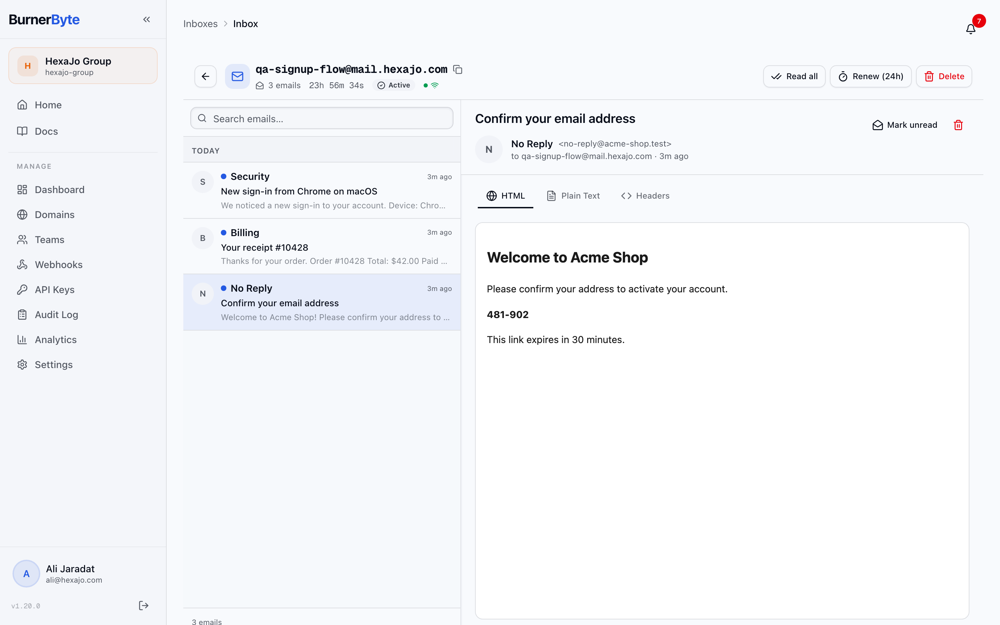
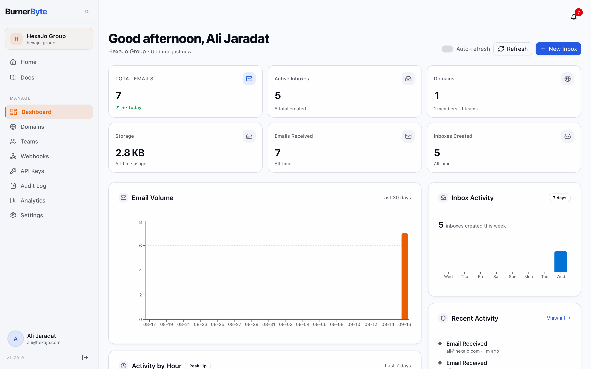
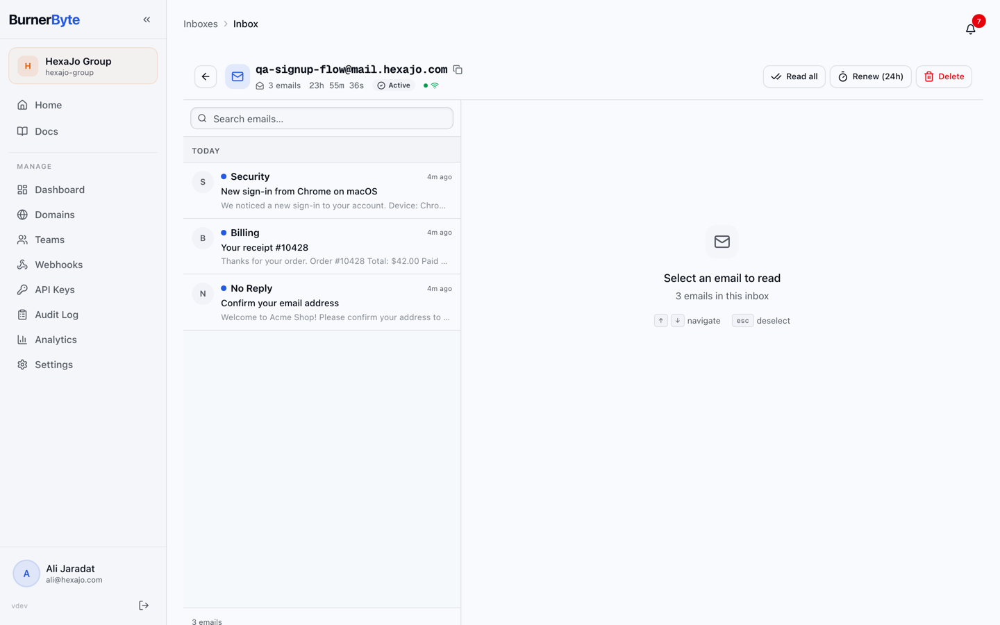
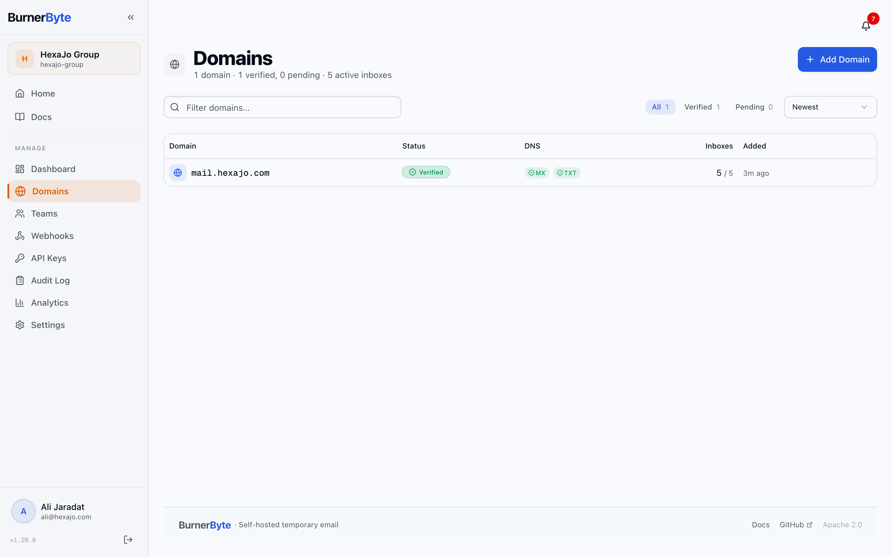
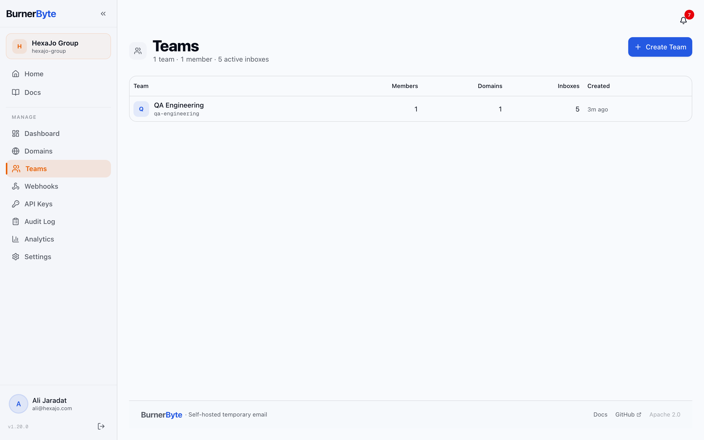
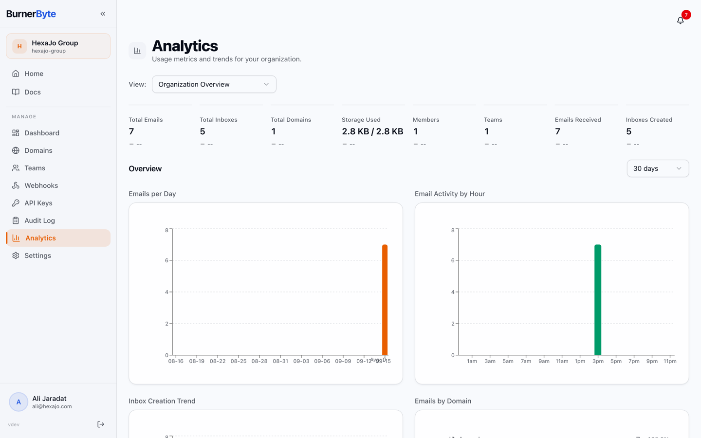
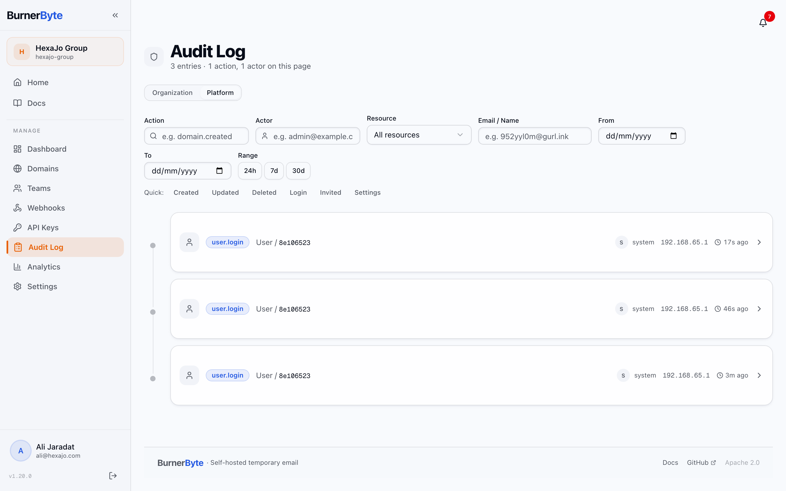

<p align="center">
  
</p>

# BurnerByte

[](LICENSE)
[](https://go.dev/)
[](https://nextjs.org/)
[](docker-compose.yml)

Self-hosted temporary email platform. Your own domains, your own database, your
own disposable inboxes — with teams, roles, audit logs and webhooks around them.

Most disposable-inbox services are someone else's server holding your test mail.
BurnerByte is the same idea run on infrastructure you control: point a domain's
MX at it, and any address on that domain becomes an inbox you can create, read,
and expire under organization and team permissions.



```
                          ┌────────────┐
   Browser ──────────────▶│ Next.js UI │  :3000
                          └─────┬──────┘
                                │ REST + WebSocket
                          ┌─────▼──────┐     ┌────────────┐
                          │   Go API   │────▶│ PostgreSQL │
                          │   :8080    │     ├────────────┤
                          │ Chi router │────▶│   Redis    │
                          │ + 7 workers│     ├────────────┤
                          └─────┬──────┘     │ MinIO / S3 │
                                │            └─────▲──────┘
   Inbound mail ──────────▶┌────▼───────┐          │
   (MX record)             │  Go SMTPD  │──────────┘
                           │   :2525    │  attachments
                           └────────────┘
```

Two binaries that scale independently and share the same database:

- **`cmd/api`** — HTTP API, WebSocket hub, and seven background workers
- **`cmd/smtpd`** — SMTP ingest server that accepts inbound mail

## Quick start

```bash
git clone https://gitlab.com/amjaradat01/burnerbyte.git
cd burnerbyte
docker compose up -d
```

Open <http://localhost:3000> and the setup wizard walks you through creating the
platform owner account, the organization, outbound SMTP, and your first domain.

That works on a clean checkout with no configuration at all — every value has a
working default, Postgres/Redis/MinIO come up alongside the app, schema
migrations run automatically, and the object-storage bucket is created on first
boot. The defaults are development-grade, so before putting this anywhere other
than localhost:

```bash
cp .env.example .env
# then set at least:
#   JWT_SECRET=$(openssl rand -hex 32)      # < 32 chars and the API refuses to boot
#   ENCRYPTION_KEY=$(openssl rand -hex 32)  # without it, stored secrets are plaintext
docker compose up -d --build
```

To receive real mail from the internet, point a domain's MX record at the host
and set `SMTPD_PORT=25` in `.env` (binding port 25 may require root).

### Running from source

```bash
make docker-infra   # postgres + redis + minio, ports published to the host
cp .env.example .env
make migrate-up     # needs the golang-migrate CLI

make run-api                          # :8080
make run-smtp                         # :2525   (separate terminal)
cd web && pnpm install && pnpm dev    # :3000   (separate terminal)
```

Prerequisites: Go 1.25+, Node 20.9+ with pnpm, Docker, and
[golang-migrate](https://github.com/golang-migrate/migrate) for the `migrate-*`
targets.

### First-run web installer

Starting the API binary with no database configured (`DATABASE_URL` unset and no
`config.yaml`) boots a token-gated installer instead of exiting. It collects the
database URL, Redis URL, JWT secret and optional encryption key, verifies the
connections, writes `config.yaml`, and restarts into normal operation.

```bash
make build
./bin/api          # logs print: open http://<host>:8080/install?token=<token>
```

`BB_CONFIG_PATH` changes where `config.yaml` is written. Database and Redis are
the only settings that must be supplied this way — everything else is configured
from inside the app. Docker and systemd deployments set `DATABASE_URL` and
`REDIS_URL` in the environment, which skips the installer entirely.

## Features

**Accounts and access**

- One-time setup wizard: owner account, organization, outbound SMTP, first
  domain, and optionally a team, branding, and invites
- Email/password auth with refresh tokens, optional httpOnly refresh cookies,
  email verification, and password reset
- SSO via OIDC — providers configured at runtime by a system admin, with
  email-domain mappings that route users to the right provider automatically
- Session management: list active sessions, revoke one or all, and a
  configurable per-user session cap with conflict resolution at login
- Role-based access control: five built-in roles (org **owner**, **admin**,
  **member**; team **lead**, **member**) over 34 permissions, plus custom roles
  a system admin can define
- System admins operate the platform without belonging to any organization;
  everyone else without one is redirected into `/onboarding`
- Org invites, including bulk invites and direct team assignment on accept
- Scoped, rotatable API keys per team

**Mail**

- Inbound SMTP server with a bounded worker queue and configurable max size
- Inboxes with TTLs, extension, and custom aliases — only the creator can read
  an inbox, enforced in the service layer
- Real-time email delivery over WebSocket, fanned out across API instances via
  Redis pub/sub
- Attachments in MinIO or any S3-compatible store, with automatic fallback to
  local filesystem storage, presigned download URLs, and size/enable policies
  that cascade from platform to org to team
- Domain management with DNS verification, re-verification on a schedule, and a
  recorded verification history
- Inbox search and active / expired / all filtering

**Operations**

- Webhooks with HMAC-SHA256 signatures, automatic retry, delivery logs and stats
- Audit logging with filtering and CSV export, plus a platform-wide audit view
- Analytics dashboard with time-series charts, backed by rollup tables and a
  cached aggregation worker
- Prometheus metrics at `/metrics`, restricted to loopback and private addresses
- Rate limiting, account lockout, and a configurable password policy
- AES-256-GCM encryption at rest for SSO, SMTP and storage credentials
- Runtime configuration from the database with hot reload across processes via
  Redis pub/sub — no restart to change mailer, storage, SSO or platform settings
- Seven background workers: `cleanup`, `reconciler`, `dns_recheck`,
  `webhook_retry`, `analytics`, `invite_expiry`, `admin_stats`
- Optional public demo mode (`/try`), disabled by default

**Interface**

- Command palette with keyboard shortcuts and recent actions
- Persistent notifications delivered in real time
- Per-user timezone and date/time format preferences
- Contextual empty states on every org- and team-scoped page
- Light-only by design — a dark theme is intentionally not shipped
- OKLCH semantic color tokens, WCAG AA contrast, reduced-motion support
- Pull-to-refresh on mobile
- Built-in documentation site at `/docs`
- Localization scaffolding via `next-intl` (English is the only bundled locale)

## API

Everything lives under `/api/v1` except `/healthz`, `/readyz` and `/metrics`,
which are served at the root. 162 operations across 122 paths, in these groups:

| Group | Base path |
|---|---|
| Setup | `/setup/status`, `/setup/complete`, `/setup/test-smtp`, `/setup/test-storage` |
| Auth | `/auth/register`, `/auth/login`, `/auth/login/resolve`, `/auth/refresh`, `/auth/logout`, `/auth/me`, `/auth/me/password`, `/auth/datetime-settings`, `/auth/forgot-password`, `/auth/reset-password`, `/auth/verify-email/{token}` |
| Sessions | `/auth/sessions`, `/auth/sessions/{id}` |
| SSO | `/auth/sso/{provider}`, `/auth/sso/{provider}/callback`, `/auth/sso/exchange`, `/auth/sso-status`, `/auth/me/sso` |
| Orgs | `/orgs`, `/orgs/{orgId}`, `/orgs/{orgId}/settings` |
| Members | `/orgs/{orgId}/members`, `.../members/me`, `.../members/search`, `.../members/{userId}` |
| Invites | `/orgs/{orgId}/invites`, `.../invites/bulk`, `/invites/{token}/preview`, `/invites/{token}/accept` |
| Domains | `/orgs/{orgId}/domains`, `.../{domainId}/verify`, `.../{domainId}/impact`, `.../{domainId}/transfer`, `.../{domainId}/verification-history`, `.../bulk-verify`, `.../bulk-delete` |
| Teams | `/orgs/{orgId}/teams`, `.../{teamId}/archive`, `.../{teamId}/restore`, `.../{teamId}/leave`, `.../{teamId}/impact`, `.../{teamId}/transfer`, `.../{teamId}/inboxes`, `.../{teamId}/members`, `.../{teamId}/members/bulk-add`, `.../{teamId}/members/bulk-remove` |
| Domain assignments | `/my/domains`, `/orgs/{orgId}/teams/{teamId}/domains` |
| Inboxes | `/inboxes`, `/inboxes/{id}`, `/inboxes/{id}/extend` |
| Emails | `/inboxes/{id}/emails` (`?q=` searches), `/inboxes/{id}/emails/mark-all-read`, `/emails/{id}`, `/emails/{id}/attachments/{aid}` |
| Files | `/files?key=` — serves attachments when the local-filesystem backend is active |
| Webhooks | `/orgs/{orgId}/teams/{teamId}/webhooks`, `.../{webhookId}/deliveries`, `.../{webhookId}/stats` |
| API keys | `/orgs/{orgId}/teams/{teamId}/api-keys`, `.../{keyId}/rotate`, `.../bulk-revoke` |
| Analytics | `/orgs/{orgId}/analytics`, `.../emails-per-day`, `.../insights`, `.../domain-series`, and the team-scoped `/orgs/{orgId}/teams/{teamId}/analytics{,/emails-per-day,/insights}` |
| Audit | `/orgs/{orgId}/audit`, `/orgs/{orgId}/audit/export` |
| Notifications | `/notifications`, `/notifications/mark-all-read`, `/notifications/{id}/read` |
| Roles | `/roles` |
| Demo | `/try/status`, `/try/inbox`, `/try/inbox/{id}/emails` |
| Admin | `/admin/stats`, `/admin/orgs`, `/admin/users`, `/admin/health`, `/admin/audit`, `/admin/version`, `/admin/platform`, `/admin/roles`, `/admin/config/{mailer,storage}`, `/admin/infra/test-{smtp,storage}`, `/admin/sso/*` |
| WebSocket | `/ws/ticket`, `/ws/inboxes/{id}`, `/ws/notifications`, `/ws/admin-stats` |
| Docs | `/docs`, `/docs/openapi.json` |
| Health | `/healthz`, `/readyz`, `/metrics` (root, not under `/api/v1`) |

The served OpenAPI document at `/api/v1/docs/openapi.json` is the authoritative
per-endpoint reference.

## Frontend routes

| Route | Description |
|---|---|
| `/` | Landing page |
| `/try` | Public demo inbox (only when demo mode is enabled) |
| `/setup` | One-time setup wizard |
| `/login`, `/register` | Authentication |
| `/forgot-password`, `/reset-password`, `/verify-email` | Account recovery and verification |
| `/invite` | Accept an organization invitation |
| `/onboarding` | Create or join an organization |
| `/dashboard` | Organization overview |
| `/inboxes`, `/inboxes/[id]` | Inbox list and live email reader |
| `/email/[emailId]` | Email detail |
| `/domains`, `/domains/[domainId]` | Domains and DNS verification |
| `/teams` | Teams and domain assignments |
| `/webhooks`, `/api-keys` | Integrations |
| `/audit`, `/analytics` | Audit log and analytics |
| `/settings` | Organization settings, members, roles, SSO, system config |
| `/profile`, `/profile/sessions`, `/profile/delete` | Account management |
| `/admin` | Platform administration |
| `/docs` | Documentation site |

## Screenshots

| | |
|---|---|
|  **Dashboard** — volume, activity and storage at a glance |  **Inbox** — live list with TTL countdown and renew |
|  **Domains** — DNS verification state per domain |  **Teams** — members, domains and inbox counts |
|  **Analytics** — time series, peak hours, top senders |  **Audit log** — filterable trail with CSV export |

## Tech stack

- **Backend** — Go 1.25, Chi v5, pgx/pgxpool, go-redis, minio-go, Prometheus
- **Frontend** — Next.js 16.1, React 19.2, Tailwind CSS 4, shadcn/ui, Zustand,
  TanStack Query, Recharts, next-intl
- **Docs** — Fumadocs (MDX with full-text search), served at `/docs`
- **Storage** — PostgreSQL 16, Redis 7, MinIO or any S3-compatible store
- **Tests** — Go `testing` with `rapid` property tests; Vitest and Testing
  Library on the frontend

## Database

47 migrations produce 36 tables, 74 indexes and 7 triggers. Migrations are
applied by the `migrate` service in Docker, or by `make migrate-up` locally.

<details>
<summary>Tables</summary>

`users`, `organizations`, `org_memberships`, `teams`, `team_memberships`,
`domains`, `domain_assignments`, `domain_verification_history`, `inboxes`,
`emails`, `attachments`, `webhooks`, `webhook_delivery_logs`, `api_keys`,
`audit_logs`, `invites`, `invite_team_assignments`, `sessions`, `setup_state`,
`password_reset_tokens`, `email_verification_tokens`, `system_configs`, `roles`,
`permissions`, `role_permissions`, `notifications`, `sso_providers`,
`sso_domain_mappings`, `user_sso_identities`, `hourly_email_stats`,
`daily_email_stats`, `daily_team_email_stats`, `daily_domain_email_stats`,
`daily_sender_domain_stats`, `org_analytics_counters`, `team_analytics_counters`

</details>

## Configuration

Configuration resolves in this order: defaults → `config.yaml` (optional) →
environment variables → values stored in the database by the admin UI.

Every key can be set from the environment: `BB_`-prefixed variables map onto the
config tree (`BB_SMTP_HOSTNAME` → `smtp.hostname`), and `DATABASE_URL`,
`REDIS_URL`, `JWT_SECRET` and `ENCRYPTION_KEY` are read unprefixed. See
[`.env.example`](.env.example) for the full list and
[`config.example.yaml`](config.example.yaml) for the file form. Mailer, storage,
SSO and platform settings can also be changed at runtime from the admin UI and
take effect without a restart.

The bundled Postgres and Redis containers are a convenience, not a requirement.
To run against managed instances, set `EXTERNAL_DATABASE_URL` and
`EXTERNAL_REDIS_URL` in `.env` — the API, the SMTP server and the migration job
all honour them, so the schema is applied to your database. They are named
distinctly because `.env` is shared with the from-source workflow, where
`DATABASE_URL` points at `localhost` — which inside a container is the container
itself.

Database and Redis are the only settings that cannot be changed from inside the
app: the setup wizard's own state lives in that database, so the connection has
to be resolved before the process can serve anything. The wizard shows which
instance it is connected to, with credentials stripped.

## Documentation

The running frontend serves full documentation at `/docs` — installation,
Docker, configuration reference, architecture, RBAC, domains, inboxes, webhooks,
API keys, SSO, the settings cascade, production hardening, reverse proxy, DNS
setup, monitoring, and troubleshooting. The source lives in
[`web/content/docs`](web/content/docs).

Design documentation lives in [`PRODUCT.md`](PRODUCT.md) (users, principles) and
[`DESIGN.md`](DESIGN.md) (palette, typography, components).

## Contributing

See [CONTRIBUTING.md](CONTRIBUTING.md) for the development setup and branching
model, and [SECURITY.md](SECURITY.md) to report a vulnerability. Participation is
governed by the [Code of Conduct](CODE_OF_CONDUCT.md).

## Maintainer

Built and maintained by **Ali Jaradat** ([@amjaradat01](https://gitlab.com/amjaradat01)).
See [AUTHORS](AUTHORS) for the full list of contributors.

## License

Apache 2.0 — see [LICENSE](LICENSE).
